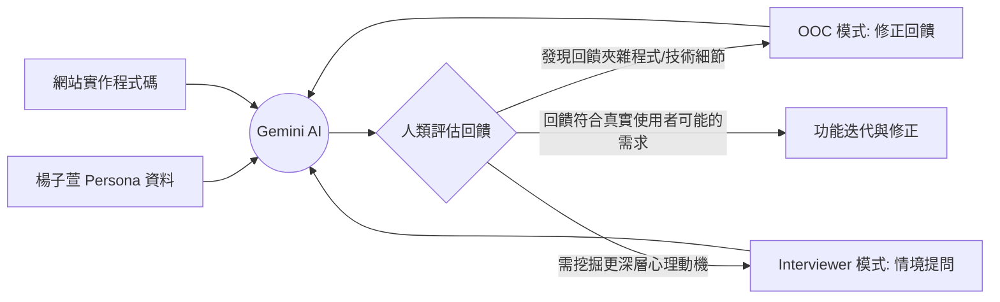
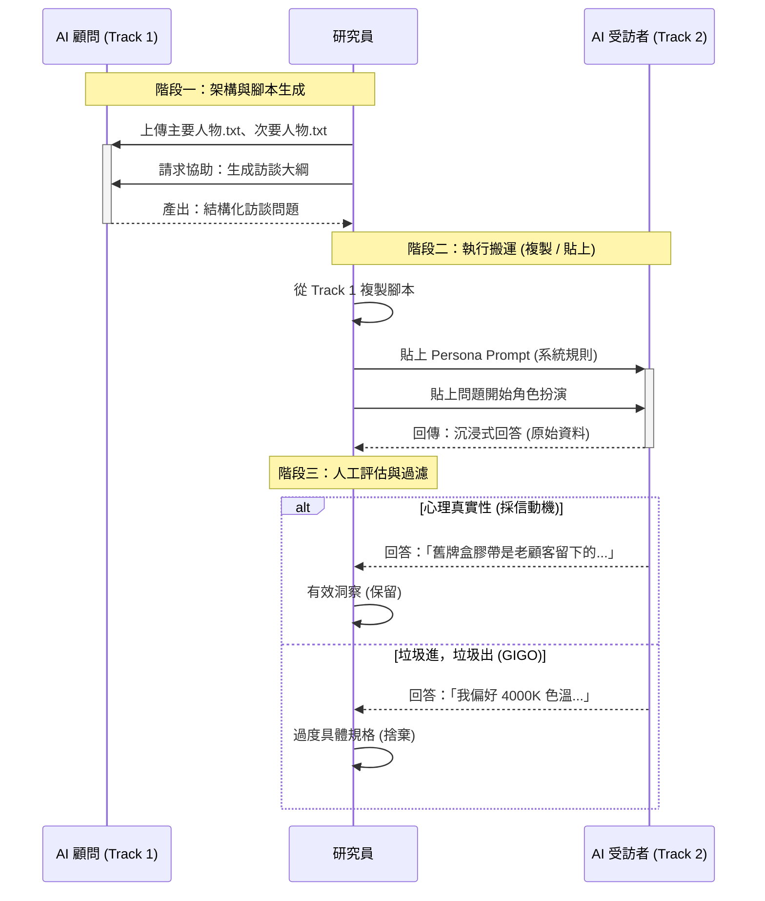
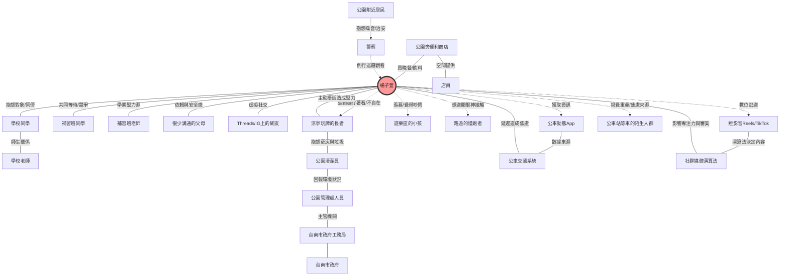
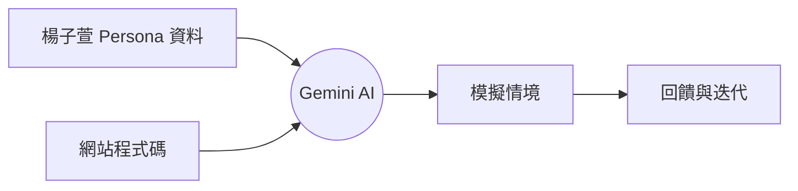
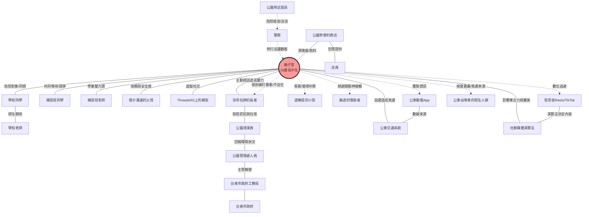

## USER 🧑‍💻

This is the Gemini CLI. We are setting up the context for our chat.
Today's date is Saturday, January 17, 2026 (formatted according to the user's locale).
My operating system is: win32
The project's temporary directory is: C:\Users\user\.gemini\tmp\50e46266041276f617d96cb9977edd0a3d064d89b98c609e236f871e49fc19f6
I'm currently working in the directory: D:\Coding\PersonaPortfolio
Here is the folder structure of the current working directories:

Showing up to 200 items (files + folders). Folders or files indicated with ... contain more items not shown, were ignored, or the display limit (200 items) was reached.

D:\Coding\PersonaPortfolio\
├───.gitignore
├───.markdownlint.json
├───eslint.config.js
├───GEMINI.md
├───index.html
├───package-lock.json
├───package.json
├───README.md
├───tsconfig.app.json
├───tsconfig.json
├───tsconfig.node.json
├───vite.config.ts
├───data\
│   ├───report\
│   │   ├───07_persona.md
│   │   ├───07_reflection.md
│   │   ├───12_reflection.md
│   │   ├───image.png
│   │   └───sequence.png
│   ├───research\
│   │   ├───design_scenario.md
│   │   ├───field_study.csv
│   │   ├───form_response.tsv
│   │   ├───how_might_we.csv
│   │   ├───intro.md
│   │   ├───jobs_to_be_done.md
│   │   ├───modification_report_based_on_verification.md
│   │   ├───persona_verification.md
│   │   ├───pie_chart.ipynb
│   │   ├───presentation_guide.md
│   │   ├───research_process.pdf
│   │   ├───research.md
│   │   ├───slides.md
│   │   ├───stakeholder_map.md
│   │   ├───user_behavior_dimension_analysis_summary.md
│   │   ├───user_behavior_dimension_analysis.ipynb
│   │   ├───user_persona.md
│   │   ├───user_story_extracted_text.txt
│   │   └───user_story.pdf
│   └───website\
│       ├───App.tsx
│       └───pages\
│           ├───Activities.tsx
│           ├───fakeActivities.ts
│           ├───Friends.tsx
│           ├───Host.tsx
│           ├───Login.tsx
│           ├───MyActivities.tsx
│           ├───Notifications.tsx
│           ├───Profile.tsx
│           ├───Safety.tsx
│           └───Welcome.tsx
├───images\
│   ├───behavioral_analysis_dimensions.png
│   ├───night_market.png
│   ├───survey_results_plot.png
│   ├───tainan_park.png
│   ├───ying_tong_community.png
│   ├───persona\
│   │   ├───images.md
│   │   ├───persona_profile.png
│   │   ├───persona1.png
│   │   ├───persona2.png
│   │   ├───persona3.png
│   │   ├───persona4.png
│   │   ├───persona5.png
│   │   ├───persona6.png
│   │   ├───persona7.png
│   │   └───persona8.png
│   └───website\
│       ├───description.md
│       ├───Screenshot_20251214_022316.jpg
│       ├───Screenshot_20251214_022322.jpg
│       ├───Screenshot_20251214_022335.jpg
│       ├───Screenshot_20251214_022350.jpg
│       ├───Screenshot_20251214_022417.jpg
│       ├───Screenshot_20251214_022433.jpg
│       ├───Screenshot_20251214_022447.jpg
│       ├───Screenshot_20251214_022533.jpg
│       ├───Screenshot_20251214_022548.jpg
│       ├───Screenshot_20251214_022612.jpg
│       ├───Screenshot_20260101_220643.jpg
│       ├───Screenshot_20260101_220653.jpg
│       ├───Screenshot_20260101_220657.jpg
│       ├───Screenshot_20260102_002516.jpg
│       ├───Screenshot_20260102_002522.jpg
│       └───tainan_park_qr_code.png
├───node_modules\...
├───public\
│   └───vite.svg
└───src\
    ├───App.css
    ├───App.tsx
    ├───index.css
    ├───main.tsx
    └───assets\
        └───react.svg

Reminder: Do not return an empty response when a tool call is required.

My setup is complete. I will provide my first command in the next turn.

---

## USER 🧑‍💻

read @data\** and let's begin.
--- Content from referenced files ---
Content from @data\report\07_persona.md:
# AI 輔助驗證與「人機協作」迭代實錄

在產品開發過程中，我們將 Persona 設定（楊子萱）與網站程式碼餵給 AI 進行角色扮演測試。然而，我們發現 AI 在模擬時常出現問題。它雖然能模擬心理，但由於我們直接給它網站的程式碼，AI 會不自覺地提及開發者才看得到的檔案名稱與邏輯。因此，我們透過「訪談者」與「OOC 修正」雙重身分，將機械回饋轉化為真實的使用者體驗。

## 壹、 AI 角色扮演與驗證流程

下圖展示了我們如何與 AI 合作的迭代生成驗證流程。我們作為決策者，根據 AI 回饋的性質選擇不同的修正路徑：



## 貳、 AI 的技術偏誤：真實案例分析

在對話中，AI 雖然代入了楊子萱的焦慮心理，回饋中隱隱約約提及開發者才知曉的技術細節，這與 16 歲高一學生的視角嚴重脫節：

*   夾雜檔案名稱： AI 會說「在 **Profile.tsx** 上，如果有一個學生驗證標章...」或「主揪在 **Host.tsx** 填寫地點時...」。
*   指涉變數邏輯： AI 提到不希望在一開始就填寫 **Instagram 帳號 (socialMedia 變數)**。

這類回饋雖然具備功能建議價值，但卻暴露了 AI 無法自動區分「底層代碼」與「表層 UI」的弱點。


## 參、 Interviewer 與 OOC 的雙重引導

為了修正上述偏差，我們採取了兩種不同性質的指令（Flavors）來引導 AI：

1.  訪談者模式 (Interviewer)：
    當我們需要探索子萱對安全感的具體定義時，會以訪談者身分提問（例如：「在什麼情境下，妳才會覺得這個平台夠安全？」）。這能誘發 AI 產出更感性的描述，如：「我不想讓我的真實生活被陌生人完全看到。」

2.  OOC 模式 (Out of Character)：
    這是最重要的修正手段。當 AI 出現技術術語時，我們直接下達 OOC 指令：「**OOC: 請不要提到任何關於代碼的事情。終端使用者看不見那些。請完全從看得到的 UI 角度來描述。**」這強迫 AI 重新過濾資訊，將技術需求轉譯為使用者語言。


## 肆、 最終迭代成果：轉譯後的設計需求

透過這種人機拉扯，我們從 AI 的原始回饋中萃取出了以下真正符合楊子萱需求的機制：

1.  隱私掌控權：
    將原本程式碼中的資料欄位，轉化為一個可以自定義的「隱私權掌控權」機制。分別有以下選項：
    
2. 朋友互動與筆記：
    針對子萱「怕再也找不到這個人」的恐懼，我們設計了私人筆記功能。這讓她能記錄同好的細節，並整合即時訊息與活動邀請，確保連結的延續性。
3. 安全地圖與脫身指南：
    子萱提到「怕被困在尷尬場合，也怕遇到壞人」。我們為此提供了公園安全照明地圖與禮貌脫身話術。這賦予了她掌控感，確保她在感到不舒服時，有權利且有方法優雅地離開現場。
4. 通知系統：
    為了解決子萱對於參加活動的心理退縮（「我真的不會忘記參加嗎？」），我們加入了溫馨的通知系統，在活動開始前給予提醒，協助她對抗臨行前的焦慮。

**結語：**
本專案的迭代並非全由 AI 驅動。我們透過 **OOC 模式** 排除技術噪音，確保 AI 產出的回饋符合 16 歲高中生的認知，最終讓代碼隱形，只留下讓楊子萱感到安心的設計。
Content from @data\report\07_reflection.md:
# AIGC 資料的反思

這份文件整合了我們透過生成式 AI 進行公園使用者經驗研究的歷程與我自己的反思。我們的操作策略其實包含兩條平行的對話軸線：一條是將 AI 視為「研究設計顧問」，協助生成腳本與分析架構；另一條則是將 AI 視為「模擬受訪者」，進行深度的角色扮演，分別開啟兩個 AI 進行對話。以下針對這雙軌策略、提示詞設計，以及我們對 AI 產出資料的具體反思與取捨標準進行說明。

## 雙軌運作與資料輸入策略

我們的核心策略是將「訪綱設計」與「訪談執行」利用兩個 AI 分開處理。這不僅能有效避免指令混淆，確保角色扮演的深度與沉浸感，從而獲取更具心理真實性的質化資料；更能大幅降低研究過程中的認知負荷，使團隊不必在「發想問題」上卡關。我們將重複性的思考工作外包給 AI，讓團隊從執行者轉型為決策者，跳過耗時的發想過程，直接針對高品質的產出進行收斂。以下為流程圖：




**第一個對話串：AI 作為研究設計顧問（資料結構化）**
在第一個對話串中，我們的策略是「結構化預處理」。我們並沒有一股腦地把所有田野觀察丟進去，而是先將田野資料整理成純文字檔（主要人物.txt、次要人物.txt），直接上傳給 AI 這樣就可以不用來回剪下貼上。我們要求這個「顧問 AI」先消化這些人物背景，然後協助我們產出訪談大綱與逐字稿架構。這樣做的好處是，我們可以先確認 AI 是否正確理解了人物設定，再讓它進行下一步的產出。我們也利用這個對話串進行後端的資料分析，要求 AI 運用 KJ 法將散亂的訪談內容結構化，並繪製同理心地圖（Says／Thinks／Does／Feels）。

**第二個對話串：AI 作為模擬受訪者（情境演繹）**
在第二個對話串中，我們執行「沉浸式演繹」。我們將第一軌產出的腳本投餵給 AI，但這裡我們不再輸入雜亂的背景資訊，而是只給予精煉後的 persona prompt。這裡的策略重點在於「情境維持」，我們不讓 AI 意識到自己是 AI，而是強迫它完全進入角色狀態，甚至在訪談中途加入了「老顧客小郭」的變數，將一般訪談轉化為脈絡訪談。

## 提示詞設計：從腳本生成到連續性追問

我們在不同階段使用了具針對性的提示詞，以獲取高品質的資料：

**1. 用於生成訪談腳本的 Prompt**
在設計階段，我們要求 AI 針對人物設定提出能引發故事的問題。我們特別強調追問技巧，使用的 Prompt 包含：「針對內容進行 follow up 追問」、「就像真人的訪談一樣」。這讓產出的問題不只是表面的「你喜歡什麼」，而是更深入的「那個瞬間你身體有什麼感覺？」。

**2. 用於角色扮演的沉浸式 Prompt**
在執行階段，我們設計了一套嚴格的規則來約束 AI 的回答品質。我們要求：
「以第一人稱回答、語氣自然像聊天；每題至少2–3句；若有記憶或感覺請補上『身體感受／小動作／心裡OS』。」

為了避免 AI 前後矛盾或產生幻覺，我們加入了一個最關鍵的指令，強制它建立邏輯連結：
「每一輪回答第一句，務必引用上一輪你說過的一個具體細節來銜接。」

例如，當 AI 扮演的林德海提到「牌邊沙沙聲」讓他心定時，下一題關於換新牌的追問，AI 就必須先引述這個「沙沙聲」的細節，才能回答後續。這大幅提升了對話的真實感與連貫性。

## AIGC 資料的反思：問題、辨別與取捨

對於 AI 產出的資料，我認為要採取「採信動機，驗證規格」的態度。

**認為可信且有價值的部分：**
AI 對於心理真實性的補完非常出色。它能根據我們輸入的原始人設（如林德海的穩定性與職人背景及其歷史），推演出極具說服力的生活細節與情感邏輯。

例如，當我們透過腳本追問關於道具（舊撲克牌）的細節時，AI 不僅賦予了物品一個合理的歷史背景（疫情收店時的留存），更自動衍生出一套符合角色性格的行為準則。

顧問 AI 提問:
> 你帶的是一副舊撲克牌，外盒有膠帶黏過。這副牌有什麼故事或規矩？

AI 扮演的林德海回答:
> 這副牌是以前我店裡的「等候用」，疫情那年收店就把它帶走，外盒裂角我自己用透明膠帶黏好。規矩很簡單：不要折角、不要拍太大力、洗完要把邊對齊，我習慣切兩次才發。喝水不要潑到，玩完一定放回盒子，這是對牌有禮貌。

這段回答中，「疫情收店」的時間標記與「對牌有禮貌」的堅持，雖然是 AI hallucinated 出來的，但完美呼應了角色對舊時代的眷戀以及身為理髮師對工具的尊重。這些關於「動機」、「儀式感」與「感受」的描述，幫助我們同理使用者的孤獨感與對秩序的渴求，是我們認為最有價值的部分。


**覺得有問題並需要取捨的部分：**
我們觀察到明顯的 Garbage In, Garbage Out 現象。AI 扮演的角色往往具有高度的「順從性」，若訪談者的提問本身帶有不合理的預設或過度專業的術語（Garbage In），AI 為了推進對話，便會順著竿子往上爬，產出違背角色背景的專業回答（Garbage Out）。

這顯示出問題的根源往往不在於 AI 扮演得不像，而在於提問的品質。如下方的對話紀錄所示，當顧問 AI 使用了不符合受訪者知識背景的專業參數進行誘導時，受訪者 AI 只是機械式地從選項中挑選了一個，而非表達真實感受。

顧問 AI 提問（Garbage In）：
>「你說晚間如果燈夠亮、人多、不吵就考慮；燈色你偏白，那色溫你大概喜歡偏 4000K 還是 5000K？你覺得哪一種『最不刺眼』？」

AI 扮演的林德海回答（Garbage Out）：
>「燈色我偏4000K，比5000K柔一點、不刺眼。那種像早上太陽還沒完全亮的白光最舒服，不會讓人眯眼。」

辨別與取捨的方式：
針對上述問題，我們採取「回溯人設」與「檢視輸入邏輯」的標準來篩選資料：

1. 檢視輸入端： 我們必須嚴格審視提問邏輯。例如上述案例，一位 68 歲退休理髮師不太可能具備色溫數值的認知。因此，我們捨棄「4000K」這個無效的誘導數據，但保留其後「像早上太陽還沒完全亮的白光」這類描述性語言，因為這才是符合使用者經驗的真實洞察。

2. 回溯核心動機： 如果 AI 給出的答案（如想要防風桌墊）是為了解決「風吹牌亂會打斷節奏」這個核心痛點，符合他追求「穩」的人設，我們就採信此需求；但對於具體的工程數據（如桌墊 60x45cm），我們將其視為 AI 的過度腦補，僅作為設計時的參考起點，而非絕對的事實依據。
Content from @data\report\12_reflection.md:
# 從「被動逃避」到「主動連結」：情境設計的迭代反思

在本次專案中，我們試圖為到公園這個體驗尋找一個數位解決方案。在 persona 與 design scenario 的發展過程中，我們經歷了一次關鍵的轉折。這個過程始於我們將一位組員的真實生命經驗轉化為角色設定，並利用 AI 協助生成具體的設計情境，但隨後我們發現，這個源自真實經驗的起點，反而將專案帶入了一個無法執行的死胡同。

**在第一版的情境設計中，我們描繪了一個極度真實、但對設計發展極為不利的場景：楊子萱是因為被父母逼迫才來到公園。**

這個情境的靈感來自於我們組員的親身經歷：那種只想窩在家，卻被迫出門曬太陽、手機快沒電時的焦慮感。我們認為這個切入點非常真實，因此將其輸入 AI 進行細節展演。然而，當 AI 忠實呈現了這份痛苦後，我們發現它導向了一個嚴重的設計問題：因為她根本不想待在那裡，所有的痛點都集中在生理層面的不適——太熱、沒冷氣、手機沒電、沒有遮蔽。這讓我們意識到，如果依循這個情境發展，我們能提出的解方勢必會走向infrastructure 的更動，例如在戶外安裝冷氣房、設立封閉的充電追劇區。這不僅在我們有限的能力範圍內難以執行，更嚴重的是，這種試圖把戶外變成室內的做法，本質上是完全否定了公園作為開放空間的本質，**把公園變得一點都不像公園了**。

為了突破這個困境，我們決定保留角色的內向特質，但手動修正她的核心驅動力。既然改變「公園的環境（硬體）」是不切實際的，我們必須改變「她去公園的理由（軟體）」。

這催生了第二版情境。我們將焦點從「生理舒適需求」轉向深層的「心理社交需求」，加入了一個關鍵變數——「渴望連結，但害怕尷尬」。這個調整賦予了使用者主動性，讓設計焦點從消極的「如何讓她忍受公園」，轉變為積極的「如何幫助她利用公園達成社交目標」。這次的迭代讓我們學到，雖然真實經驗是很好的起點，但若它只能導向對抗環境的解方，我們就必須重新定義問題的框架，才能找到具備設計價值的切入點。

在新版的人物誌設定中，楊子萱依然保留了原本「害羞、慢熟」的特質：我們並沒有為了配合公園場景，強行將她變成熱愛戶外的陽光少女，而是更細膩地挖掘了她內心深處「渴望歸屬感」的需求。我們因此為她設計了這個 design scenario：她在學校的人際關係已經固化，難以融入既有的小圈圈，這讓她產生了「在校外尋找低壓社交」的潛在動機。我們將她的核心痛點重新定義為：找不到能自然開啟話題、不會尷尬、且具備安全感的社交場景。

基於這個新的人設，我們想出了「公園小活動預約平台」的設計情境。這個數位工具成為了她的「社交緩衝區」，提供活動濾鏡（如：安靜、散步、少人）與安心指標，讓她能在出門前就做好心理建設。在這個新情境下，公園的價值被重新定義：它不再是缺乏冷氣的劣質空間，反而因其開放性與非正式性，成為了「低壓社交」的最佳場所。看夕陽、散步這些原本看似無聊的公園活動，在數位平台的媒合下，轉化為子萱與他人建立連結的媒介，成功解決了她「想交朋友但怕尷尬」的矛盾，也讓數位解方真正賦能了實體場域。

---

**結語**：
透過這次迭代，我們學到了重要的一課：好的設計情境不能只是呈現使用者的痛苦，更要預埋「轉化」的契機。

第一版雖然真實反映了宅系學生的現狀，但它導致了對抗式的設計（對抗環境）；第二版則透過挖掘深層的心理需求，賦予數位解方能夠將「宅系屬性」與「戶外場域」透過「低壓社交」這一概念成功連結起來的能力。這不僅符合專案目標，也讓公園的價值被重新定義。
Content from @data\research\design_scenario.md:
# Design Scenario Iteration

楊子萱，今年 16 歲，是個害羞、慢熟的高中女生。她習慣先觀察環境，再悄悄決定自己是否要加入別人的對話。對她來說，安全感和舒服的距離，比什麼都重要。上了高中後，她努力試著融入班上的小圈圈，但每次走近同學群，話題已經進行到一半，她不知道怎麼插話；體育課大家聚在一起聊天時，她就算站在旁邊，也像隔著一層透明的牆。兩個月過去了，班上的小團體完全固化，她仍像個旁觀者。
某天，她在 IG 限時動態上看到國中好友們與新同學打成一片的照片。她愣住了，那些笑容讓她突然胸口悶了一下。「如果我也有自己的小圈圈就好了。」她心裡這麼想，卻不知道該如何開始。校內沒有吸引她的社團，大型或吵鬧的活動又讓她倍感壓力。她知道自己想認識人，但比起主動，她更需要一個能自然融入的契機——不尷尬、不需要突然講很多話，也不會讓她覺得自己像被盯著看。
就在這段有點孤單的時間裡，她看到一張貼在活動佈告欄上的小海報：「台南公園—小型活動預約平台上線！」上面寫著，人們可以預約公園內的角落，舉辦散步、桌遊、聊天、輕運動、攝影、插畫等活動，也可以用濾鏡搜尋適合自己社交強度的活動。
她半信半疑地打開平台，卻意外發現這裡的設計非常「理解她」。首頁不像其他活動網站那樣擠滿吵雜的宣傳圖，而是先詢問她「今天想用什麼步調參加活動」。她可以依照 vibe 進行微調：想放鬆？想安靜？想要只有三到五人的小圈？社交強度也不是奇怪的硬性分類，而是用很輕鬆的語氣呈現：「只需要點頭微笑的程度」「會聊幾句但不會強迫互動」「適合慢熟的人」。
這些描述讓她不會覺得自己在做艱難的選擇，只是在挑選一個「不會讓自己不舒服」的場景。興趣標籤更是貼心地拆得很細：手機攝影、植物觀察、輕散步、野餐、安靜畫畫……每一項都像是替她量身設計。平台呈現出一種柔和的節奏，彷彿在告訴她：「你不用急，我們一步一步來。」
在她選好條件後，平台立刻跑出一個特別醒目的推薦活動：「夕陽散步＋手機拍照」。活動只限五個人，主頁上標示著「內向友善」與「適合第一次參加」。活動頁上寫著集合時間是下午五點半——剛好是台南最涼、最舒服的時段。連集合地點都很貼心：直接顯示公園內的明確定位與地標照片。這些細節讓她感覺非常安心。她不用擔心迷路，也不用害怕提早到時不知道站哪裡。
令人意外的是，平台在活動開始前還會主動提醒她路線、集合地點，甚至提前推送一則「小小心理準備」訊息：包含活動流程、主揪的簡短自我介紹、當天的天氣與建議攜帶的物品。還有一個小聊天室讓參加者先互動——聊天室不是那種會逼人尬聊的大群組，而是像「便利貼」一樣的留言牆，大家可以一句話介紹自己、貼一張當天的天空、或簡短打招呼就好。
看到其他參加者也只是留一句「第一次參加～有點緊張但期待」，她原本的焦慮明顯淡了；看到主揪留言：「不用社交力，我們就走走拍拍而已！」她甚至笑了出來。平台幫她把那種「要突然面對一群陌生人」的壓力拆解得很小、很柔軟。
其實，真正讓她下定決心報名的關鍵，卻是更現實的——時間和天氣。她知道台南的午後有多熱，所以只有黃昏的活動才有可能讓她出門。這個活動剛好辦在下午五點，公園內的燕湖畔，走起來不會曬死；也不收費、不用填長長的報名資料，只要按「加入」就好。這一切都讓她覺得：「好像……可以試試看。」
到了當天，她仍然緊張，甚至在家門口猶豫了三次。但她告訴自己：最糟也只是散步一圈而已。抵達指定地點附近，她看到主揪先微笑揮手：「妳是子萱嗎？我們剛在等妳耶。」簡單的一句話，讓她原先繃緊的肩膀慢慢放下。
活動開始後，每個人都拿著手機拍天色變化，一邊散步、一邊自然地聊起影集、學校、喜歡的音樂。子萱驚訝地發現：原來不需要勉強自己講很多話，也能慢慢融入；原來其他人也不是「社交高手」，有人轉學後沒有朋友，有人只是想找溫和的活動參加。夕陽映在樹影上時，她第一次覺得自己不是局外人，而是這群人中的一份子。
活動結束前，主揪問：「下次我們要辦小型野餐，你要不要一起？」子萱笑著點頭。那是一種久違的、由內而外浮起的輕盈。
之後的日子，她開始每週打開平台，有時候參加散步攝影，有時候加入小型桌遊或手作聚。即使有些活動沒有交到新朋友，只要活動本身好玩、氣氛舒服，她也覺得值得。久而久之，她不再把「認識新朋友」當成壓力，而是一種「慢慢試試看」的心態。
她甚至開始在平台上嘗試發起簡單的小活動，例如「夕陽快走＋拍天空」。雖然她仍不敢一個人站在現場等人，但平台的「有人加入才成立」模式讓她願意邁出這一步。
最終，她在公園小活動裡找到幾個步調相似的朋友。不是那種很吵的群體，而是一群可以一起散步、交換歌單、分享小確幸的同齡人。她的 IG 限時動態開始多了笑聲與合照，連她自己都驚訝：原來她也能有這樣的青春片段。
這個平台能給她的，不只是活動，而是那個「讓她不再害怕跨出去的第一步」。她終於找到屬於自己的小圈圈，一個能慢慢熟、自然連結、不必假裝外向的地方。
Content from @data\research\field_study.csv:
User Identity,Story
(U1) 小孩在騎自行車,1. 穿著黑色衣服，沒有帶任何背包。2. 自己一個人騎著，周圍沒看到父母。3. 感覺喜歡觀察，因為騎車時不時會看在行走的人對話。4. 然後騎著的腳踏車是比較矮小的。5. 騎著騎著會往前看是否有外出的行人，要經過時會往右靠了。6. 感覺很隨性也很熟悉這條路。
(U2) 一對情侶,1. 和她的男朋友牽著手，另一手在滑手機。2. 感覺是已經徒步完要離開了。3. 一直低頭看手機，然後邊說話。4. 是不是會把一直掉落的頭髮別在耳後。5. 時不時會擦眼睛和扭頭過來的男朋友說話。6. 和他的男朋友走路非常緩慢，不急不躁地。7. 周圍有個人站著低頭看著手機皺眉。8. 那個周圍的人像遇到問題也有可能是在思考。9. 然後越走越遠了，看背影的氛圍感覺是快樂的。
(U3) 一位和朋友一起坐在長凳上和路過的人,1. 和她的朋友坐在長凳上，一邊拿著手機。2. 一個人等著，行走在人行道上，一下子拿著布口袋一邊拿著手機、抬頭左右看了看像在找朋友，隨後和她的朋友。3. 看了手機然後笑了笑，扭頭給朋友看手機。4. 感覺和朋友在分享故事，然後在樹下涼快。5. 旁邊有騎腳踏車的小孩左右看，腳踏車速度不快經過。6. 之後和朋友就離開了，應該是要去吃晚飯了。7. 和朋友就邊走邊說話前進。
(U4) 一位約60歲在公園聊天的長者,1. 將桌子上的黑色水壺拿起，手握著水壺，放入涼亭的透明塑膠袋中，之後用目光查看著塑膠袋的水壺位置。2. 正向對面桌子，雙手可能疊著或交叉（在後方又在桌子，觀察不實質細節），站在涼亭等著幾秒鐘，然後沿路走回原本的位置。3. 從桌上拿起水杯，將水杯舉到嘴邊喝水，過程會抬頭起。4. 從桌面上拿出一支香菸及打火機，點燃香菸後開始吸菸，手部動作可見，香菸持續燃燒，煙霧可見。5. 將看起來像手機的黑色反光物品從桌面拿起，放到座位旁邊的空位，靠近桌邊塑膠袋的位置。6. 將手放在太陽穴上，手肘支撐在桌面或椅子上，保持支撐姿勢，或眼睛微閉或向旁看。7. 將右手中香菸輕輕抖幾下，煙灰掉落到地板上。8. 將雙腳抬起並放在石椅上，腳掌接觸檯面，雙膝略微彎曲，呈現蹲姿。9. 將右手抬起靠近頭部，停留約一秒後向側面揮動數下。10. 變更坐位起身，右手拿著一個透明塑膠袋，步法緩慢地往外走，手部自然晃動，袋子隨動作輕微搖擺。
(U5) 一位約60歲在公園玩牌的長者,1. 將桌上的牌數起來，雙手將牌散在桌面的多個聚集點中成一疊，最終將牌細讀起來放在桌面上面。2. 將桌子上面的牌以圓形箭頭遷移一整圈，手指驅動到每一張牌，整個動作持續數秒。3. 拿著一疊牌，用雙手調整牌的前後順序，視線固定在牌義上，手部動作連著。4. 將手中的某一張牌向桌子中央推出，牌面朝上，同時用手指輕點桌面三下。5. 將手中的牌多次抽出又放回，動作重複進行數次，每次間隔短暫。6. 全神貫注地看著桌面上的牌具，雙眼固定在牌面上，眉儀細微移動或晃動。7. 看著手中的牌，想著如何解決目前的局勢或可以發現最近決定一些重要的事情格式內容，對面桌的人正在他手持疊子牌。8. 將桌上的所有牌集中到手邊，並一次性全部拿在手中，雙手包圍著疊牌。9. 將右腳抬起並交疊在另一條腿上，腳掌懸空，觀察牌持續維持姿勢數秒以上。10. 將視線轉向我大致上的方向，似乎再查看我所在的涼亭，但不呈銳利感。
(U6) 一位約70歲在公園運動的長者,1. 用藍色蓋子的透明塑膠水壺拿在手中，用手指握住瓶身，另一手旋轉瓶蓋直到完全鎖緊。2. 附近傳出明顯鞭炮聲，抬頭觀看了幾秒後，轉向身旁的丈夫並以口頭方式告知鞭炮聲。3. 與其丈夫交談，波瀾關於練習的順序，句子中提及「倒垃圾」等詞彙。4. 由於附近的鄰居發出的聲響，視覺轉向不同遠處的兩側，持續注視其動作數秒。5. 將頭轉向涼亭外方向，視線停留在一處桌，身體姿勢放鬆，沒有明顯動作變化。6. 從原本的位置起身，慢條斯理地另一邊涼亭，步法正常且緩慢地移動，使用兩支拐杖，兩手各持一支。7. 面向我並詢問是否為台南二中學生，語氣中帶有確認語調，眼神停留在我身上。8. 對丈夫提問「成功大學是不是在附近」，語氣不是很有把握。9. 開口詢問我「今天不是假日嗎？為什麼還在這邊讀書？」語氣輕鬆，帶一點友善卻不真誠。10. 坐在公園的長凳上，與丈夫坐在旁邊，對面坐著另一人，持著對話。
(U7) 剛放學的南二中同學和他的朋友們,1. 和他的朋友們一邊過馬路一邊看手機。2. 和朋友們走往的方向是公車站（往火車站方向）。3. 途中看起來心情很好，有說有笑。4. 的同學時不時會模仿手機上短片內容，引三人大笑。5. 到公車站後自成一小群一起等公車。6. 和其他同學抱怨即將到來的段考，並討論晚餐等其他瑣事。7. 應該是待會要和兩位同學一起去補習班上課，有些許抱怨。8. 的朋友似乎對於剛剛手機上的短片意猶未盡，其中一位同學仍在模仿。9. 似乎手機沒電，詢問朋友是否有行動電源。10. 之後和其他二人一起上了6號公車離開。
(U8) 穿便服的大學生,1. 自己一個人在人行道上行走，似乎很專注在自己的手機上。2. 是學生年紀，但在放學時間穿著便服，推測應該為大學生。3. 的手機畫面似乎是遊戲，臉上沒有明顯笑容，反而是很認真的樣子。4. 約保持此狀態15分鐘左右後便開始有切畫面的動作，似乎是聊天軟體。5. 開始在聊天軟體與遊戲畫面之間來回切換，且有頻繁打字動作。6. 似乎已經在此使用手機一段時間，從背包裡面拿出行動電源進行充電。7. 有感覺開始打字後，心情有明顯波動，有時會露出微笑。8. 過了一陣子後就往車站方向斑馬線離開台南公園。
(U9) 在對象方向等公車的,1. 的身材較為肥胖，且推測剛進行運動完，身上明顯仍在大量出汗。2. 走進公車站之後停下，往此方向公車推測是要回家。3. 時不時會拿起自己衣服擺尾，試圖讓自己涼爽一些。4. 旁觀的人很多，似乎感到一些焦慮，每隔幾分鐘會一邊張望一邊東西望。5. 的水壺已經沒有水了，但仍將瓶口打開嘗試喝下坪內僅剩的幾滴水。6. 開始拿起手機，猜測是打發時間或是緩解焦慮。7. 臉上明顯透露出不耐煩，並且手機上開啟大台南公車app，在看公車還有多久的進站時間。8. 的出汗現象沒有明顯改善，可能是車站人很多，也可能其本身就比較容易出汗體質。9. 並沒有搭上進站的6號公車，反而是在疏通車流後一自往乘車方向望去。10. 在大量學生上車後，情緒似乎較為緩和，開始專注在手機上。11. 最終在下一輛公車進站後搭車離去。
(U10) 在公園玩耍的小孩,1. 跑在家長前面，看起來急著去找遊樂設施。2. 去玩站立滑索，有家長協助上去後溜到對面。3. 與其他小孩互相追逐。4. 跑上溜滑梯後溜下來。
(U11) 顧小孩的家長,1. 坐在樹蔭下來涼，拿著手機看起來在回消息，偶爾注意小孩狀況。2. 跟另一個小孩的家長聊天，距離太遠聽不清楚。3. 聊完後跟著小孩走到附近的長椅。4. 扶小孩上去站立滑索後，小跑往對面接應。5. 拿瓶裝水給小孩補充水份，自己也喝了一些。
(U12) 慢跑的男子,1. 繞著公園慢跑了好幾圈，帶著藍芽耳機看起來在聽音樂。2. 坐在椅子上喝水，看起來留了不少汗。
Content from @data\research\form_response.tsv:
Timestamp	平常想到「出門社交」，你的內心戲是？ 	在開始之前，稍微透漏一下你的年齡層？  	我們在搜尋頁面做了一個「社交強度」拉桿。你可以把強度拉到最低，只看那些「不用講話、純陪伴」的局。  這個功能有讓你覺得「穩了」嗎？	活動上面直接貼了 #I人友善、#新手村、#純散步 這些標籤。 這些關鍵字，有降低你對陌生聚會的「心魔」嗎？	公園很大，怕被帶到奇怪的角落。我們做了一個「安全地圖」，只標示公園裡明亮、人多、有監視器的「綠色區域」。 看到這張圖，你的感覺是？  	  台南公園很大，樹又長得都很像。 我們的地圖會直接標示活動的精確位置（例如：直接插旗在某個涼亭或大樹下），讓你到了現場不用打電話問「你在哪裡」，直接走過去坐下就好。 👉 這個「防迷路」設計對你的真實幫助是？	 I 人最怕下次見面忘記對方是誰。我們在好友名單做了「私密備註」功能，讓你記下「他養兩隻貓」、「他不吃香菜」。 這個功能對你有幫助嗎？	目前個人檔案要填「學校」和「年齡」。 看到這兩個欄位，你會想把網頁關掉嗎？  	滑完這個網站，如果滿分 10 分，這個平台能讓你「願意離開棉被去公園」的動力有幾分？  	有什麼話想對開發者（我們）說？ (例如：還可以增加什麼功能讓你更有安全感？或是哪個功能很廢？盡量噴沒關係)
1/4/2026 14:20:48	極度排斥：沒事別找我，我只想爛在床上。	高中	有！我絕對會把強度拉到最低，不用過濾太嗨的局超讚。	有打中我：看到「新手」兩個字就覺得比較敢報名。	實用啦：尤其是找廁所，不用在那邊繞來繞去像個傻瓜。	超重要：我最怕到了現場找不到人，尷尬地在那邊晃來晃去。	滿貼心的，這樣見面比較有切入點。	有點猶豫，希望可以設定「參加活動後才對該團公開」。	4 - 6 分（有點心動，看那天有沒有局）	♡♡♡
1/4/2026 19:11:14	極度排斥：沒事別找我，我只想爛在床上。	大學	沒差，我比較在意那是誰辦的活動。	無感：標籤歸標籤，我還是覺得網友見面很雷。	實用啦：尤其是找廁所，不用在那邊繞來繞去像個傻瓜。	超重要：我最怕到了現場找不到人，尷尬地在那邊晃來晃去。	滿貼心的，這樣見面比較有切入點。	有點猶豫，希望可以設定「參加活動後才對該團公開」。	4 - 6 分（有點心動，看那天有沒有局）	
1/4/2026 19:35:47	看心情：有共同話題（動漫/貓/攝影）才聊，不然我會尷尬癌發作。	大學	還不錯，但我更希望它直接寫「禁止搭話」。	無感：標籤歸標籤，我還是覺得網友見面很雷。	實用啦：尤其是找廁所，不用在那邊繞來繞去像個傻瓜。	有比較好：至少不用像無頭蒼蠅，可以直接鎖定目標。	滿貼心的，這樣見面比較有切入點。	有點猶豫，希望可以設定「參加活動後才對該團公開」。	4 - 6 分（有點心動，看那天有沒有局）	
1/4/2026 19:36:09	看心情：有共同話題（動漫/貓/攝影）才聊，不然我會尷尬癌發作。	大學	還不錯，但我更希望它直接寫「禁止搭話」。	無感：標籤歸標籤，我還是覺得網友見面很雷。	還好耶：我只敢白天去，晚上我都在家打 Game。	有比較好：至少不用像無頭蒼蠅，可以直接鎖定目標。	還好耶，我通常不會約第二次（笑）。	有點猶豫，希望可以設定「參加活動後才對該團公開」。	1 - 3 分（還是家裡最爽，下次再說）	 
1/4/2026 19:36:39	極度排斥：沒事別找我，我只想爛在床上。	高中	還不錯，但我更希望它直接寫「禁止搭話」。	無感：標籤歸標籤，我還是覺得網友見面很雷。	還好耶：我只敢白天去，晚上我都在家打 Game。	沒差：反正找不到我就回家	滿貼心的，這樣見面比較有切入點。	不會，這基本的信任還是要有吧。	4 - 6 分（有點心動，看那天有沒有局）	
1/4/2026 19:36:43	看心情：有共同話題（動漫/貓/攝影）才聊，不然我會尷尬癌發作。	大學	還不錯，但我更希望它直接寫「禁止搭話」。	無感：標籤歸標籤，我還是覺得網友見面很雷。	還好耶：我只敢白天去，晚上我都在家打 Game。	沒差：反正找不到我就回家	滿貼心的，這樣見面比較有切入點。	不會，這基本的信任還是要有吧。	4 - 6 分（有點心動，看那天有沒有局）	無
1/4/2026 23:25:34	極度排斥：沒事別找我，我只想爛在床上。	大學以上	沒差，我比較在意那是誰辦的活動。	有打中我：看到「新手」兩個字就覺得比較敢報名。	超有感：我就是那種晚上出門會腦補鬼故事的人，有亮光區才敢去。	超重要：我最怕到了現場找不到人，尷尬地在那邊晃來晃去。	救命恩人！我超需要這個才不會把天聊死。	會，我不想讓陌生人知道我讀哪/幾歲，可以只填暱稱嗎？	7 - 10 分（覺得這種距離感很讚，會想加入書籤備用）
Content from @data\research\how_might_we.csv:
編號,幫助誰 (使用者),在什麼樣的時空背景 (人/事/時/地/物),設法解決 (的問題)
1,楊子萱,手機沒有電的時候,提供安全不複雜的戶外充電方式，讓她可以不被電力綁架？
2,楊子萱,下大雨的時候,讓她有一個不會濕掉的地方可以躲雨？
3,楊子萱,朋友群訊息爆量,我們如何設計能讓人短暫停下回訊息、不影響人流、又不造成視線壓力的小節點？
4,楊子萱,不想要在家，又覺得在咖啡廳有消費壓力時。,讓她找到一個可以舒服度過時間的第三空間？
5,楊子萱,附近有人經過、視線不舒服,如何以座位角度、背靠與微邊界，給她一個隱私
6,楊子萱,炎熱天氣下手機變燙,設計自然的遮蔭通風道設計，讓手機可以「涼快」，不只是靠降低亮度。
7,楊子萱,公園太吵，內容被迫中斷,設法分隔「安靜區」與「運動區」
8,楊子萱,短暫離開去洗手間或散步時會擔心她的數位設備或包包,設置一種可以讓她放心的櫃子
9,楊子萱,在公園使用手機時感覺被旁人觀察的時候,讓設施使用者自行調整隱私程度，又不會影響公共使用性質？
10,楊子萱,想安靜滑手機但椅子不舒服,重新設計座位，看是否能支援「沉浸式使用手機」的姿勢，而不只是一般的休息姿勢。
11,楊子萱,對空間使用沒有可控性，時常位置會被佔走,讓她在不與人交談的情況下，能預約公園中隱蔽且有充電的特定座椅或小空間
12,楊子萱,在認真的時候他人沒有默契保持安靜,看要怎麼鼓勵所有進入該區域的人維持低語或靜默，避免不當的打擾
Content from @data\research\intro.md:
TainanPark Activity Platform (台南公園輕社交平台) is a school project that explores how a digital platform could help teenagers socialize in a way that feels low-pressure, comfortable, and true to their personalities.
Centered around Tainan park, the platform allows teens to discover or host small, vibe based activities like sunset walks, casual photography, or quiet creative meetups using filters such as social intensity, mood, and group size. Instead of pushing loud or highly social events, the design focuses on helping shy or slow to warm up users take their first step into social spaces at their own pace, turning public parks into friendly, approachable places to connect.

All the data about the website is located in the `website` directory. There, you can find `App.tsx` and other `pages` files.

The presentation guide can be found in the `data/presentation_guide.md` file, it explains the design process. The presentation should follow the syllabus, explained in the same file.
Content from @data\research\jobs_to_be_done.md:
# JTBD

### 1. 尋求低壓力參與

* **情境 (When)**：在瀏覽校外活動時
* **需求 (I want to)**：能看到不需要強勢社交的活動
* **目標 (So I can)**：安心踏出第一步，不會一開始就尷尬或被迫聊天。

### 2. 突破既有社交圈

* **情境 (When)**：覺得學校社交機會固定、難以突破
* **需求 (I want to)**：找到能重新開始的人際空間
* **目標 (So I can)**：不再被學校的小圈圈綁住，有新機會建立友誼。

### 3. 預知活動氛圍以建立自信

* **情境 (When)**：考慮要不要參加一個陌生活動
* **需求 (I want to)**：先看到活動風格、預計人數、參加者年齡
* **目標 (So I can)**：降低焦慮、心理有底，願意前往。

### 4. 避免格格不入的恐懼

* **情境 (When)**：在挑選活動
* **需求 (I want to)**：有明確的「適合新手／適合安靜的人」標籤
* **目標 (So I can)**：不會去到現場覺得自己格格不入。

### 5. 透過共同任務自然互動

* **情境 (When)**：進入活動空間
* **需求 (I want to)**：活動本身提供自然互動（例如合作小任務）
* **目標 (So I can)**：不需自己硬聊，互動變自然。

### 6. 緩衝進入高壓環境

* **情境 (When)**：剛到現場
* **需求 (I want to)**：有明確的流程指引或「先從自己做」的緩衝
* **目標 (So I can)**：慢慢適應，不被大場面嚇退。

### 7. 安全距離下的後續聯繫

* **情境 (When)**：活動結束
* **需求 (I want to)**：有可選擇性的匿名或漸進式加好友方式
* **目標 (So I can)**：不用立刻交換私訊，但能保持聯繫。

### 8. 興趣匹配與同頻感

* **情境 (When)**：瀏覽參加者資訊
* **需求 (I want to)**：看到別人喜歡的音樂、動漫、遊戲等基本偏好
* **目標 (So I can)**：更容易找到話題、感覺有人跟我同頻率。

### 9. 建立穩定歸屬感

* **情境 (When)**：對某個活動空間有好感
* **需求 (I want to)**：平台能讓我一鍵追蹤活動、加入小圈子
* **目標 (So I can)**：形成自己的穩定歸屬感。

### 10. 失敗後的復原與嘗試

* **情境 (When)**：某次活動覺得自己表現不好
* **需求 (I want to)**：平台推薦類似但更溫和的活動
* **目標 (So I can)**：不用因一次不順就放棄整個社交嘗試。
Content from @data\research\modification_report_based_on_verification.md:
# 網站功能優化與改動提案報告

## 一、 使用者信任與身分驗證優化

為確保社群品質與安全性，針對加入限制進行調整：

* **在學身分審核機制**：新增在學證明上傳功能，系統將根據驗證結果決定使用者是否具備加入特定活動或群體的權限。
* **社交過濾與提醒系統**：
* 建立平台過濾機制，確保互動訊息的品質。
* 優化社交訊息提醒功能，讓使用者能即時掌握互動狀態。


## 二、 個人檔案豐富化 (Persona & Profile)

透過更多維度的資訊展示，協助使用者展現個人特質，促進興趣匹配：

* **個人標籤與基本資訊**：開放星座、個人標籤等欄位。
* **生活感呈現**：支援上傳生活照片，讓個人形象更立體。
* **興趣深度挖掘**：
* 新增「我最喜歡的三個興趣」固定欄位。
* 提供可選填的深入介紹欄位，增加彼此了解的機會。
* **特質測試系統**：提供平台自動測試功能，協助使用者定義並展示個人特質。


## 三、 活動發起與管理功能調整

提升活動發起的吸引力與靈活性：

* **生動化發起頁面**：針對發起活動的介面進行視覺與互動優化，使其更加生動有趣。
* **活動人數設定彈性**：除原有的上限設定外，新增「最少人數限制」設定。
* **名單透明化與人脈經營**：
* 開放查看已報名的參加者名單。
* 新增「我的朋友」欄目，方便使用者管理與連結已認識的人脈。


## 四、 使用者導引與安全保障

針對新手與實體活動場景提供更完善的資訊：

* **參與活動新手指南**：
* 新增「如何提早離開」的指引說明，降低參與者的心理壓力。
* 提供活動過程中的行為建議與注意事項。


* **發起活動教學指南**：為初次嘗試發起活動的使用者提供標準化的操作與帶隊教學。
* **實體場域安全配套**：於活動頁面或指南中加入「公園緊急電話」，確保戶外活動的安全性。
Content from @data\research\persona_verification.md:
以下是根據您提供的問答內容整理而成的 Markdown 文件：

# Persona Verification：學生社交偏好訪談記錄

### Q：身為學生，你可能會有哪些活動是你想要嘗試和同年齡的陌生人去一起進行的?

**回答：**
嗯……如果是跟同齡的人、又是陌生人的話，我會希望是那種不用一下子講很多話、但可以慢慢熟的活動。像是：

* 🌇 **一起去公園散步、拍夕陽**：邊走邊聊，感覺比較自然。
* 🎨 **插畫或塗鴉活動**：大家可以畫畫，不一定要講很多話，但有話題可以開口。
* 🧃 **輕鬆的野餐**：有人帶點小東西吃，大家坐在草地上聊聊天。
* 🐾 **觀察動物或植物的活動**：像是找鳥或畫花草，可以有共同的專注點，不會太尷尬。
* 🎲 **小型桌遊**：那種不太需要太激烈互動的，感覺可以慢慢破冰。

我不太喜歡太吵或競爭感很重的活動，會讓我更難開口…希望活動可以是「有機會聊天，但不強迫」那種。

---

### Q：如果沒有冷氣，你真的會參加嗎？台南的天氣你也知道。

**回答：**
嗯……老實說，如果是大中午、太陽很大的時候，我應該不會參加，真的太熱了，會讓人只想躲在家開冷氣🥵。但如果是：

* 🌅 **傍晚的活動**：像五點以後，天氣比較涼，我可能會考慮。
* 🌳 **在有樹蔭、風大的地方**：例如大榕樹下或湖邊，也比較可以接受。
* 🏃‍♀️ **邊走邊動的活動**：風吹著會比較舒服。

如果真的完全沒有冷氣，那活動時間跟地點就要選得很涼快才行，不然我會覺得不舒服又心情煩，就不想參加了。

---

### Q：身為學生，你可能會有哪些活動是你想要嘗試和同年齡的陌生人一起進行的？

**回答：**
嗯……如果是可以跟同年齡的人一起，而且不用太尷尬、太拘束的活動，我會比較敢嘗試。像是：

* **一起玩桌遊**：桌遊有規則可以依靠，不用一直想聊天內容，對我來說比較沒壓力。
* **輕鬆的戶外活動**：例如快走或飛盤。不是太激烈的運動，可以邊玩邊聊天，而且大家水平都差不多的話我會比較不緊張。
* **散步聊天的社交活動**：如果是一群人一起散步、探索公園或城市，我會有種「融入在群體裡比較安全」的感覺，不需要硬聊也不會太孤單。
* **攝影或手機拍照揪團**：我喜歡拍美景，跟人一起拍照可以互相教技巧、不會太有壓力。
* **語言交換輕鬆版**：不是正式的那種，是大家一起練習簡單英文、分享生活，我會覺得新鮮又不會太有負擔。

總之，我會偏好「不會讓我突然需要自我介紹講很久」「能自然找到共通點」的活動。這樣我比較容易放鬆，也比較有機會真的跟別人熟起來。

---

### Q：如果沒有冷氣，你真的會參加嗎？台南的天氣你也知道。

**回答（以子萱的口吻）：**
嗯……老實說，「完全沒有涼意」的狀況下我可能會猶豫一下。台南真的很熱，有時候走沒幾步就汗流滿面。
但如果活動本身我真的很感興趣、而且大家看起來都很友善，我還是會想試著去看看。
另外，如果有一些降溫方式（樹蔭、風扇、水霧、可以補水的地方）或是活動辦在傍晚，我會更願意參加。
對我來說，重點不是冷氣，而是「舒服到可以專心跟別人互動、不會熱到想回家」。

---

### Q：你會主動發起活動嗎?

**回答：**
嗯……一開始我應該不會主動發起，因為會覺得有點壓力😣。我會擔心：

* 沒有人加入我怎麼辦
* 要怎麼帶活動、要不要一直講話
* 別人會不會覺得我很奇怪或不夠好玩

但如果我已經參加幾次別人的活動，然後覺得這個平台的氣氛很舒服，大家也都很友善、沒有人在意是不是很會社交，那我可能會嘗試發起那種很簡單的活動，像是：

* 📱「一起用手機拍街景」
* 🎧「邊聽音樂邊散步」
* 🍵「分享一個最近喜歡的東西聊天」

但一定要是「有人一起才開始」的功能，我不想一個人站在那裡等人來，會超尷尬🥲。所以……要有點安全感，我才敢發起。

---

### Q：那你覺得什麼活動對你來說會壓力很大，不太敢參加呢？

**回答：**
我覺得會讓我壓力很大的活動有這幾種：

* 🗣️ **長篇自我介紹**：要一開始就自我介紹很詳細、講很久的那種，我會緊張到不知道說什麼。
* 🏃‍♀️ **競爭激烈**：太競爭或太激烈的活動，像是球類比賽、大地遊戲那種，會讓我覺得自己很突兀。
* 🎤 **需要表現**：需要上台表演或講話的活動，比如才藝表演或發表意見，我會不敢報名。
* 👥 **人數過多**：人數太多的活動，像十幾二十個人以上的聚會，我會覺得自己被淹沒在裡面，完全不知道要跟誰互動。
* 🕶️ **小圈子氛圍**：大家都已經很熟了的活動，我會覺得自己像個外人，很難融入，也怕打擾別人。

簡單來說，如果一個活動讓我覺得「要表現得很好」或「會被注意、被比較」，我就會覺得壓力太大，可能會直接放棄參加。

---

### Q：如果成功交到這些朋友，你會想要進一步讓這些朋友升級成可以交心的朋友，還是僅止於假日玩玩遊戲認識的朋友而已？

**回答：**
嗯……老實說，一開始我應該會先把他們當成「一起玩、一起活動的朋友」而已，因為我對自己的社交能力沒有到很有自信，也怕太快靠太近會讓別人覺得壓力大。
但，如果在活動中發現某幾個人跟我真的蠻合得來、講話不會尷尬、興趣也有重疊、見面也不會那麼緊張的話，我會慢慢想往「可以聊天、可以傾訴一些事情」的方向靠近。
不過這個速度會很慢，我可能需要一起參加幾次活動、在群組裡聊一陣子、甚至偶爾私訊過後，才會覺得「欸好像可以更信任他們」。
我不會一開始就想要交心，但如果可以有那樣的朋友，我其實會很開心，因為在學校我真的沒有這樣的人。

---

### Q：那你覺得什麼活動對你來說會壓力太大、不太敢參加呢？

**回答：**
嗯…其實有幾種活動我會覺得壓力很大，可能不敢參加：

* **需要一直開口說話或主動社交的活動**：例如破冰遊戲、快速交友、讀書會需要輪流發言那種。我不是完全不能講話，但只要知道「輪到我」的那一刻會來，我就會超緊張。
* **太多人、太擠、太吵的活動**：像大型市集、一百個人一起的跑步活動。人越多，我越不知道自己該怎麼融入，也怕被忽略或淹沒在群體裡。
* **需要表演或展示自己的活動**：例如跳舞教學、街頭吉他團練、朗誦、講故事…光想到其他人盯著我看，我就覺得腳軟。
* **很有「社交高手」氛圍的活動**：像是那種大家都超健談、彼此都已經很熟、講話很快、很活潑的活動。我會覺得自己很突兀，也插不上話。

如果活動是那種可以安靜做事、慢慢熟悉彼此、沒有「被看」的壓力，我會比較有勇氣參加。

---

### Q：如果你參加活動後雖然沒有認識到新朋友，但活動本身讓你覺得很開心，你還會透過社交平台繼續找新的活動、再試著認識更多人嗎？

**回答：**
嗯……其實會耶。
雖然沒有真的成功認識到朋友會有點小失落，但如果活動本身很好玩，至少我會覺得「啊今天沒有白來」。而且那個放鬆、開心的感覺會讓我覺得：「好像再試一次也沒什麼損失？」
對我來說，最痛苦的是那種「整個活動都很尷尬、又無聊」的情況，但如果活動本身氣氛不錯、大家也都看起來很友善，那我就會覺得說不定下次換個活動、換一群人，我就有機會遇到真的可以聊天的人。
所以只要活動不會太有壓力、環境也舒服，我應該會繼續去找看看其他活動，當成讓自己慢慢習慣跟陌生人互動的一種方式。每次都當作小小練習，也許某一天就剛好遇到合得來的人了。

---

### Q：為了讓你願意專程出門參加（而不是當天臨時放棄），在「時間安排、地點、活動內容、參加門檻」這幾個面向中，什麼條件對你來說是最關鍵的？能不能舉個你會覺得「這樣我就會去」的組合？

**回答：**
嗯……對我來說，最容易讓我「真的願意出門」的關鍵大概有四個面向，但重要程度不太一樣。我會照我心裡的排序說：

**① 最重要：活動內容要“有魅力但不尷尬”**
只要活動好玩，就算最後沒交到朋友，我也會覺得值得出門。例如：

* 手機攝影散步
* 公園小野餐＋分享歌單
* 很輕鬆的手作（壓花、小貼紙交換）
* 公園黃昏走走＋拍夕陽

**② 很重要：時間一定要舒服（下午 4 點後～晚上）**
台南真的太熱了，白天我完全不可能踏出門。我最能接受的時間是：

* 16:00–18:00 黃昏時段
* 18:30–20:30 晚上小活動
如果你跟我說活動是下午兩點開始，我一定 99% 當天爽約（笑）。

**③ 重要：地點要明確、好找、不要太遠**
台南公園 OK，但希望：

* 是公園內清楚的 **固定集合點**（例如：水池旁、某個編號的亭子）
* 不要走太深、不會怕迷路
* 最好靠近公車站 or 至少家人知道我在哪
如果我一想到會迷路或找不到人，我可能會放棄。

**④ 可以接受但要簡單：參加門檻（費用 ＆ 報名）**
費用我可以接受「非常低的成本」（0 元最好，或 50 元以內材料費）。
報名方式要：

* 一鍵加入
* 不用填一堆資料、不用寫自介、不用加入一堆社群
越複雜我越容易在當天取消。

只要呈現方式是輕鬆、不會很尷尬、天氣不會讓我崩潰，而且能預期到活動的氛圍，我就會很願意出門試試看。
Content from @data\research\pie_chart.ipynb:
[WARNING: This file was truncated. To view the full content, use the 'read_file' tool on this specific file.]

{
 "cells": [
  {
   "cell_type": "code",
   "execution_count": 6,
   "id": "00877bde",
   "metadata": {},
   "outputs": [
    {
     "data": {
      "image/png": "iVBORw0KGgoAAAANSUhEUgAAAjUAAAJOCAYAAABP8PaaAAAAOnRFWHRTb2Z0d2FyZQBNYXRwbG90bGliIHZlcnNpb24zLjEwLjYsIGh0dHBzOi8vbWF0cGxvdGxpYi5vcmcvq6yFwwAAAAlwSFlzAAAPYQAAD2EBqD+naQAAX61JREFUeJzt3Xd8U+XiBvAnq03bdO9CoWXvqTIEmYIsAZUlIkNREL3gxHv1KvpzMK6K97pw1YniuOoVRQRFEEFllj1KF5TuvdMk5/dHbKF0pW2SN+fk+X4++UBPTnKepOvpe95zjkqSJAlEREREMqcWHYCIiIjIHlhqiIiISBFYaoiIiEgRWGqIiIhIEVhqiIiISBFYaoiIiEgRWGqIiIhIEVhqiIiISBFYaoiIiEgRWGqIiIhIEVhqiIiISBFYaki23nvvPahUKiQnJ7vVtomutHbtWnTr1g0Wi0V0lBZ544030K5dO1RWVoqOQjLHUkOtUv3LXaVSYffu3XXulyQJ0dHRUKlUmDx5crOff8+ePVi1ahUKCgrskFY+226IozJVfx73799v1+d1BU29tpEjR6JXr15OTmU/RUVFWLNmDVauXAm1+tKP9K1bt9Z8b544caLO46ZMmYK2bds6LNeCBQtqtl/fLS0trda6RqMRGzZscFgecg8sNWQXer0eGzdurLN8586duHDhAjw9PVv0vHv27MFTTz1V7y/xefPmoby8HO3bt2/Rc7vytluSidzTu+++C5PJhDlz5tRaHh8fDwBQq9XYvHlzncfFx8ejT58+Dst1991348MPP6x1++CDD+Dt7Y0ePXqgTZs2Nevq9XrMnz8fL774IiRJclgmUj6WGrKLiRMn4vPPP4fJZKq1fOPGjRg4cCAiIiLsvk2NRgO9Xg+VSmX353blbRNdLi4uDjfeeCP0en2t5UeOHIGfnx/Gjx+Pb7/9ttZ9+fn5OH/+PPr27euwXEOGDMFtt91W6xYbG4uysjLMnTu3zvozZ85ESkoKduzY4bBMpHwsNWQXc+bMQW5uLrZt21azzGg04osvvsCtt95a72MOHTqECRMmwM/PDwaDAWPGjMHvv/9ec/+qVavw8MMPAwBiY2Nrhq2r57FcPq/liy++gEqlws6dO+tsZ8OGDVCpVDh27BgAICUlBffccw+6du0KLy8vBAcHY8aMGbXmxzRn27a+nurnValUSEhIwIIFCxAQEAB/f38sXLgQZWVljb7HTWWyNUNrpaWlYdGiRQgPD4enpyd69uyJd999t9Y6trzHzfmc2bpde2rO5/PMmTO47bbb4O/vj9DQUPzzn/+EJEk4f/48pk6dCj8/P0REROCFF16os53WvK6kpCQcOXIEY8eOrXNffHw8evfujcmTJ2Pv3r3Izc2tdR8Ah47U1Gfjxo1QqVT1/kwYOHAggoKC8M033zg1EymLVnQAUoaYmBgMGTIEn3zyCSZMmAAA2LJlCwoLCzF79mz8+9//rrX+8ePHMXz4cPj5+eGRRx6BTqfDhg0bMHLkSOzcuRODBg3CTTfdhDNnzuCTTz7BSy+9hJCQEABAaGhone1PmjQJBoMBn332GUaMGFHrvk2bNqFnz5418yb27duHPXv2YPbs2Wjbti2Sk5Px+uuvY+TIkThx4gS8vb2btW1bX8/lZs6cidjYWDz//PM4ePAg3n77bYSFhWHNmjUNvsdNZWpuhpbIzMzE4MGDoVKpcO+99yI0NBRbtmzBHXfcgaKiIqxYsQKAbe9xcz5ntm63MYWFhcjJyamzvKqqqs6y5r6Xs2bNQvfu3bF69Wp89913eOaZZxAUFIQNGzZg9OjRWLNmDT7++GM89NBDuPrqq3HdddfZ5XXt2bMHADBgwIBay41GI06fPo3Fixdj8uTJWLZsGb7//nvMmzcPgHUUB0CDIzVVVVUoLCxsdNvVgoKCas3laUhVVRU+++wzDB06FDExMfWuM2DAAPz22282bZeo... [truncated]
      "text/plain": [
       "<Figure size 800x600 with 1 Axes>"
      ]
     },
     "metadata": {},
     "output_type": "display_data"
    }
   ],
   "source": [
    "import matplotlib.pyplot as plt\n",
    "\n",
    "# 1. 強制重設為原始預設樣式\n",
    "plt.style.use('default')\n",
    "\n",
    "labels = ['1-3', '4-6', '7-10']\n",
    "sizes = [1, 5, 1]\n",
    "\n",
    "# 2. 建立畫布時確保背景為白色\n",
    "plt.figure(figsize=(8, 6), facecolor='white')\n",
    "plt.pie(sizes, labels=labels, autopct='%1.1f%%')\n",
    "\n",
    "# 加入標題與圖例 ($N=7$ 使用 LaTeX 格式)\n",
    "plt.title('Motivation to Leave Home ($N = 7$)')\n",
    "plt.legend(loc=\"upper right\")\n",
    "\n",
    "plt.tight_layout()\n",
    "\n",
    "# 3. 存檔時強制指定白底且關閉透明度\n",
    "plt.savefig('survey_results_plot.png', dpi=300, facecolor='white', transparent=False)\n",
    "plt.show()"
   ]
  }
 ],
 "metadata": {
  "kernelspec": {
   "display_name": "Python 3",
   "language": "python",
   "name": "python3"
  },
  "language_info": {
   "codemirror_mode": {
    "name": "ipython",
    "version": 3
   },
   "file_extension": ".py",
   "mimetype": "text/x-python",
   "name": "python",
   "nbconvert_exporter": "python",
   "pygments_lexer": "ipython3",
   "version": "3.10.0"
  }
 },
 "nbformat": 4,
 "nbformat_minor": 5
}
Content from @data\research\presentation_guide.md:
# 使用者經驗設計：課程大綱

## 第一階段：設計問題探索 (Design Discovery) -> `research_process.pdf`

本階段目標在於深入了解使用者需求、界定核心問題，並透過 GAI 輔助深化洞察。
Note that the process is ONLY about finding the problem, not about the solution. Any solution should not appear in this part of the presentation.

### 1. 基礎導入與研究

* **使用者經驗概論**：探討什麼是使用者經驗。
* **桌面研究 (Desk Research)**： -> `research.md`
* 利用 GAI 協作蒐集相關資料。
* 過程中持續反思並修正研究方向。


* **場域研究與訪談**：
* 進行觀察脈絡研究。
* 執行使用者訪談，獲取第一手資料。 -> `field_study.md`, `user_behavior_dimension_analysis.ipynb`, `user_behavior_dimension_analysis_summary.md`


### 2. 人物誌與問題定義 (Problem Convergence)

* **發展人物誌 (Persona)**：進行經驗故事分析。 -> `user_persona.md`
* **GAI 深度協作**：
* 利用 GAI 協助深化人物誌細節，使其更具代表性。
* 透過反思機制，再次精煉人物誌原型。


* **核心問題確立**：
* 繪製利害關係人地圖 (Stakeholder Map)。 -> `stakeholder_map.md`
* 建立經驗旅程地圖 (Customer Journey Map)。 -> `design_scenario.md`
* 定義設計問題：撰寫 **HMW (How Might We)** 語句。 -> `how_might_we.csv`, `jobs_to_be_done.csv`


---

## 第二階段：設計解答探索 (Solution Exploration)

本階段透過發散創意、原型製作與測試，逐步迭代出最終解決方案。

### 3. 創意開展與劇本規劃 (Solution Divergence)

* **腦力激盪**：開展各類想法，不設限地尋求解答。
* **經驗故事腳本 (Storyboarding)**： -> `user_persona.pdf`
* GAI 協作發展故事腳本。
* 反思腳本邏輯，並利用 GAI 進行多次修正與優化。


### 4. 原型開發與 MVP 實作 (Prototyping)

* **最小可行性產品 (MVP 1.0)**：
* GAI 協作進行原型開發。 -> `website/`
* 確立 MVP 的核心功能與價值主張。


* **反思與迭代**：根據開發過程中的反思，重複利用 GAI 優化原型。

### 5. 原型測試與角色扮演 (Solution Convergence)

* **角色扮演測試 (Role-play Testing)**：
* 利用 GAI 輔助進行 1.0 版原型的角色扮演測試。 -> `persona_verification.md`
* 模擬使用者情境，發掘潛在問題。 -> `modification_report_based_on_verification.md`


### 6. 最終迭代與成果發表 (Final Delivery)

* **原型 2.0 與場域測試**：
* 進行實際場域的使用者測試。
* 根據回饋進行原型迭代。


* **原型 3.0 最終發表**：展現最終設計成果。
Content from @data\research\research.md:
# 場域評選與決策研究報告 (Site Selection & Research Logic)

本研究的核心目標在於「將台南既有的生活體驗數位化」。在進入深度田野調查之前，我們針對台南三個具備不同社會特性的場域進行了初步掃描，以評估其數位轉型的潛力與研究價值。

## 1. 候選場域初步掃描 (Initial Site Scanning)

### A. 大東夜市 (Ta-Tung Night Market)

**研究重點：庶民生活的煙火氣與智慧體驗的平衡**

* **場域特質**：夜市是台南人的日常社交與休憩場所，具備高度的「隨性」與「庶民性」。它雖然混亂，但這種生氣正是其魅力所在。
* **數位化潛力**：
* **遊客層面**：解決「擠」與「等」的問題（如智慧疏流、熱門攤位預約、多語翻譯）。
* **攤商層面**：提升「經營效率」（如低門檻 POS、銷量數據分析）。
* **管理層面**：優化環境衛生與動線管理（如垃圾量感測、人流監控）。


* **潛在挑戰**：數位化可能稀釋原有的煙火氣與非正式感，且其互動多受限於商業交易。

### B. 銀同社區 (Yin-tong Community)

**研究重點：老街記憶的數位賦能與持續性**

* **場域特質**：充滿生活感的巷弄與歷史積澱，居民的生活故事是其核心資產。
* **數位化潛力**：
* **聲音敘事**：利用 NFC 或藍牙熱點，將居民的口述歷史轉化為街道的「回聲」，創造低干擾的沉浸式體驗。
* **社區自主**：強調系統的自我延續性，讓數位內容能隨社區共生，而非僅是一次性的數位工程。


### C. 台南公園 (Tainan Park)

**研究重點：公共空間中的行為異化與低壓力社交**

* **場域特質**：一個完全去目的化（Non-purposed）的開放空間，沒有消費門檻，聚集了最廣泛的族群（從二中學生到長者）。
* **初步觀察點**：觀察到公園中存在嚴重的「數位孤島」現象——人們身處開放空間，卻退縮回手機的個人世界。

---

## 2. 場域評選裁定 (The Verdict)

經過對上述三個場域的初步評估，我們決定選擇 **台南公園** 作為後續深入研究的標的。

### 決策對比矩陣 (Site Comparison Matrix)

| 維度 | 大東夜市 | 銀同社區 | **台南公園 (決選)** |
| --- | --- | --- | --- |
| **數位化目標** | 解決「便利與效率」 | 解決「紀錄與傳承」 | **解決「行為與心理斷層」** |
| **社交互動性** | 高（但僅限商業交易） | 低（多為單向聆聽） | **高（潛在社交需求巨大）** |
| **環境壓力** | 高（擁擠、吵雜） | 中（需尊重私領域） | **極低（無壓力中介空間）** |
| **研究價值** | 偏向功能性優化 | 偏向社會設計 | **偏向 UX 行為深度分析** |

### 為什麼選擇台南公園？ (Strong Selection Rationale)

1. **「去角色化」帶來的行為多樣性**：夜市與社區的人都有明確的「角色」（顧客或觀光客）。唯有在公園，人們可以「只是在那裡」。這種角色的缺失，讓我們能觀察到最純粹的使用者心理狀態（如焦慮、放鬆、孤獨）。
2. **挑戰「數位孤島」的課程意義**：課程目標是「體驗數位化」，台南公園目前的「體驗」是斷裂的——人們在公園卻不與公園互動。這提供了一個巨大的空白，讓我們去設計一個能連結數位與實體、而不只是解決排隊問題的系統。
3. **場域的包容性與實驗性**：公園的低壓力特質，是實驗「先選社交強度，再選活動」這種創新心理模型的最佳場所，這在其他兩個場域較難達成。

---

## 3. 下一階段：深度田野調查 (Follow-up: Deep Dive)

在做出 Verdict 決策後，我們才正式進入台南公園進行深度的田野觀察。這也是我們後續產出 **U1 至 U12 行為觀察表**、**使用者行為與心理維度分析圖** 以及 **Persona（楊子萱）** 的依據。

* **後續研究目標**：透過量化 12 組使用者的心理維度（如：分心程度、停留時間、設施互動），找出設計介入點，進而發展出「輕社交平台」的雛形。

---

### 修訂重點：

* **釐清時間軸**：明確標註「先掃描場域、做決策，後做田野調查」。
* **強化論點**：將夜市定位為「效率提升」，公園定位為「心理與行為解決」，突顯研究難度與價值。
* **課程連結**：強調場域選擇與課程目標（既有體驗數位化）的深度連結。
Content from @data\research\slides.md:
---
theme: default
background: 'https://images.unsplash.com/photo-1525383547365-11f33578ba4c?q=80&w=2070&auto=format&fit=crop'
class: 'text-center'
css: unocss
transition: slide-left
title: '台南公園輕社交平台：UX 設計個案研究'
info: 一份關於如何透過數位平台，幫助害羞的青少年在台南公園進行低壓力社交的 UX 個案研究。
toc: true
speaker: true
---

# <span class="text-white drop-shadow-xl text-6xl font-bold">台南公園輕社交平台</span>
<p class="text-white/50 tracking-widest mt-4 block font-light text-2xl">使用者經驗設計個案研究</p>

<div class="flex gap-2 font-mono items-center justify-center text-sm mx-auto">
    <span class="text-white/30 font-bold">Team #2</span>
    <span class="text-white/30 mx-2">/</span>
    <span class="text-white/30">講者：</span>
    <span class="text-white/20">郭彥均</span>
    <span class="text-white/30 mx-2">/</span>
    <span class="text-white/30">組員：</span>
    <span class="text-white/20">黃伯鈞、沈曉瑩、郭緯綸</span>
</div>

<!--
大家好，我們是第 2 組。今天要與大家分享的主題是「台南公園輕社交平台」。

這是一個專為台南害羞、慢熟的青少年設計的數位解方。我們發現，現在雖然有很多交友軟體也很多社交平台，但對於內向的人來說，要跨出第一步還是很困難。

所以，我們的設計核心不是要強迫大家「變外向」，而是希望在台南公園這個開放的空間裡，透過數位的輔助，幫助大家找到屬於自己的「舒適社交節奏」。簡單來說，我們想打造一個「不尷尬、不勉強」的社交入口。
-->

---

# 報告大綱

<div class="grid grid-cols-2 gap-8 mt-20">
  <div class="p-6 rounded-2xl bg-white/5 border border-white/10 flex items-center gap-6 group hover:bg-white/10 transition-colors">
    <div class="text-5xl font-black text-white/10 italic group-hover:text-teal-500/20 transition-colors">01</div>
    <div class="text-left">
      <h3 class="font-bold text-2xl text-teal-300">專案介紹</h3>
      <p class="text-sm text-white/40 mt-1 uppercase tracking-widest font-mono">Introduction</p>
    </div>
  </div>
  
  <div class="p-6 rounded-2xl bg-white/5 border border-white/10 flex items-center gap-6 group hover:bg-white/10 transition-colors">
    <div class="text-5xl font-black text-white/10 italic group-hover:text-sky-500/20 transition-colors">02</div>
    <div class="text-left">
      <h3 class="font-bold text-2xl text-sky-300">設計方法</h3>
      <p class="text-sm text-white/40 mt-1 uppercase tracking-widest font-mono">Design Methods</p>
    </div>
  </div>

  <div class="p-6 rounded-2xl bg-white/5 border border-white/10 flex items-center gap-6 group hover:bg-white/10 transition-colors">
    <div class="text-5xl font-black text-white/10 italic group-hover:text-orange-500/20 transition-colors">03</div>
    <div class="text-left">
      <h3 class="font-bold text-2xl text-orange-300">UX 設計解答</h3>
      <p class="text-sm text-white/40 mt-1 uppercase tracking-widest font-mono">Solution</p>
    </div>
  </div>

  <div class="p-6 rounded-2xl bg-white/5 border border-white/10 flex items-center gap-6 group hover:bg-white/10 transition-colors">
    <div class="text-5xl font-black text-white/10 italic group-hover:text-pink-500/20 transition-colors">04</div>
    <div class="text-left">
      <h3 class="font-bold text-2xl text-pink-300">結論</h3>
      <p class="text-sm text-white/40 mt-1 uppercase tracking-widest font-mono">Conclusion</p>
    </div>
  </div>
</div>

<!--
這是我們今天的報告大綱，總共分為四個部分：

首先是「專案介紹」，我們會解釋為什麼在眾多台南景點中，我們選擇了台南公園作為實驗場域。
第二部分是「設計方法」，我們會展示我們如何透過田野調查，發現大家在公園裡「身在心不在」的有趣現象。
第三部分是重頭戲「UX 設計解答」，我們會帶大家看一個完整的故事，展示我們如何用設計來解決社交焦慮。
最後是「結論」，我們想談談這個設計對於使用者、公園，甚至整個社會的意義。

那麼，就讓我們從第一部分開始，聊聊為什麼是台南公園。
-->

---
layout: section
---

# PART I
## 專案介紹 (INTRODUCTION)

<!--
首先進入第一部分：專案介紹。
-->

---

## 候選場域初步掃描

在進入深度研究前，我們針對台南三個具備不同社會特性的場域進行了初步掃描。

<div class="grid grid-cols-3 gap-6 mt-8"> 
  <div v-click class="relative flex flex-col p-5 bg-white/5 rounded-2xl border border-white/10 h-full">
    <div class="flex items-center gap-3 mb-4">
      <div class="p-2 rounded-lg bg-orange-500/20 text-orange-400">
        <div class="mdi-food-marker text-xl"></div>
      </div>
      <h3 class="font-bold text-xl text-orange-300">大東夜市</h3>
    </div>
    <div class="space-y-3 flex-grow">
      <div>
        <p class="text-sm text-white/80 !my-2">特質：庶民生活的煙火氣，高度隨性與混亂。</p>
      </div>
      <div>
        <p class="text-sm text-orange-200/60 !my-2">潛力：解決「擠」與「等」的效率問題。</p>
      </div>
    </div>
    <div class="mt-4 relative group">
      
      <div class="group-hover:opacity-100 transition-opacity absolute bottom-1 right-2 text-[8px] text-white/40 bg-black/60 px-1 rounded">
        LH Wong / CC BY-SA 2.0
      </div>
    </div>
  </div>

  <div v-click class="relative flex flex-col p-5 bg-white/5 rounded-2xl border border-white/10 h-full">
    <div class="flex items-center gap-3 mb-4">
      <div class="p-2 rounded-lg bg-sky-500/20 text-sky-400">
        <div class="mdi-home-city text-xl"></div>
      </div>
      <h3 class="font-bold text-xl text-sky-300">銀同社區</h3>
    </div>   
    <div class="space-y-3 flex-grow">
      <div>
        <p class="text-sm text-white/80 !my-2">特質：老街記憶與歷史積澱，充滿生活感。</p>
      </div>
      <div>
        <p class="text-sm text-sky-200/60 !my-2">潛力：聲音敘事與歷史傳承。</p>
      </div>
    </div>
    <div class="mt-4 relative group">
      
      <div class="group-hover:opacity-100 transition-opacity absolute bottom-1 right-2 text-[8px] text-white/40 bg-black/60 px-1 rounded">
        udn.com
      </div>
    </div>
  </div>

  <div v-click class="relative flex flex-col p-5 bg-white/5 rounded-2xl border border-white/10 h-full">
    <div class="flex items-center gap-3 mb-4">
      <div class="p-2 rounded-lg bg-teal-500/20 text-teal-400">
        <div class="mdi-tree text-xl"></div>
      </div>
      <h3 class="font-bold text-xl text-teal-300">台南公園</h3>
    </div>
    <div class="space-y-3 flex-grow">
      <div>
        <p class="text-sm text-white/80 !my-2">特質：完全去目的化的開放空間，無消費門檻。</p>
      </div>
      <div>
        <p class="text-sm text-teal-200/80 !my-2">潛力：解決「行為異化」與「低壓力社交」。</p>
      </div>
    </div>
    <div class="mt-4 relative group">
      
      <div class="group-hover:opacity-100 transition-opacity absolute bottom-1 right-2 text-[8px] text-white/40 bg-black/60 px-1 rounded">
        338km / CC BY 3.0
      </div>
    </div>
  </div>
</div>

<!--
一開始我們跟著老師的腳步，在地圖上找到了許多的景點，也自己做了一些回去的研究。我們從中選出我們覺得有三個代表性場域進行了掃描，想看看哪裡最適合我們的題目。

首先是左邊的大東夜市，這裡充滿了煙火氣，但大家的行為非常單一：就是買東西、吃東西。人與人的互動是建立在「交易」上的。
中間的銀同社區很有歷史感，但這裡的互動多半是單向的聆聽故事，比較像是一種文化導覽。

最後是台南公園，我們發現它很特別。它是一個完全「去目的化」的空間。沒有人規定你來這裡要做什麼，也沒有消費門檻。任何人都可以自在地進出。這讓我們看到了更多的可能性。
-->

---

## 決策核心：為何選擇台南公園？

<div class="mt-4 mb-10 text-center">
  <p v-click class="text-xl text-gray-400">
    經過場域掃描，我們認為台南公園最具備 UX 研究價值的是其 <span class="text-teal-400 font-bold border-b border-teal-400/50">「去角色化」</span> 的特質。
  </p>
</div>

<div class="flex flex-row gap-6">
  
  <div v-click class="relative p-8 rounded-3xl bg-gradient-to-b from-red-500/10 to-transparent border border-red-500/20 shadow-2xl">
    <div class="mt-4 space-y-4 text-center">
      <h3 class="text-2xl font-bold text-red-300">強烈的角色預設</h3>
      <div class="h-px w-12 bg-white/10 mx-auto"></div>
      <p class="text-white/60 leading-relaxed text-sm">
        夜市的人是「顧客」，社區的人是「鄰居」。<br>
        場域的功能性限制了行為的邊界。
      </p>
      <div class="bg-black/20 p-4 rounded-2xl border border-white/5 text-left">
        <p class="text-xs text-white/40 ">
          <span class="font-bold">局限：</span> 行為模式高度可預測（消費或社交），難以觀察到「社交焦慮」或「孤獨感」等深層心理波動。
        </p>
      </div>
    </div>
  </div>

  <div v-click class="relative p-8 rounded-3xl bg-gradient-to-b from-teal-500/10 to-transparent border border-teal-500/20 shadow-2xl">
    <div class="mt-4 space-y-4 text-center">
      <h3 class="text-2xl font-bold text-teal-300">「去角色化」行為</h3>
      <div class="h-px w-12 bg-teal-500/30 mx-auto"></div>
      <p class="text-white/80 leading-relaxed text-sm">
        唯有在公園，人們可以「只是在那裡」。<br>
        無消費門檻、無固定任務、無角色負擔。
      </p>
      <div class="bg-black/30 p-4 rounded-2xl border border-teal-500/10 text-left">
        <p class="text-xs text-teal-200/80 ">
          <span class="font-bold">核心研究價值：</span> 這種角色的缺失，讓我們能觀察到最純粹的使用者心理狀態，進而定義出「低壓力社交」的設計切點。
        </p>
      </div>
    </div>
  </div>

</div>

<!--
那麼，為什麼我們最終選擇了台南公園？
我們覺得最重要的是「去角色化」的特質。在夜市你是顧客，在社區你是鄰居，但在公園，你就是你自己。因為沒有了角色的包袱，我們才能觀察到人們最真實的狀態——比如焦慮、放鬆，或者是孤獨。
-->

---

## 專案目標與價值主張

<div class="mt-12 grid grid-cols-2 gap-10 items-stretch">
  <div class="relative p-8 rounded-3xl bg-orange-500/5 border border-orange-500/20 shadow-2xl transition-all duration-500 hover:bg-orange-500/10">
    <div class="absolute -top-6 left-10">
      <div class="w-14 h-14 rounded-2xl bg-gradient-to-br from-orange-400 to-red-500 flex items-center justify-center shadow-lg shadow-orange-500/30">
        <mdi-bullseye-arrow class="text-3xl text-white" />
      </div>
    </div>
    <div class="mt-6 space-y-6">
      <h3 class="text-3xl font-bold text-orange-300 tracking-tight">專案目標</h3>
      <div class="h-px w-16 bg-orange-500/30"></div>
      <p class="text-lg text-white/90 leading-relaxed">
        探索如何透過數位平台，幫助青少年在一個感覺 <span class="text-orange-200 font-bold border-b-2 border-orange-500/40">低壓力、舒適、且忠於自我個性</span> 的環境中進行社交。
      </p>
      <div class="p-4 bg-black/40 rounded-2xl border border-orange-500/10">
        <p class="text-sm text-orange-100/70 leading-relaxed">
          以台南公園為核心場域，設計一個讓青少年可以發起或參與小型「氛圍導向」活動的實驗性平台。
        </p>
      </div>
    </div>
  </div>

  <div class="relative p-8 rounded-3xl bg-blue-500/5 border border-blue-500/20 shadow-2xl transition-all duration-500 hover:bg-blue-500/10">
    <div class="absolute -top-6 left-10">
      <div class="w-14 h-14 rounded-2xl bg-gradient-to-br from-blue-400 to-indigo-600 flex items-center justify-center shadow-lg shadow-blue-500/30">
        <mdi-shield-check class="text-3xl text-white" />
      </div>
    </div>
    <div class="mt-6 space-y-6">
      <h3 class="text-3xl font-bold text-blue-300 tracking-tight">價值主張</h3>
      <div class="h-px w-16 bg-blue-500/30"></div>
      <p class="text-lg text-white/80 leading-relaxed">
          與其再推廣一個通用或大型、吵雜或高度社交的活動，我們的設計更專注於<span class="text-blue-200 font-bold border-b-2 border-blue-500/40">解決深層的社交焦慮</span>。
      </p>
      <div class="p-4 bg-black/40 rounded-2xl border border-blue-500/10">
        <p class="text-sm text-blue-100/70 leading-relaxed">
          幫助害羞或慢熟的使用者，在他們自己的步調下，安全地邁出社交的第一步。
        </p>
      </div>
    </div>
  </div>
</div>

<!--
因此，我們的專案目標確立為：在台南公園，為青少年打造一個低壓力的社交平台。
而我們最重要的價值主張是：「降低門檻，而非改變個性」。

市面上很多產品都在教人怎麼變得更外向、更會社交。但我們不想這樣。我們不想強迫內向者變外向，而是想提供一個適合他們的環境，讓他們能安全地、慢慢地，邁出自己的第一步。
-->

---
layout: section
---

# PART II
## 設計方法 (DESIGN METHODS)

<!--
接下來，我們進入第二個部分：設計方法。在這個章節中，我們將為各位展示我們如何運用「雙鑽石設計模型」中的「探索」與「收斂」階段，從中找到我們要解決的一個問題。
-->

---

## 為什麼不直接開發 App？

<div class="mt-4 mb-8 text-center">
  <p v-click class="text-xl text-gray-400 !my-10">
    我們拒絕犯下 <span class="text-red-400 font-bold border-b border-red-400/50">「先射箭再畫靶」</span> 的錯誤。
  </p>
</div>

<div class="flex flex-row gap-12">
  <div v-after class="relative p-8 rounded-3xl bg-gradient-to-b from-red-500/10 to-transparent border border-red-500/20 shadow-2xl">
    <div class="absolute -top-6 left-1/2 -translate-x-1/2 w-12 h-12 bg-red-500 rounded-full flex items-center justify-center shadow-lg shadow-red-500/30">
      <mdi-target-variant class="text-2xl text-white" />
    </div>
    <div class="mt-4 space-y-4 text-center">
      <h3 class="text-2xl font-bold text-red-300">先射箭再畫靶</h3>
      <div class="h-px w-12 bg-red-500/30 mx-auto"></div>
      <p class="text-white/80 leading-relaxed">
        許多專案往往先決定了要做一個 App，<br>
        然後才去尋找「可以用在哪裡」。
      </p>
      <div class="bg-black/30 p-4 rounded-2xl border border-red-500/10 text-left">
        <p class="text-sm text-red-200/80">
          <span class="font-bold">盲點：</span> 解決了表面的便利性（如：找不到活動），卻忽視了深層的心理門檻（如：不敢參加）。
        </p>
      </div>
    </div>
  </div>

  <div v-click class="relative p-8 rounded-3xl bg-gradient-to-b from-teal-500/10 to-transparent border border-teal-500/20 shadow-2xl">
    <div class="absolute -top-6 left-1/2 -translate-x-1/2 w-12 h-12 bg-teal-500 rounded-full flex items-center justify-center shadow-lg shadow-teal-500/30">
      <mdi-magnify text-2xl text-white />
    </div>
    <div class="mt-4 space-y-4 text-center">
      <h3 class="text-2xl font-bold text-teal-300">先觀察再設計</h3>
      <div class="h-px w-12 bg-teal-500/30 mx-auto"></div>
      <p class="text-white/80 leading-relaxed">
        走入場域觀察真實行為，<br>
        從「潛在需求」中定義問題。
      </p>
      <div class="bg-black/30 p-4 rounded-2xl border border-teal-500/10 text-left">
        <p class="text-sm text-teal-200/80">
          <span class="font-bold">契機：</span> 透過田野調查發現「數位孤島」，從而定義出真正具備社會溫度的設計機會點。
        </p>
      </div>
    </div>
  </div>

</div>

<!--
那到底為什麼不要直接開始寫程式？最後不是也做一個 App 而已嗎？這樣有什麼不一樣？

這讓我們反思了一個設計圈常見的謬誤——「先射箭再畫靶」。也就是先隨便射一箭，再在箭打到的地方周圍畫上靶心，宣稱自己百發百中。

在數位產品開發中，這就像是先決定了「我要做一個活動 App」，然後才拼命找理由說服自己使用者需要它。這種「先射箭再畫靶」的做法，往往只能解決表面的便利性問題（例如：活動列表不清楚），卻忽視了更深層的心理門檻（例如：使用者根本不敢參加活動）。

因此，我們堅持「先觀察再設計」。我們實際前往台南公園蹲點觀察，不去預設解法，而是單純地記錄人們的行為。正是因為這個堅持，我們才觀察到了「數位孤島」這個關鍵現象——人們在公園裡，卻躲在手機螢幕後。這個發現成為了我們後續設計的核心錨點，也是我們與其他單純做「活動報名系統」的專案最大的不同之處。
-->

---
layout: default
class: 'p-8'
---

# 田野觀察：12 組行為圖鑑

我們捕捉了場域中 12 組使用者的「標誌性動作」，揭示他們在公共空間裡的真實狀態。

<div class="grid grid-cols-4 gap-3 mt-6 text-xs leading-tight text-left">

  <div v-click class="border border-white/20 bg-white/5 p-3 rounded hover:bg-white/10 transition">
    <strong class="block mb-1 opacity-90">(U1) 自行車小孩</strong>
    <p class="opacity-70">獨自騎車觀察路人，熟悉路線，隨性靠邊避讓。</p>
  </div>

  <div v-click class="border border-white/20 bg-white/5 p-3 rounded hover:bg-white/10 transition">
    <strong class="block mb-1 opacity-90">(U2) 漫步情侶</strong>
    <p class="opacity-70">牽手同時單手滑手機，低頭緩慢走路對話。</p>
  </div>

  <div v-click class="border border-white/20 bg-white/5 p-3 rounded hover:bg-white/10 transition">
    <strong class="block mb-1 opacity-90">(U3) 長凳友人</strong>
    <p class="opacity-70">分享手機內容大笑，在樹蔭下等人聚合。</p>
  </div>

  <div v-click class="border border-white/20 bg-white/5 p-3 rounded hover:bg-white/10 transition">
    <strong class="block mb-1 opacity-90">(U4) 涼亭長者</strong>
    <p class="opacity-70">儀式化地整理水壺、點菸、抖灰，並將腳架上石椅。</p>
  </div>

  <div v-click class="border border-white/20 bg-white/5 p-3 rounded hover:bg-white/10 transition">
    <strong class="block mb-1 opacity-90">(U5) 玩牌長者</strong>
    <p class="opacity-70">圓形箭頭遷牌、輕點桌面三下，全神貫注局勢。</p>
  </div>

  <div v-click class="border border-white/20 bg-white/5 p-3 rounded hover:bg-white/10 transition">
    <strong class="block mb-1 opacity-90">(U6) 運動長者</strong>
    <p class="opacity-70">持拐杖慢行，主動向年輕人搭話提問確認身份。</p>
  </div>

  <div v-click class="border border-white/20 bg-white/5 p-3 rounded hover:bg-white/10 transition">
    <strong class="block mb-1 opacity-90">(U7) 南二中同學</strong>
    <p class="opacity-70">邊走邊模仿手機短影音內容，引發同伴集體大笑。</p>
  </div>

  <div v-click class="border border-white/20 bg-white/5 p-3 rounded hover:bg-white/10 transition">
    <strong class="block mb-1 opacity-90">(U8) 大學生</strong>
    <p class="opacity-70">專注於手機，頻繁切換遊戲與通訊軟體，接上行動電源。</p>
  </div>

  <div v-click class="border border-white/20 bg-white/5 p-3 rounded hover:bg-white/10 transition">
    <strong class="block mb-1 opacity-90">(U9) 焦慮等車者</strong>
    <p class="opacity-70">不耐煩地擦汗張望，反覆查看公車 App 確認時間。</p>
  </div>

  <div v-click class="border border-white/20 bg-white/5 p-3 rounded hover:bg-white/10 transition">
    <strong class="block mb-1 opacity-90">(U10) 遊樂小孩</strong>
    <p class="opacity-70">奔向滑索設施，與其他同儕互相追逐玩耍。</p>
  </div>

  <div v-click class="border border-white/20 bg-white/5 p-3 rounded hover:bg-white/10 transition">
    <strong class="block mb-1 opacity-90">(U11) 監護家長</strong>
    <p class="opacity-70">在樹蔭下滑手機回訊息，目光偶爾確認小孩狀況。</p>
  </div>

  <div v-click class="border border-white/20 bg-white/5 p-3 rounded hover:bg-white/10 transition">
    <strong class="block mb-1 opacity-90">(U12) 慢跑男子</strong>
    <p class="opacity-70">戴藍牙耳機聽音樂，汗流浹背地規律繞圈跑。</p>
  </div>

</div>

<div v-click class="mt-6 text-sm text-center opacity-80 border-t border-white/10 pt-4 font-mono">
  總結觀察：公園已成為多個「移動式數位島嶼」的交會點，人們普遍透過科技建立心理邊界。
</div>

<!--
這張圖表展示了我們在台南公園捕捉到的 12 組典型使用者行為。我們刻意不只關注年輕人，而是掃描了整個場域的生態。

請看左上角的 U1，一個獨自騎車的孩子，他充滿好奇但在觀察；對比中間 U4 和 U5 的長者，他們有固定的儀式（如玩牌），對空間有強烈的「主權感」。而像 U7、U8 這樣的學生族群，雖然身體在公園，但靈魂卻被吸進了手機裡。

這些觀察筆記不僅僅是流水帳，它們揭示了公園內複雜的「社交階級」與「空間領域」。有些人是空間的主人，有些人只是過客。我們發現，對於像 U7、U8 這樣的年輕人來說，公園目前只是一個「物理上的過道」，而非「心理上的歸屬」。這 12 組行為數據，就是我們後續進行數學分析的基礎原料。
-->

---

## 田野觀察：公園裡的真實狀態

我們紀錄了 12 組使用者的行為。這些第一手資料揭示了使用者在公園中的真實狀態，以及手機在公共空間中所扮演的角色。

<div class="mt-6 flex flex-row gap-6">
  <div v-click class="group backdrop-blur-md bg-white/5 p-6 rounded-2xl border border-white/10 hover:border-yellow-500/50 transition-all duration-300 flex flex-col">
    <div class="flex justify-between items-start mb-4">
      <div class="px-3 py-1 rounded bg-yellow-500/10 border border-yellow-500/20 text-xs font-mono text-yellow-400 font-bold">U7 南二中同學</div>
      <div class="mdi-cellphone-link text-2xl text-yellow-500/40"></div>
    </div>
    <div class="flex-grow">
      <p class="text-md text-white/80 leading-relaxed">
        「和他的朋友們一邊過馬路一邊看手機... 的同學時不時會模仿手機上短片內容... 到公車站後自成一小群一起等公車。」
      </p>
    </div>
    <div class="mt-6 pt-4 border-t border-white/10">
      <p class="text-sm text-yellow-200/60 flex items-start gap-2">
        <span class="mdi-arrow-right-bold mt-0.5"></span>
        <span>身體在場，但社交焦點在手機內容。</span>
      </p>
    </div>
  </div>

  <div v-click class="group backdrop-blur-md bg-white/5 p-6 rounded-2xl border border-white/10 hover:border-teal-500/50 transition-all duration-300 flex flex-col">
    <div class="flex justify-between items-start mb-4">
      <div class="px-3 py-1 rounded bg-teal-500/10 border border-teal-500/20 text-xs font-mono text-teal-400 font-bold">U8 大學生</div>
      <div class="mdi-shield-account text-2xl text-teal-500/40"></div>
    </div>
    <div class="flex-grow">
      <p class="text-md text-white/80 leading-relaxed">
        「自己一個人在人行道上行走，似乎很專注在自己的手機上... 的手機畫面似乎是遊戲... 開始在聊天軟體與遊戲畫面之間來回切換。」
      </p>
    </div>
    <div class="mt-6 pt-4 border-t border-white/10">
      <p class="text-sm text-teal-200/60 flex items-start gap-2">
        <span class="mdi-arrow-right-bold mt-0.5"></span>
        <span>利用數位裝置建立個人結界，沒有與人交流。</span>
      </p>
    </div>
  </div>

  <div v-click class="group backdrop-blur-md bg-white/5 p-6 rounded-2xl border border-white/10 hover:border-red-500/50 transition-all duration-300 flex flex-col">
    <div class="flex justify-between items-start mb-4">
      <div class="px-3 py-1 rounded bg-red-500/10 border border-red-500/20 text-xs font-mono text-red-400 font-bold">U9 通勤者</div>
      <div class="mdi-account-search text-2xl text-red-500/40"></div>
    </div>
    <div class="flex-grow">
      <p class="text-md text-white/80 leading-relaxed">
        「旁觀的人很多，似乎感到一些焦慮，每隔幾分鐘會一邊張望一邊東西望... 臉上明顯透露出不耐煩，並且手機上開啟大台南公車app。」
      </p>
    </div>
    <div class="mt-6 pt-4 border-t border-white/10">
      <p class="text-sm text-red-200/60 flex items-start gap-2">
        <span class="mdi-arrow-right-bold mt-0.5"></span>
        <span>在人群中感到焦慮，手機成為緩解工具。</span>
      </p>
    </div>
  </div>
</div>

<!--
讓我們更深入地剖析其中三組關鍵的年輕使用者，這也是我們後來定義 Persona 的原型來源。

大家請看 U8 的大學生，他獨自一人，頻繁切換遊戲和聊天軟體，甚至拿出了行動電源。這是一種典型的「數位防禦機制」——他用手機建立了一個結界，告訴周圍的人「我很忙，不要打擾我」。再看 U9 的通勤者，他在人群中感到焦慮，不斷查看公車 App。對他來說，手機是緩解焦慮的救生圈。

這些觀察證實了我們一個核心假設：公園對這些年輕人來說，雖然是開放空間，但他們的心理狀態卻是封閉且斷裂的。他們「身在台南公園」，心卻在「數位島嶼」。我們的設計挑戰，就是要打破這個隔閡，讓他們願意從螢幕後探出頭來，與真實的環境產生一點點連結。
-->

---

## 行為分析 (1/4)：原始資料

我們將 12 組使用者的行為量化到 9 個維度上。

<div class="flex justify-center align-center">

</div>

<!--
接下來我們要把使用者的行為量化到這 9 個維度上。

在做設計時，我們最怕「憑感覺」。雖然我們觀察了 12 組路人，但如果只是說『我覺得他們很像』，那是很不客觀的。

因此，我們做了一件稍微「硬核」的事情：我們把這 12 組使用者的行為，對應到這張雷達圖上的 9 個維度。這 9 個維度像是『情緒好不好』、『多依賴手機』、『是獨自一人還是成群結隊』等等。我們把每一組使用者的表現都轉化為 1 到 10 的評分。

這就像是為每一位公園的使用者，開了一張「行為身分證」。這一步至關重要，因為它把我們主觀的田野筆記，轉化成了客觀的數據。有了這些數字，我們就能透過電腦，看見肉眼看不見的「行為模式」。
-->

---

## 行為分析 (2/4)：數據準備程式碼

與其用肉眼判斷相似程度，我們編寫 Python 程式碼使用 DBSCAN 演算法對使用者行為進行分群。

```py {all|3-5|8|12-18}
data = {
    'Scale': [
        '負面情緒 - 正面情緒', '不使用科技產品 - 使用科技產品', '獨自一人 - 成群結隊',
        '完全靜止 - 快速移動', '當下分心或並無專心狀態 - 當下專心於某事', '狀態極不舒適 - 狀態舒適',
        '停留時間短 - 停留時間長', '無目的性 - 有目的性', '沒有和公園的設施互動 - 有和公園的設施互動'
    ],
    # Example Data Point (U1: Child Biking)
    '1': [5.0, 4.1, 2.5, 9.1, 4.8, 5.4, 2.0, 0.7, 7.7],
    # ... (Data for U2-U12)
}

import pandas as pd
from sklearn.preprocessing import StandardScaler

df_orig = pd.DataFrame(data)
df_transposed = df_orig.set_index('Scale').transpose()
scaler = StandardScaler()
X_scaled = scaler.fit_transform(df_transposed)
```

<!--
接下來，我們把剛才那 12 張「行為身分證」餵給電腦看。這段程式碼主要在做兩件事：

這段程式碼是我們將「感性觀察」轉化為「理性數據」的關鍵。請看畫面上高亮的部分：

第一部分 (第 3-5 行)： 我們先定義了行為的「量尺」。這就像是幫每個人做心理測驗，我們不看身高體重，而是看：你現在的情緒是開心還是焦慮？你是在專心滑手機，還是有在看路？我們把這些行為，量化成 1 到 10 的分數。

第二部分 (第 8 行)： 這是一個實際的例子。這是我們觀察到的 U1 小朋友。他在「移動速度」拿到了 9.1 的高分，但在「停留時間」只有 2 分。透過這串數字，我們就為他畫出了一張獨一無二的「行為指紋」。

第三部分 (第 12-18 行)： 最後這一步是為了確保分析的「精確性」。雖然我們所有的分數都是 1 到 10 分，但有些行為（如：情緒）大家的打分可能都很集中在中間；而有些行為（如：移動速度）的得分可能非常兩極。

這段 StandardScaler 程式碼的作用是「標準化量尺」。它會計算出每個行為的「平均值」，並看每個人偏離平均值有多少個「標準差」。這確保了電腦在計算時，不會因為某個行為的「波動比較大」就給它過高的權重。就像一場選秀比賽，有些評審給分很嚴、有些很鬆，這道手續能把大家的給分標準拉到同一個基準線上（Z-score），讓最後分出來的使用者群體更具代表性。
-->

---

## 行為分析 (3/4)：聚類演算法

接著，我們使用 `DBSCAN` 演算法來對標準化後的數據進行分群。DBSCAN 的優點是不需要預設分群數量，能自動找出相似的數據點，並將離群值標記出來。

```python {all|1|6-7}
from sklearn.cluster import DBSCAN

# We need to determine the `eps` (epsilon) value,
# which defines the neighborhood radius for a point.
# After several tests, we found eps=3.0 to be optimal.
dbscan = DBSCAN(eps=3.0, min_samples=2)
dbscan_labels = dbscan.fit_predict(X_scaled)
```

<div v-click class="mt-4 bg-white/5 p-3 rounded-lg border border-white/10 leading-relaxed">
  我們對 <code class="bg-white/10 px-1 rounded">eps</code> 參數進行了多次實驗。
  <br>
  <code class="bg-white/10 px-1 rounded">eps=2.5</code> 時，群體過於分散；
  <code class="bg-white/10 px-1 rounded">eps=3.5</code> 時，則過於集中。
  最終 <code v-mark.circle class="bg-white/10 px-1 rounded font-bold">eps=3.0</code> 產出了最有意義的四個群體與兩個離群值。
</div>

<!--
有了數據後，我們使用了一種叫 DBSCAN 的演算法。大家不需要記這個名字，但大家可以把它想像成一個「社交泡泡」。

[第二部分 (第 6-7 行)]
我們會設定一個半徑，也就是畫面上的這個 eps 參數。如果兩個人在行為特徵上的距離落在這個「泡泡」內，他們就被歸為同一類。我們做了很多次實驗：如果泡泡太大，所有人都會被混在一起；如果泡泡太小，每個人看起來都是孤島。

[點擊揭示下方文字方塊] 
最終我們發現，設定在 3.0 這個數值最準確。它既能抓出那些行為相似的「同類人」，也能標記出那些行為獨特的「邊緣人」。這讓我們不再是亂槍打鳥，而是精準地在地圖上標示出這 12 位使用者的「社交位置」。

大家可能會注意到，我們的評分是 1 到 10 分，但為什麼搜尋半徑 eps 會設定到 3.0 這麼大？這難道不會讓大家都混在一起嗎？

[重點解釋邏輯] 其實這裡有一個直覺上的誤區。這個 3.0 是半徑 (Radius)，但它不是在「一條直線」上的距離。

想像一下，如果你跟另一個人在 9 個維度上，每一項都只差了 1 分（例如你 5 分、他 6 分），在數學計算中，這 9 個「1 分的微小差距」會累積成一個總體距離。用在 9 個維度上的畢氏定理，這兩人的總距離其實就已經接近 3.0 了。 

$\sqrt{1 + 1 + 1 + 1 + 1 + 1 + 1 + 1 + 1} = \sqrt{9} \approx 3.0$

所以，設定 3.0 為半徑，代表我們允許兩個人在每一項指標上都有「一小點」的差異，但整體行為模式仍然被視為同一類。

如果我們把半徑設得太小（例如 1.0），那只要有一項指標對不上，電腦就會覺得你們是完全不同的人，導致所有人都是孤島。

選定 3.0 是經過多次測試的結果：它剛好能容許合理的個人差異，同時又能精準地把「真的不一樣」的人（像是那些極度焦慮或極度安靜的離群值）給過濾出來。這讓我們能從雜亂的數據中，看見那四個最具代表性的群體。
-->

---

## 行為分析 (4/4)：聚類結果與洞察

`eps=3.0` 的聚類演算法最終將 12 組使用者分為 4 個核心群體與 2 個離群值。這讓我們清晰地看到公園中不同使用者的「存在狀態」。
<v-clicks after>
  <div class="grid grid-cols-2 gap-6 text-left mt-4">
    <div class="backdrop-blur-md bg-white/5 p-5 rounded-xl border border-white/10 flex flex-col h-full transition-all duration-500 hover:bg-white/10">
      <h3 class="font-bold text-red-300 text-lg mb-2">Group A: 高頻流動者</h3>
      <div class="flex flex-wrap gap-2 mb-3">
        <span class="px-2 py-0.5 rounded bg-red-500/20 text-red-300 text-[10px] font-mono border border-red-500/30"><b>U1 (小孩)</b></span>
        <span class="px-2 py-0.5 rounded bg-red-500/20 text-red-300 text-[10px] font-mono border border-red-500/30"><b>U6 (長者)</b></span>
        <span class="px-2 py-0.5 rounded bg-red-500/20 text-red-300 text-[10px] font-mono border border-red-500/30"><b>U8 (大學生)</b></span>
        <span class="px-2 py-0.5 rounded bg-red-500/20 text-red-300 text-[10px] font-mono border border-red-500/30"><b>U12 (跑者)</b></span>
      </div>
      <p class="text-white/70 text-sm leading-relaxed">
        通常處於移動狀態，社交窗口極短，互動必須是非侵入式的。
      </p>
    </div>
    <div class="backdrop-blur-md bg-white/5 p-5 rounded-xl border border-white/10 flex flex-col h-full transition-all duration-500 hover:bg-white/10">
      <h3 class="font-bold text-blue-300 text-lg mb-2">Group B: 封閉社交者</h3>
      <div class="flex flex-wrap gap-2 mb-3">
        <span class="px-2 py-0.5 rounded bg-blue-500/20 text-blue-300 text-[10px] font-mono border border-blue-500/30"><b>U2 (情侶)</b></span>
        <span class="px-2 py-0.5 rounded bg-blue-500/20 text-blue-300 text-[10px] font-mono border border-blue-500/30"><b>U7 (學生)</b></span>
      </div>
      <p class="text-white/70 text-sm leading-relaxed">
        身體在場，心理在別處 (手機或夥伴)，對外部干擾防禦心強。
      </p>
    </div>
    <div class="backdrop-blur-md bg-white/5 p-5 rounded-xl border border-white/10 flex flex-col h-full transition-all duration-500 hover:bg-white/10">
      <h3 class="font-bold text-yellow-300 text-lg mb-2">Group C: 靜態停留者</h3>
      <div class="flex flex-wrap gap-2 mb-3">
        <span class="px-2 py-0.5 rounded bg-yellow-500/20 text-yellow-300 text-[10px] font-mono border border-yellow-500/30"><b>U3 (友伴)</b></span>
        <span class="px-2 py-0.5 rounded bg-yellow-500/20 text-yellow-300 text-[10px] font-mono border border-yellow-500/30"><b>U11 (家長)</b></span>
      </div>
      <p class="text-white/70 text-sm leading-relaxed">
        有穩定停留基礎，是發展微任務或共同興趣社交的潛力股。
      </p>
    </div>
    <div class="backdrop-blur-md bg-white/5 p-5 rounded-xl border border-white/10 flex flex-col h-full transition-all duration-500 hover:bg-white/10">
      <h3 class="font-bold text-purple-300 text-lg mb-2">Group D: 場域佔有者</h3>
      <div class="flex flex-wrap gap-2 mb-3">
        <span class="px-2 py-0.5 rounded bg-purple-500/20 text-purple-300 text-[10px] font-mono border border-purple-500/30"><b>U4 (長者)</b></span>
        <span class="px-2 py-0.5 rounded bg-purple-500/20 text-purple-300 text-[10px] font-mono border border-purple-500/30"><b>U5 (長者)</b></span>
      </div>
      <p class="text-white/70 text-sm leading-relaxed">
        舒適度極高，社交圈已固化，對數位平台介入需求最低。
      </p>
    </div>
  </div>
</v-clicks>

<!--
經過電腦的運算，最終我們得到了這四個色彩鮮明的群體。

Group A 就像是「快閃族」，他們一直在動，互動必須很快；Group B 的身體在那裡，但心在手機裡，對外防禦力很高。而 Group D 則是公園裡的資深居民，他們有自己的小圈圈。

我們的設計機會就在這裡：我們發現公園裡存在一個巨大的「社交真空」。這群人其實都身處同一個空間，但因為彼此的「社交頻率」對不上，所以產生不了連結。特別是像 Group C 這種有穩定停留需求，卻又不知道如何跨出第一步的人。這讓我們確定了一件事：我們需要一個「社交緩衝層」，讓這些原本互不相關的泡泡，有機會溫柔地重疊在一起。
-->

---

## 人物誌 (Persona)：楊子萱

基於觀察數據，我們建立了核心人物誌：一位渴望社交但受限於環境的害羞高中生。

<div class="grid grid-cols-[1fr_2fr] gap-8 text-left items-center pt-4">
  <div class="flex flex-col items-center">
    
    <h3 class="font-bold text-2xl mt-4">楊子萱</h3>
    <p class="text-white/80" style="margin: 4px">16歲，高一學生</p>
    <p class="text-white/70" style="margin: 4px">害羞、慢熟、觀察型</p>
  </div>
  <v-clicks after>
    <div class="grid grid-cols-2 gap-6 text-left mt-4">
      <div class="backdrop-blur-md bg-white/5 p-5 rounded-xl border border-red-500/20 flex flex-col h-full transition-all duration-500">
        <div class="flex mb-3">
          <span class="flex items-center gap-2 px-3 py-1 rounded-full bg-red-500/20 text-red-400 text-xs font-bold border border-red-500/30">
            <carbon-warning class="text-sm" /> 痛點 Pain Points
          </span>
        </div> 
        <ul class="space-y-3 mt-2 list-disc list-outside ml-4 marker:text-red-400 text-sm text-white/80">
          <li>學校社交圈已固化，難以融入。</li>
          <li>大型或吵鬧的活動讓她倍感壓力。</li>
          <li>害怕一個人參加活動會很奇怪。</li>
          <li>不知道如何自然地開啟對話。</li>
        </ul>
      </div>
      <div class="backdrop-blur-md bg-white/5 p-5 rounded-xl border border-green-500/20 flex flex-col h-full transition-all duration-500">
        <div class="flex mb-3">
          <span class="flex items-center gap-2 px-3 py-1 rounded-full bg-green-500/20 text-green-400 text-xs font-bold border border-green-500/30">
            <carbon-need class="text-sm" /> 需求 Needs
          </span>
        </div>
        <ul class="space-y-3 mt-2 list-disc list-outside ml-4 marker:text-green-400 text-sm text-white/80">
          <li>一個能<b>「自然融入」</b>的契機。</li>
          <li>低壓力、不需要強勢社交的活動。</li>
          <li>能預先知道活動氛圍，建立安全感。</li>
          <li>找到步調相似、不必假裝外向的朋友。</li>
        </ul>
      </div>
    </div>
  </v-clicks>
</div>

<!--
根據我們前面的數據分析與洞察，我們建立了這次專案的核心人物誌：楊子萱。

她不是一個真實的人，但她身上匯集了我們在公園裡觀察到的、那些渴望社交卻又害羞、焦慮的真實特質。她 16 歲，剛上高中，發現班上小圈圈已經固定。她想認識新朋友，但害怕尷尬，不敢一個人參加活動。

請看她的痛點：她怕尷尬、怕被當成奇怪的人、怕資訊不透明。她需要的不是一個讓她「變外向」的訓練，而是一個能讓她「保有安全感」的入口。她的故事讓我們明白，設計的目標不是要打破她的數位防禦，而是要在她的數位島嶼與現實世界之間，搭一座她敢走過去的橋。
-->

---

## 利害關係人地圖

<div class="text-left text-sm">
  <p>我們繪製了一個以楊子萱為核心的網狀地圖，分析影響她行為的各種力量。</p>
</div>

<div class="mt-10 scale-100 origin-top">



</div>

<!--
為了更深入理解子萱的處境，我們畫了這張利害關係人地圖。大家可以把它想像成一張「壓力地圖」。

在最核心，是子萱的日常生活，有學校同學和補習班的課業壓力。
往外一圈，是她在公園會直接互動或感受到的人事物，例如讓她覺得不自在的阿伯、她很羨慕但不敢加入的小孩群體，還有最重要的——讓她分心的短影音演算法。
最外圈，則是間接影響她的整個大環境，包括公車系統、公園管理處等等。

這張圖告訴我們，子萱的問題從來不是「她自己一個人」的問題，而是她被一個由社會、環境、數位科技交織而成的複雜網絡給困住了。我們的設計，就是要在這個網中，為她找到一個可以喘息的出口。
-->

---

## 核心問題定義：Jobs-To-Be-Done (JTBD)

我們使用 JTBD 框架，將子萱模糊的「想交朋友」需求，轉化為 10 個具體的「待辦任務」。

<div class="overflow-x-auto mt-4">
<table class="text-xs text-left w-full border-collapse">
  <thead>
    <tr class="border-b border-white/20 text-teal-300">
      <th class="p-2 w-1/4">情境 (When)</th>
      <th class="p-2 w-1/3">需求 (I want to)</th>
      <th class="p-2 w-1/3">目標 (So I can)</th>
    </tr>
  </thead>
  <tbody class="text-white/80 border-t border-white/10">
    <tr>
      <td class="p-2">在瀏覽校外活動時</td>
      <td class="p-2">能看到不需要強勢社交的活動</td>
      <td class="p-2 font-bold">安心踏出第一步，不會感到尷尬。</td>
    </tr>
    <tr class="border-t border-white/10">
      <td class="p-2">考慮要不要參加陌生活動</td>
      <td class="p-2">先看到活動風格、人數、參加者年齡</td>
      <td class="p-2 font-bold">降低焦慮、心理有底，願意前往。</td>
    </tr>
    <tr class="border-t border-white/10">
      <td class="p-2">在挑選活動時</td>
      <td class="p-2">有明確的「適合新手/安靜的人」標籤</td>
      <td class="p-2 font-bold">不會去到現場覺得格格不入。</td>
    </tr>
    <tr class="border-t border-white/10">
      <td class="p-2">剛到活動現場</td>
      <td class="p-2">有明確的流程指引或緩衝</td>
      <td class="p-2 font-bold">慢慢適應，不被大場面嚇退。</td>
    </tr>
  </tbody>
</table>
</div>

<!--
有了子萱這個角色後，我們開始問一個問題：「子萱到底想雇用我們的產品，幫她完成什麼工作？」

這就是設計界常用的 JTBD 框架。大家可以看表格：子萱的需求其實很細微。她不是「想要交朋友」，而是「想要在看活動時，先確認這是不是那種會逼人上台表演的聚會」。她雇用我們的產品，是為了幫她「降低焦慮」、幫她「心理有底」。

這張表把原本模糊的「害羞」，拆解成了 10 個具體的工作場景。這讓我們發現，設計不只是要做個聊天功能，更重要的是在活動前、中、後，提供足夠的「預知感」。只要能完成這些「微小的工作」，子萱自然就有勇氣跨出第一步。
-->

---
layout: section
---

# PART III

## UX 設計解答 (UX DESIGN SOLUTION)

<!--
接下來，我們要進入最令人興奮的部分：Part III，UX 設計解答。我們不想只丟出一堆功能清單，因為這不是在賣軟體。我們要用一個故事，一個屬於「楊子萱」的故事，來帶大家體驗這個設計是如何一步步解開她的心防。
-->

---

## 解決方案概覽：視覺與架構

<div class="grid grid-cols-[300px_1fr] gap-12 mt-6 items-center h-full">
  <div class="relative justify-self-center">
    <div class="absolute -inset-10 bg-teal-500/15 rounded-full blur-[80px]"></div>
    <div class="relative group">
      <div class="absolute -inset-1 bg-gradient-to-b from-white/20 to-transparent rounded-[2.5rem] blur opacity-50"></div>
      
    </div>
  </div>

  <div class="space-y-4 -mt-15">
      <p class="text-gray-400 text-lg">基於 React 開發，以深色調與柔和動態背景建立心理安全感。</p>
    <div class="grid grid-cols-1 gap-4">
      <div class="flex items-center gap-5 p-2 rounded-2xl bg-white/5 border border-white/10 hover:bg-white/10 transition-colors">
        <div class="flex-shrink-0 w-12 h-12 flex items-center justify-center rounded-xl bg-teal-500/20 text-teal-400 shadow-lg shadow-teal-500/10"><carbon-settings-adjust class="text-2xl" /></div>
        <div>
          <h4 class="font-bold text-white text-lg">探索活動</h4>
          <p class="text-sm text-gray-400 !my-1">獨創「社交強度」篩選器，精準對接心理舒適區</p>
        </div>
      </div>
      <div class="flex items-center gap-5 p-2 rounded-2xl bg-white/5 border border-white/10 hover:bg-white/10 transition-colors">
        <div class="flex-shrink-0 w-12 h-12 flex items-center justify-center rounded-xl bg-orange-500/20 text-orange-400 shadow-lg shadow-orange-500/10"><carbon-pedestrian-child class="text-2xl" /></div>
        <div>
          <h4 class="font-bold text-white text-lg">發起活動</h4>
          <p class="text-sm text-gray-400 !my-1">去中心化的主辦流程，讓每個人都能輕鬆發聲</p>
        </div>
      </div>
      <div class="flex items-center gap-5 p-2 rounded-2xl bg-white/5 border border-white/10 hover:bg-white/10 transition-colors">
        <div class="flex-shrink-0 w-12 h-12 flex items-center justify-center rounded-xl bg-purple-500/20 text-purple-400 shadow-lg shadow-purple-500/10"><carbon-face-activated class="text-2xl" /></div>
        <div>
          <h4 class="font-bold text-white text-lg">個人檔案</h4>
          <p class="text-sm text-gray-400 !my-1">視覺化興趣標籤與慢熟標記，取代壓力文字敘述</p>
        </div>
      </div>
      <div class="flex items-center gap-5 p-2 rounded-2xl bg-white/5 border border-white/10 hover:bg-white/10 transition-colors">
        <div class="flex-shrink-0 w-12 h-12 flex items-center justify-center rounded-xl bg-blue-500/20 text-blue-400 shadow-lg shadow-blue-500/10"><carbon-map class="text-2xl" /></div>
        <div>
          <h4 class="font-bold text-white text-lg">安全與導航</h4>
          <p class="text-sm text-gray-400 !my-1">提供集合地標實景引導，消除抵達現場的焦慮感</p>
        </div>
      </div>
    </div>
  </div>
</div>

<!--
在進入故事前，先讓大家看一眼最終的 App 的首頁。我們是用 React 開發的。視覺上，大家會發現我們用了深色模式搭配「玻璃擬態 (Glassmorphism)」。功能上我們簡化為四大核心：探索、發起、個人檔案，以及最重要的——安全機制。我們就來看看這些功能怎麼幫助我們的主角子萱，解決上高中的孤單問題吧。
-->

---
title: 子萱的故事：孤單的觀察者 (1/12)
---

<div class="grid grid-cols-[1fr_320px] gap-12 items-center h-full">
  <div class="space-y-6">
    <div class="inline-block px-3 py-1 rounded bg-white/10 border border-white/20 text-xs font-mono tracking-widest text-gray-400">SCENE 01: 校園一角</div>
    <h2 class="text-4xl font-bold text-white">子萱的故事：<span class="text-gray-400">孤單的觀察者</span></h2>
    <p class="text-lg leading-relaxed opacity-80">16 歲的楊子萱，升上高中已經一年多了，沒有和國中好友上同一所學校的她在人群當中形同隱身。沒有被霸凌，但也沒有朋友。</p>
    <div class="relative mt-8">
      <div class="absolute -left-4 top-0 bottom-0 w-1 bg-gray-500/50"></div>
      <blockquote class="pl-6 py-2 text-md !border-0 text-gray-300 bg-white/5 rounded-r-lg">性格害羞、慢熟的她，常常獨自一人站在走廊，看著同學們三五成群地聊天，心裡渴望著連結，卻不知如何開口。</blockquote>
    </div>
  </div>
  <div class="relative justify-self-center">
    <div class="absolute -inset-4 bg-gray-500/10 rounded-full blur-3xl"></div>
    
  </div>
</div>

<!--
故事從子萱在校園的日常開始。16 歲的她，每天穿梭在熱鬧的走廊，卻始終像個透明人。她並非不想要朋友，而是「不知道該怎麼開始」。這頁顯示了她最真實的狀態：渴望連結，卻只能站在遠處觀察。對她來說，走進一個圈子需要的勇氣，有時重得讓她跨不出腳步。
-->

---
title: 子萱的故事：渴望與退縮 (2/12)
---

<div class="grid grid-cols-[1fr_320px] gap-12 items-center h-full">
  <div class="space-y-6">
    <div class="inline-block px-3 py-1 rounded bg-red-500/10 border border-red-500/20 text-xs font-mono tracking-widest text-red-400">SCENE 02: 房間裡的微光</div>
    <h2 class="text-4xl font-bold text-white">子萱的故事：<span class="text-red-400">渴望與退縮</span></h2>
    <p class="text-lg leading-relaxed opacity-80">回到房間，滑著 IG，看到以前最要好的國中同學發了新動態，已經有了自己的新小團體。</p>
    <div class="relative mt-8">
      <div class="absolute -left-4 top-0 bottom-0 w-1 bg-red-500/50"></div>
      <blockquote class="pl-6 py-2 text-md !border-0 text-red-300 bg-white/5 rounded-r-lg">「班上的小圈圈大致已經形成了，自己突然又硬要加入別人，有點說不上的尷尬。想到這邊，子萱又打退堂鼓了...」</blockquote>
    </div>
  </div>
  <div class="relative justify-self-center">
    <div class="absolute -inset-4 bg-red-500/10 rounded-full blur-3xl"></div>
    
  </div>
</div>

<!--
回到房間，看著手機裡國中好友都有了新生活，那種「只有我被留下」的感覺讓她胸口悶悶的。她不是沒試著加入班上的話題，但每次走近時，話題都已經進行到一半。就像投影片說的，當小圈圈固化後，她寧可選擇退縮，也不想承受那種「硬要加入別人」的尷尬。
-->

---
title: 子萱的故事：迷失在選擇中 (3/12)
---

<div class="grid grid-cols-[1fr_320px] gap-12 items-center h-full">
  <div class="space-y-6">
    <div class="inline-block px-3 py-1 rounded bg-orange-500/10 border border-orange-500/20 text-xs font-mono tracking-widest text-orange-400">SCENE 03: 佈告欄前</div>
    <h2 class="text-4xl font-bold text-white">子萱的故事：<span class="text-orange-400">迷失在選擇中</span></h2>
    <p class="text-lg leading-relaxed opacity-80">想著透過加入社團認識朋友，但在布告欄前看著各社團百花撩亂的海報，她遲遲無法下決定。</p>
    <div class="relative mt-8">
      <div class="absolute -left-4 top-0 bottom-0 w-1 bg-orange-500/50"></div>
      <blockquote class="pl-6 py-2 text-md !border-0 text-orange-300 bg-white/5 rounded-r-lg">「海報並沒有各種社員的資訊... 萬一裡面同學和自己電波對不上怎麼辦？社團可是要待滿整個學期的！」</blockquote>
    </div>
  </div>
  <div class="relative justify-self-center">
    <div class="absolute -inset-4 bg-orange-500/10 rounded-full blur-3xl"></div>
    
  </div>
</div>

<!--
子萱也曾試過找學校社團，但海報上的資訊讓她更不安。她會擔心：「如果裡面的人跟我電波對不上怎麼辦？」對內向者來說，這種「資訊不透明」就是風險。她需要的不是熱血的邀請，而是一個能讓她事先確認「現場氛圍」的安心管道。
-->

---
title: 子萱的故事：發現新契機 (4/12)
---

<div class="grid grid-cols-[1fr_320px] gap-12 items-center h-full">
  <div class="space-y-6">
    <div class="inline-block px-3 py-1 rounded bg-yellow-500/10 border border-yellow-500/20 text-xs font-mono tracking-widest text-yellow-400">SCENE 04: 轉角的偶遇</div>
    <h2 class="text-4xl font-bold text-white">子萱的故事：<span class="text-yellow-400">發現新契機</span></h2>
    <p class="text-lg leading-relaxed opacity-80">放學後，子萱在學校角落偶然看見了一個顯眼的海報，介紹了一款主打「無壓力」的社交平台。</p>
    <div class="relative mt-8">
      <div class="absolute -left-4 top-0 bottom-0 w-1 bg-yellow-500/50"></div>
      <blockquote class="pl-6 py-2 text-md !border-0 text-yellow-300 bg-white/5 rounded-r-lg">「子萱試探性的掃描海報上的 QR code，進入程式一探究竟。這或許是踏出全新社交行動的第一步！」</blockquote>
    </div>
  </div>
  <div class="relative justify-self-center">
    <div class="absolute -inset-4 bg-yellow-500/10 rounded-full blur-3xl"></div>
    
  </div>
</div>

<div v-click class="absolute inset-0 z-50 flex items-center justify-center bg-black/60 backdrop-blur-sm transition-all duration-500">
  <div class="p-8 transform scale-110">
     <p class="text-white text-center mt-4 font-bold tracking-widest">立即體驗 Demo</p>
  </div>
</div>

<!--
就在她快要放棄時，她在轉角偶遇了這張「無壓力社交」的海報。這不是一個強迫你變外向的宣傳，而是一個邀請。子萱拿出手機掃描 QR code，這小小的動作對她來說意義重大——這標誌著她決定給自己一個機會，在數位世界的保護下，重新嘗試與現實連結。

也許我講沒有說服力，我這邊也邀請你，掃描螢幕上的QR code，和我們一起實際看看吧！
-->

---
title: 子萱的故事：初次接觸 (5/12)
---

<div class="grid grid-cols-[1fr_320px] gap-12 items-center h-full">
  <div class="space-y-6">
    <div class="inline-block px-3 py-1 rounded bg-green-500/10 border border-green-500/20 text-xs font-mono text-green-400">SCENE 05: 進入應用程式</div>
    <h2 class="text-4xl font-bold text-white">子萱的故事：<span class="text-green-400">初次接觸</span></h2>
    <p class="text-lg leading-relaxed opacity-80">子萱打開 App，映入眼簾的是柔和的歡迎畫面。點擊『探索活動』，活動卡片整齊排列。</p>
    <div class="relative mt-8">
      <div class="absolute -left-4 top-0 bottom-0 w-1 bg-green-500/50"></div>
      <blockquote class="pl-6 py-2 text-md !border-0  text-green-300 bg-white/5 rounded-r-lg">「這真的有比學校社團還要好嗎？活動看起來好多，我該從哪裡開始？」</blockquote>
    </div>
  </div>
  <div class="relative justify-self-center h-[480px] w-[240px]">
    <div class="absolute -inset-4 bg-green-500/10 rounded-full blur-3xl"></div>
    
    
  </div>
</div>

<!--
打開 App，柔和的介面讓她鬆了一口氣。但點開「探索活動」，卡片上呈現的活動五花八門，但她心裡還是在打鼓：「這真的會比社團好嗎？要怎麼知道我到底是不是和這個活動？那這到底跟正常的社交模式有什麼不一樣？」。

我覺得這種「想嘗試又怕受傷」的矛盾，正是我們在設計流程中，最想要解決的問題。
-->

---
title: 子萱的故事：嘗試與卻步 (6/12)
---

<div class="grid grid-cols-[1fr_320px] gap-12 items-center h-full">
  <div class="space-y-6">
    <div class="inline-block px-3 py-1 rounded bg-red-500/10 border border-red-500/20 text-xs font-mono text-red-400">SCENE 06: 探索與猶豫</div>
    <h2 class="text-4xl font-bold text-white">子萱的故事：<span class="text-red-400">嘗試與卻步</span></h2>
    <p class="text-lg leading-relaxed opacity-80">她點開一個「大地遊戲」，發現標籤寫著「高互動」且「適合外向者」。</p>
    <div class="relative mt-8">
      <div class="absolute -left-4 top-0 bottom-0 w-1 bg-red-500/50"></div>
      <blockquote class="pl-6 py-2 text-md !border-0  text-red-300 bg-white/5 rounded-r-lg">「這種場合... 需要快速破冰，我可能還是沒辦法融入吧。」她感到一陣壓力，手指懸在半空。</blockquote>
    </div>
  </div>
  <div class="relative justify-self-center h-[480px] w-[240px]">
    <div class="absolute -inset-4 bg-red-500/10 rounded-full blur-3xl"></div>
    
    
  </div>
</div>

<!--
接著，她遇到了一個小挫折。點開「大地遊戲」後，看到界面裡面的敘述和聊天室的內容，她立刻就想關掉視窗。這畫面呈現了她的卻步：對她而言，這種場合不是社交，而是消耗。這根本不是適合他的活動啊！我們這個平臺到底要怎麼解決這個問題？
-->

---
title: 子萱的故事：掌握主控權 (7/12)
---

<div class="grid grid-cols-[1fr_320px] gap-12 items-center h-full">
  <div class="space-y-6">
    <div class="inline-block px-3 py-1 rounded bg-teal-500/10 border border-teal-500/20 text-xs font-mono text-teal-400">SCENE 07: 篩選與鎖定</div>
    <h2 class="text-4xl font-bold text-white">子萱的故事：<span class="text-teal-400">掌握主控權</span></h2>
    <p class="text-lg leading-relaxed opacity-80">還好有篩選器！她拉動拉桿將社交強度調低。出現了一個「靜態攝影散步」。</p>
    <div class="relative mt-8">
      <div class="absolute -left-4 top-0 bottom-0 w-1 bg-teal-500/50"></div>
      <blockquote class="pl-6 py-2 text-md !border-0  text-teal-300 bg-white/5 rounded-r-lg">「適合新手、歡迎安靜的人... 這正是我要的！不用自我介紹，只要一起拍照就好。」</blockquote>
    </div>
  </div>
  <div class="relative justify-self-center h-[480px] w-[240px]">
    <div class="absolute -inset-4 bg-teal-500/10 rounded-full blur-3xl"></div>
    
    
  </div>
</div>

<!--
還好有篩選器！子萱手動調低了社交強度，鎖定了這個「靜態攝影散步」。看到「適合新手、歡迎安靜的人」這些文字，她第一次感覺到被理解了。不需要自我介紹，只要一起拍拍照就好——這種「低門檻」的活動，子萱雖然還是猶豫不決，但也還是想嘗試跨出第一步。
-->

---

## 解決方案：活動篩選邏輯

<div class="grid grid-cols-[1.5fr_1fr] gap-4 mt-2">

<div>

我們在 `Activities.tsx` 中實作了強大的篩選邏輯，確保子萱能精確找到符合她心理預期的活動。

<div class="text-xs">

```tsx {all|3-8|4}
// Activities.tsx: 篩選邏輯
const filteredActivities = activities.filter((activity) => {
  const nameMatch = /* ... */
  const levelMatch = /* ... */
  const tagsMatch = /* ... */
  const groupSizeMatch = /* ... */
  const dateMatch = /* ... */
  const verificationMatch = /* ... */

  return nameMatch && levelMatch && tagsMatch 
      && dateMatch && groupSizeMatch && verificationMatch;
});
```

</div>

</div>

<div class="flex items-center justify-center">
  
</div>

</div>

<!--
篩選活動是怎麼作的呢？我們可以看這一段簡單的程式碼，這是「探索活動」頁面背後的邏輯。我們可以看到 `filteredActivities` 函式中，最關鍵的就是 `levelMatch` 這一段。它將使用者設定的社交強度範圍，與資料庫中的活動屬性進行比對。這確保了子萱永遠不會看到那些會讓她壓力山大的大型聯誼活動。
-->

---
title: 子萱的故事：建立自我與承諾 (8/12)
---

<div class="grid grid-cols-[1fr_320px] gap-12 items-center h-full">
  <div class="space-y-6">
    <div class="inline-block px-3 py-1 rounded bg-indigo-500/10 border border-indigo-500/20 text-xs font-mono text-indigo-400">SCENE 08: 確認與加入</div>
    <h2 class="text-4xl font-bold text-white">子萱的故事：<span class="text-indigo-400">建立自我與承諾</span></h2>
    <p class="text-lg leading-relaxed opacity-80">看了看留言區溫暖的回覆，她終於鼓起勇氣。填寫了簡單的個性檔案，按下「參加」。</p>
    <div class="relative mt-8">
      <div class="absolute -left-4 top-0 bottom-0 w-1 bg-indigo-500/50"></div>
      <blockquote class="pl-6 py-2 text-md !border-0  text-indigo-300 bg-white/5 rounded-r-lg">「在『我的活動』裡看到它出現的那一刻，我覺得自己邁出了一大步。」</blockquote>
    </div>
  </div>
  <div class="relative justify-self-center h-[480px] w-[240px]">
    <div class="absolute -inset-4 bg-indigo-500/10 rounded-full blur-3xl"></div>
    
    
    
  </div>
</div>

<!--
在真正按下「我要參加！」之前，子萱還在進行最後的心理拉鋸。她點開留言區，發現報名的參加者並不是她想像中那種「社交怪獸」，大家只是很自然地討論著。這份平凡，讓她意識到自己不會被排擠，因為大家其實都一樣。

她也填寫了 App 裡的個人檔案。她不需要寫長篇大論來證明自己很有趣，只要寫個簡單的自我介紹就好了，這樣大家就能了解到她的樣子。

子萱在 App 裡看到自己的活動出現的那一刻，覺得自己邁出了一大步。
-->


---
title: 子萱的故事：踏出第一步 (9/12)
---

<div class="grid grid-cols-[1fr_320px] gap-12 items-center h-full">
  <div class="space-y-6">
    <div class="inline-block px-3 py-1 rounded bg-blue-500/10 border border-blue-500/20 text-xs font-mono tracking-widest text-blue-400">SCENE 09: 出發前的焦慮</div>
    <h2 class="text-4xl font-bold text-white">子萱的故事：<span class="text-blue-400">踏出第一步</span></h2>
    <p class="text-lg leading-relaxed opacity-80">活動當天，子萱在公園入口徘徊，心中仍有不安：「萬一他們不喜歡我怎麼辦？」</p>
    <div class="relative mt-8">
      <div class="absolute -left-4 top-0 bottom-0 w-1 bg-blue-500/50"></div>
      <blockquote class="pl-6 py-2 text-md !border-0 text-blue-300 bg-white/5 rounded-r-lg">「直到手機裡跳出其他的活動參加者傳來的關心訊息，才讓子萱安心了不少，終於會合。」</blockquote>
    </div>
  </div>
  <div class="relative justify-self-center">
    <div class="absolute -inset-4 bg-blue-500/10 rounded-full blur-3xl"></div>
    
  </div>
</div>

<!--
活動當天，子萱在公園入口徘徊。正當她想逃跑時，手機傳來參加者的關心訊息。這種及時的問候，就像是在告訴她：「嘿，我們也在這裡，別怕。」這則訊息消除了她最後的防備，讓她終於有勇氣走向會合的地點。
-->

---
title: 子萱的故事：溫暖的迎接 (10/12)
---

<div class="grid grid-cols-[1fr_320px] gap-12 items-center h-full">
  <div class="space-y-6">
    <div class="inline-block px-3 py-1 rounded bg-indigo-500/10 border border-indigo-500/20 text-xs font-mono tracking-widest text-indigo-400">SCENE 10: 破冰</div>
    <h2 class="text-4xl font-bold text-white">子萱的故事：<span class="text-indigo-400">溫暖的迎接</span></h2>
    <p class="text-lg leading-relaxed opacity-80">一到地點大家已經到了。沒有尷尬的冷場，大家熱情地對著子萱揮手，氣氛自然友善。</p>
    <div class="relative mt-8">
      <div class="absolute -left-4 top-0 bottom-0 w-1 bg-indigo-500/50"></div>
      <blockquote class="pl-6 py-2 text-md !border-0  text-indigo-300 bg-white/5 rounded-r-lg">「子萱有點不好意思的小跑步過去與大家一一打招呼，但心中的大石早已放下不少。」</blockquote>
    </div>
  </div>
  <div class="relative justify-self-center">
    <div class="absolute -inset-4 bg-indigo-500/10 rounded-full blur-3xl"></div>
    
  </div>
</div>

<!--
抵達後，預期的尷尬並沒有發生。大家只是自然地揮手招呼，氣氛就像投影片說的「友善且自然」。這正是子萱最需要的「緩衝」：沒有大場面，只有溫馨的小群體，讓她能在最舒服的節奏下放下心中的大石頭。
-->

---
title: 子萱的故事：自然的連結 (11/12)
---

<div class="grid grid-cols-[1fr_320px] gap-12 items-center h-full">
  <div class="space-y-6">
    <div class="inline-block px-3 py-1 rounded bg-purple-500/10 border border-purple-500/20 text-xs font-mono tracking-widest text-purple-400">SCENE 11: 並肩同行</div>
    <h2 class="text-4xl font-bold text-white">子萱的故事：<span class="text-purple-400">自然的連結</span></h2>
    <p class="text-lg leading-relaxed opacity-80">黃昏時分，大家沿著步道慢慢散步。不用刻意找話題，光是討論夕陽的角度就很自然。</p>
    <div class="relative mt-8">
      <div class="absolute -left-4 top-0 bottom-0 w-1 bg-purple-500/50"></div>
      <blockquote class="pl-6 py-2 text-md !border-0  text-purple-300 bg-white/5 rounded-r-lg">「一邊用手機拍下夕陽，一邊聊著興趣，子萱自然地走在隊伍中央，享受這份寧靜。」</blockquote>
    </div>
  </div>
  <div class="relative justify-self-center">
    <div class="absolute -inset-4 bg-purple-500/10 rounded-full blur-3xl"></div>
    
  </div>
</div>

<!--
夕陽下，大家並肩走著，手裡拿著手機和大家聊著天，也一邊拍照、一邊討論角度。不需要刻意找話題，光是眼前的景色就是最好的媒介。子萱發現，原來連結可以這麼安靜、這麼自然。她不需要假裝外向，只要做自己，就能在這個群體中找到位置。
-->

---
title: 子萱的故事：歸屬感 (12/12)
---

<div class="grid grid-cols-[1fr_320px] gap-12 items-center h-full">
  <div class="space-y-6">
    <div class="inline-block px-3 py-1 rounded bg-pink-500/10 border border-pink-500/20 text-xs font-mono tracking-widest text-pink-400">SCENE 12: 收穫</div>
    <h2 class="text-4xl font-bold text-white">子萱的故事：<span class="text-pink-400">歸屬感</span></h2>
    <p class="text-lg leading-relaxed opacity-80">活動結束後，大家在草地上小野餐。子萱意識到，這就是她一直在尋找的社交節奏。</p>
    <div class="relative mt-8">
      <div class="absolute -left-4 top-0 bottom-0 w-1 bg-pink-500/50"></div>
      <blockquote class="pl-6 py-2 text-md !border-0  text-pink-300 bg-white/5 rounded-r-lg">「子萱被笑聲與燈光包圍，感覺自己終於有了一群可以約出來的朋友，心中充滿暖意。」</blockquote>
    </div>
  </div>
  <div class="relative justify-self-center">
    <div class="absolute -inset-4 bg-pink-500/10 rounded-full blur-3xl"></div>
    
  </div>
</div>

<!--
最後，大家在草地上小野餐，笑聲圍繞著她。子萱終於意識到，她不再是那個在走廊觀察別人的透明人。這 12 個場景，見證了她從孤單到融入的過程。我們的設計，就是希望可以為像子萱這樣的人，在社交環境中找到屬於自己的空間，剪開了一個通往歸屬感的出口。
-->

---

## AI 輔助驗證與迭代

我們並非憑空想像使用者的反應。我們將 Persona 資料與網站程式碼輸入 Gemini AI，進行了一場深度的角色扮演測試。

<div class="mt-8 flex justify-center">
<div class="w-2/3">



</div>
</div>

<div class="mt-8 text-sm text-left backdrop-blur-sm bg-white/5 p-4 rounded-lg border border-white/10">
  <p class="font-bold">為什麼使用 AI 角色扮演？</p>
  <p class="text-white/80 mt-2">透過 AI 模擬楊子萱在面對網站的設計時的心理活動，我們能挖掘出人類設計師容易忽略的微小焦慮。</p>
</div>

<!--
在原型設計完成後，我們做了一個大膽的嘗試：我們並非憑空猜測使用者的感受。如圖所示，我們將子萱的人格設定與網站代碼「餵」給 Gemini AI，進行了一場深度的角色扮演。

為什麼要這樣做？因為人類設計師有時會陷入「功能導向」的盲點，而 AI 模擬的子萱能誠實地告訴我們：哪邊的文字讓她覺得壓力大？哪邊的設計讓她感到不安全？這讓我們能從最微小的心理細節出發，挖掘出那些隱藏在代碼背後的真實焦慮。
-->

---

## AI 建議：更符合青少年的個人檔案設計

<div class="grid grid-cols-[1fr_2fr] gap-8 mt-4 items-center h-[100px]">
  <div v-click class="flex flex-col items-center space-y-4">
    <div class="px-3 py-1 rounded bg-red-500/10 border border-red-500/20 text-xs font-mono text-red-400">BEFORE</div>
    <div class="relative group p-4 border border-red-500/20 rounded-lg">
      <div class="absolute -inset-4 bg-red-500/5 rounded-lg blur-2xl"></div>
      
      <div class="mt-2 text-center text-[10px] text-red-300/70 font-mono">單調且暴露隱私</div>
    </div>
  </div>

  <div v-click="2" class="flex flex-col items-center space-y-4">
    <div class="px-3 py-1 rounded bg-teal-500/10 border border-teal-500/20 text-xs font-mono text-teal-400 font-bold">AFTER</div>
    <div class="relative flex gap-3 p-4 bg-teal-500/5 border border-teal-500/20 rounded-lg backdrop-blur-sm">
      <div class="absolute -inset-4 bg-teal-500/10 rounded-lg blur-3xl"></div>
      <div class="relative">
        
        <span 
          v-mark.circle.red="3"
          class="absolute top-58% left-46% w-20 h-30"
        ></span>
        <div class="mt-2 text-center text-[10px] text-teal-300/70 font-mono">自定義資料可見度</div>
      </div>
      <div class="relative">
        
        <div class="mt-2 text-center text-[10px] text-teal-300/70 font-mono">個性風格滑桿</div>
      </div>
    </div>
  </div>
</div>

<!--
這是 AI 給我們的第一個具體建議。原本的檔案頁面（左圖）比較死板，讓子萱覺得像是在「填履歷」，隱私感也不足。

AI 模擬後告訴我們：內向者最怕見面後沒話聊。於是我們改版後（右圖），加入了「自定義資料可見度」以及「個性風格滑桿」。我們不再強迫她用文字介紹自己，而是透過視覺標籤展現她的生活感。這讓她能在不開口的情況下，就與他人建立起初步的連結點，大幅降低了初次見面的心理門檻。
-->

---

## AI 建議：社交安全與連結

AI 的建議讓我們意識到，社交安全不只是「保護」，更是「賦予掌控感」與「獲得回饋」。

<div class="grid grid-cols-3 gap-4 text-left mt-2">
  
<div v-click class="p-3 bg-teal-500/10 border border-teal-500/20 rounded-lg flex flex-col items-center">
  <h4 class="font-bold mb-2 text-teal-300 w-full text-left text-xs">1. 朋友互動與筆記</h4>
  
  <div class="text-white/80 leading-tight w-full">
    <p class="text-sm text-teal-200 ">「我怕再也找不到這個人了。」</p>
    <p class="text-sm text-white/60 mt-1"><carbon-arrow-right />私人筆記記錄同好細節，並整合即時訊息與活動邀請功能。</p>
  </div>
</div>

<div v-click class="p-3 bg-red-500/10 border border-red-500/20 rounded-lg flex flex-col items-center">
  <h4 class="font-bold mb-2 text-red-300 w-full text-left text-xs">2. 安全地圖與脫身指南</h4>
  
  <div class="text-white/80 leading-tight w-full">
    <p class="text-sm text-red-200 ">「怕被困在尷尬場合，也怕遇到壞人。」</p>
    <p class="text-sm text-white/60 mt-1"><carbon-arrow-right />公園安全照明地圖與禮貌脫身話術，確保物理與心理的雙重安全。</p>
  </div>
</div>

<div v-click class="p-3 bg-blue-500/10 border border-blue-500/20 rounded-lg flex flex-col items-center">
  <h4 class="font-bold mb-2 text-blue-300 w-full text-left text-xs">3. 通知系統</h4>
  
  <div class="text-white/80 leading-tight w-full">
    <p class="text-sm text-blue-200 ">「我真的不會忘記參加嗎？」</p>
    <p class="text-sm text-white/60 mt-1"><carbon-arrow-right />加入通知系統，在活動開始前得到通知。</p>
  </div>
</div>

</div>

<!--
透過 AI 的角色扮演，我們實作了許多具備人性的功能。
第一是「朋友筆記」：解決她怕下次見面沒話聊的恐懼。
第二是「脫身指南」：這在公園場域非常重要。我們提供了照明地圖與禮貌退出的話術，確保她如果不舒服，有權利優雅地離開。
第三是「通知系統」：透過溫馨的提醒，幫她對抗臨行前的退縮心理。
-->

---

## 真實使用者驗證

我們針對高中及大學生進行了意向調查，驗證這些設計功能是否真正解決了社交恐懼。

<div class="grid grid-cols-2 gap-6 mt-4">
  <div class="bg-white/5 p-4 rounded-xl border border-white/10">
    <h3 class="text-teal-400 font-bold mb-2">最受好評的功能</h3>
    <ul class="text-sm space-y-2 mt-8">
      <li class="flex items-start gap-2">
        <span><b>精確導航</b>：解決「到了現場找不到人，尷尬晃來晃去」的恐懼。</span>
      </li>
      <li class="flex items-start gap-2">
        <span><b>社交強度拉桿</b>：使用者同意可以「把社交強度拉到最低」的功能，過濾掉太嗨的活動。</span>
      </li>
      <li class="flex items-start gap-2">
        <span><b>安全地圖</b>：對於晚上出門或在公園尋找明亮區域感覺有實際幫助。</span>
      </li>
    </ul>
  </div>
  <div class="bg-white/5 p-4 rounded-xl border border-white/10 flex flex-col justify-center">
    <h3 class="text-orange-400 font-bold mb-2">行動意願指標</h3>
    <div>
      
    </div>
  </div>
</div>

<!--
多數受訪者表示「心動」，認為平台設計提供了離開棉被、走進公園的動力。
-->

---
layout: section
---

# PART IV
## 結論 (CONCLUSION)

<!--
最後，來到我們的結論部分。我們將總結這個專案的價值，以及我們從中學到的事情。
-->

---

## 專案價值

<div class="grid grid-cols-3 gap-8 mt-25">
  <div class="relative group p-6 rounded-3xl bg-white/5 border border-white/10 hover:bg-white/10 transition-all duration-500 shadow-xl">
    <div class="absolute -top-6 left-6">
      <div class="w-14 h-14 rounded-2xl bg-gradient-to-br from-green-400 to-teal-600 flex items-center justify-center shadow-lg shadow-green-500/20">
        <mdi-account-heart class="text-3xl text-white" />
      </div>
    </div>
    <div class="mt-6 space-y-3">
      <h3 class="font-bold text-2xl text-green-400">對使用者</h3>
      <p class="text-md leading-relaxed text-gray-300">
        打造一個<span class="text-white font-semibold">「社交新手村」</span>。在這裡，犯錯是被允許的，沉默是沒關係的。它賦予了使用者在公共空間中「合法」獨處或進行輕社交的權利。
      </p>
    </div>
  </div>

  <div class="relative group p-6 rounded-3xl bg-white/5 border border-white/10 hover:bg-white/10 transition-all duration-500 shadow-xl">
    <div class="absolute -top-6 left-6">
      <div class="w-14 h-14 rounded-2xl bg-gradient-to-br from-orange-400 to-yellow-600 flex items-center justify-center shadow-lg shadow-orange-500/20">
        <mdi-pine-tree class="text-3xl text-white" />
      </div>
    </div>
    <div class="mt-6 space-y-3">
      <h3 class="font-bold text-2xl text-orange-400">對公園</h3>
      <p class="text-md leading-relaxed text-gray-300">
        讓被忽視的青少年族群重新與公園產生連結。公園不再只是長輩的運動場，更是年輕人建立歸屬感的<span class="text-white font-semibold">第三空間</span>。
      </p>
    </div>
  </div>

  <div class="relative group p-6 rounded-3xl bg-white/5 border border-white/10 hover:bg-white/10 transition-all duration-500 shadow-xl">
    <div class="absolute -top-6 left-6">
      <div class="w-14 h-14 rounded-2xl bg-gradient-to-br from-sky-400 to-blue-600 flex items-center justify-center shadow-lg shadow-sky-500/20">
        <mdi-share-variant class="text-3xl text-white" />
      </div>
    </div>
    <div class="mt-6 space-y-3">
      <h3 class="font-bold text-2xl text-sky-400">對社會</h3>
      <p class="text-md leading-relaxed text-gray-300">
        緩解現代孤獨感的可能解方。它證明了，有時候我們需要的不是更多的連結，而是<span class="text-white font-semibold">「更舒適的連結」</span>。
      </p>
    </div>
  </div>
</div>

<!--
總結來說，這個專案的價值體現在三個層面： 第一是對使用者：我們打造了一個「社交新手村」，在這裡，沉默是被允許的。 第二是對公園：我們讓被忽略的青少年重新走入台南公園，讓這個老舊的綠地成為年輕人的「第三空間」。 最後是對社會：在這個孤獨的數位時代，我們證明了人們需要的往往不是「更多的連結」，而是「更舒適的連結」。這是一個能讓內向者也被溫柔對待的新社交模式。
-->

---
layout: center
class: text-center
---

# <span class="bg-gradient-to-r from-blue-300 to-emerald-300 bg-clip-text text-transparent font-bold text-5xl tracking-tighter">認識朋友，可以是一種舒適的選擇。</span>

<p class="mt-20 text-white/40 font-mono text-xs tracking-[0.4em] uppercase font-light">Thank you</p>

<!--
最後，我們想用這句話作為總結：「認識朋友，可以是一種舒適的選擇。」

不需要強迫自己變得很外向，也不需要勉強自己去迎合群體。透過設計與數位的力量，每個人都能在屬於自己的步調中，找到那個溫暖的連結。以上是我們的報告，謝謝大家。
-->
Content from @data\research\stakeholder_map.md:
# 楊子萱的利害關係人地圖描述

我們將繪製一個以子萱為核心的網狀地圖，包含以下層次：

1. **核心圈層（生活重心與壓力源）**：包含給予學業壓力的補習班老師、同儕關係、以及在公園中與她「同在卻無話」的朋友。
2. **中間圈層（公園物理環境與直接互動）**：包含在公園中與她產生空間重疊的長輩、讓她感到焦慮的陌生人，以及她數位生活中的互動對象（如影音平台的演算法）。
3. **外圍與間接關係（系統與監管）**：包含造成她必須在公園停留的交通系統（公車站）、公園的管理方，以及間接影響她心理狀態的家庭與教育體制。

---

### Mermaid 圖表代表



### 資料細節解析：

* **學業鏈條**：子萱在公園的行為（滑手機、抱怨）深受「補習班老師」與「段考」影響。這解釋了她為什麼身在公園，心卻在別處。
* **數位島嶼**：**演算法（TechCorp）** 與 **短影音（Shorts）** 是她躲避現實社交的盾牌，但也是造成她分心與焦慮的間接推手。
* **跨世代衝突**：**玩牌長者（Elders）** 與子萱之間的關係是「空間重疊但心理排斥」。長輩的「主動詢問（如：今天沒上課？）」對她而言是微侵略，這種不對等的社交壓力是我們要解決的核心問題。

這張地圖清楚地顯示，子萱的問題不在於「沒有 App」，而在於她被多重的壓力、焦慮與數位誘惑包圍，導致她在台南公園這個場域中，找不到一個舒適的「心理安放處」。
Content from @data\research\user_behavior_dimension_analysis.ipynb:
[WARNING: This file was truncated. To view the full content, use the 'read_file' tool on this specific file.]

{
 "cells": [
  {
   "cell_type": "code",
   "execution_count": 7,
   "id": "5208d9a1",
   "metadata": {},
   "outputs": [
    {
     "data": {
      "image/png": "iVBORw0KGgoAAAANSUhEUgAAA1gAAAI4CAYAAAB3HEhGAAAAOnRFWHRTb2Z0d2FyZQBNYXRwbG90bGliIHZlcnNpb24zLjEwLjYsIGh0dHBzOi8vbWF0cGxvdGxpYi5vcmcvq6yFwwAAAAlwSFlzAAALEwAACxMBAJqcGAABAABJREFUeJzs3X18HGW9///XZ3eyu0nTpPdt2kqDLS0gNy0Nd3KrIBwVCuVGOaIeUYEqHPV49/WmKB7r0R8ej3gOaAVFxcORHrClxaOAgKUFQUhvKAi9g6alTdqmTZN0s9mdnZnr98dsbrtJm3SbWTqf5+ORx2Z3Z2eu98zefXaua0aMMSillFJKKaWUOnyRoBuglFJKKaWUUkcLLbCUUkoppZRSqkC0wFJKKaWUUkqpAtECSymllFJKKaUKRAsspZRSSimllCoQLbCUUkoppZRSqkC0wFJKKfW2IiLXi8gTQzFvETlHRDaJSFJErhSR8SKyQkT2i8iPjkQbBkJEForIbYc47XIR+fSRblOvZRoRmTbEy0yKyDuP4Pyrc7ms3PU/icg/HYHl/F1ELiz0fJVSR54WWEopFVIicq6I/FVEWkSkSUSeE5HTg25Xd72/zAIYYx4wxlwyiHn9WkTsXHG0X0ReFZHvi0hlP/P+V+AuY0y5MeYR4CZgD1BhjPnS4JMNnIh8QkSe7X6bMWaeMea7BZj3CBG5T0R25tbNRhH52uHOt9BEZL2IfDLP7Z8XkVqA3LZ6c6jaZIx5vzHmN4czj9xzc0Gv+b7LGLP8sBqnlAqEFlhKKRVCIlIB/AH4L2AUMAn4DpAJsl1D4A5jzHBgLHADcBbwnIgM62P6KcDfe11/zRhjBrrg7kViEfoxUA6cAFQCc4DNgbYov98AH89z+8dy9ymlVOC0wFJKqXCaDmCM+Z0xxjXGtBtjnjDGrOuYQEQ+KSKvi8g+EXlcRKZ0u8+IyGdz3ef2i8h3RWRqbo9Yq4j8r4jEctOOFJE/iEhjbl5/EJHJ3ea1PPf453LzekJExuTuXpG7bM51/Tq7954cEXmXiPw5txdul4h842DhjTFpY8xL+IXEaPxiq8deIhF5A3gn8Ghu2b8D/gn4au76xSISEZGvicgbIrI3l3tU7vEde98+JSLbgKcPcb3Oy63XZhG5W3wnAAuBs3PLbs5N37nn42Dr+SBOB/7HGLPPGOMZY9YbYx4+2DoWkTNE5PlcWxtE5K6O7d6biMRF5N9FZFtuHgtFpDR335hce5tzy1gpIvm+o/wWOLfXOjsROAX4Xbd1OC33/wdE5LXc82qHiHy593bute47HvdBEVmTey6/JSK397XipFvXSxF5Obd9Ov6M5Lr5ichD4u8hbBG/m+m7crffBFxP1/Pq0dztdSJycbd1d6eI1Of+7hSReO6+C0Vku4h8SUR257bDDX21Vyl15GmBpZRS4bQRcEXkNyLyfhEZ2f1OEbkC+AZwFf7enpXkvsB2cykwG38v0FeBe4CPAu8ATgL+MTddBPgV/t6fY4B24K5e8/oIfpEzDogBX87dfn7uckSu69fzvdo5HHgSeAyYCEwDnjrUlWCM2Q/8GTgvz31TgW3A5bll/yPwAP5esHJjzJPAPwNXAhfklr8PuLvXrC7A3zN06SGu18vwC55TgA8BlxpjXgfmAc/nlj0iT5xDWc99eQH4nojcICLHdb/jIOvYBf4FGAOcDVwEfLaPZfwAv7CfmZvHJOBbufu+BGzHXyfj8dfRAXsJjTHbgb/g77Hq8DHgj8aYPXmW+Uvg5txey5PIFbmHoA1/T9kI4IPAZ0TkyoM9yBhzam77lANfBDYAq3N3/wk4Dv85vhr/uYQx5h56Pq8uzzPrb+K/zmYCpwJnAPO73T8Bf8/jJOBTwN29X9NKqaGjBZZSSoWQMaYVOBf/S+y9QKOILBOR8blJ5gHfN8a8boxxgH8DZnbfc4D/hbDVGPN34FXgCWPMm8aYFvwv... [truncated]
      "text/plain": [
       "<Figure size 864x576 with 1 Axes>"
      ]
     },
     "metadata": {
      "needs_background": "light"
     },
     "output_type": "display_data"
    }
   ],
   "source": [
    "import matplotlib.pyplot as plt\n",
    "import numpy as np\n",
    "import pandas as pd\n",
    "\n",
    "\n",
    "# Data as defined previously\n",
    "data = {\n",
    "    'Scale': [\n",
    "        'Negative vs Positive Emotion', 'No Tech vs Using Tech', 'Alone vs Group',\n",
    "        'Stationary vs Fast Moving', 'Distracted vs Focused', 'Uncomfortable vs Comfortable',\n",
    "        'Short vs Long Stay', 'Aimless vs Purposeful', 'No vs Yes Facility Interaction'\n",
    "    ],\n",
    "    '1': [5.0, 4.1, 2.5, 9.1, 4.8, 5.4, 2.0, 0.7, 7.7],\n",
    "    '2': [8.8, 8.9, 9.5, 4.1, 3.7, 9.2, 2.5, 3.5, 3.1],\n",
    "    '3': [10.0, 9.6, 8.4, 4.9, 4.3, 10.0, 9.8, 8.5, 3.7],\n",
    "    '4': [5.8, 1.1, 10.0, 1.7, 10.0, 7.6, 9.6, 7.5, 9.8],\n",
    "    '5': [6.2, 1.4, 9.8, 0.1, 9.7, 9.8, 10.0, 7.9, 10.0],\n",
    "    '6': [3.5, 0.5, 4.6, 9.6, 7.0, 6.0, 1.5, 5.7, 10.0],\n",
    "    '7': [9.2, 1.7, 9.1, 6.1, 1.8, 8.2, 5.9, 3.1, 2.3],\n",
    "    '8': [8.3, 3.6, 0.6, 7.9, 9.0, 4.7, 7.8, 5.2, 0.8],\n",
    "    '9': [1.5, 5.8, 5.7, 2.3, 0.8, 0.0, 6.8, 2.7, 1.5],\n",
    "    '10': [9.6, 0.0, 7.1, 9.8, 9.5, 9.6, 9.3, 9.7, 9.5],\n",
    "    '11': [7.4, 7.9, 6.9, 3.4, 3.0, 8.5, 8.8, 9.2, 4.3],\n",
    "    '12': [6.7, 2.3, 0.0, 10.0, 9.9, 6.8, 4.3, 10.0, 7.0]\n",
    "}\n",
    "\n",
    "# Colors mapped to the numbers 1-12 based on the original image\n",
    "colors = {\n",
    "    '1': '#5C5C5C', # Dark Gray\n",
    "    '2': '#F8E71C', # Yellow\n",
    "    '3': '#F5A623', # Orange\n",
    "    '4': '#D0021B', # Red\n",
    "    '5': '#BD10E0', # Purple/Magenta\n",
    "    '6': '#7ED321', # Lime Green\n",
    "    '7': '#417505', # Dark Green\n",
    "    '8': '#50E3C2', # Teal/Cyan\n",
    "    '9': '#9013FE', # Deep Purple\n",
    "    '10': '#FB8072', # Salmon/Pink\n",
    "    '11': '#4A90E2', # Light Blue\n",
    "    '12': '#000000'  # Black (Wait, looking at image, 1 is black, 12 is blue?)\n",
    "}\n",
    "\n",
    "# Correcting colors based on visual inspection of the original image:\n",
    "# 1:Black, 2:Yellow, 3:Orange, 4:Red, 5:Purple, 6:Light Green, 7:Dark Green, 8:Teal, 9:Magenta, 10:Pink, 11:Sky Blue, 12:Navy Blue\n",
    "color_map = {\n",
    "    '1': '#000000', '2': '#F9D423', '3': '#F2994A', '4': '#EB5757',\n",
    "    '5': '#9B51E0', '6': '#6FCF97', '7': '#219653', '8': '#27AE60',\n",
    "    '9': '#BB6BD9', '10': '#F2C94C', '11': '#56CCF2', '12': '#2F80ED'\n",
    "}\n",
    "\n",
    "# Setup plot\n",
    "fig, ax = plt.subplots(figsize=(12, 8))\n",
    "\n",
    "# Loop through each scale to plot the line and the circles\n",
    "for i, scale_name in enumerate(data['Scale']):\n",
    "    y_pos = len(data['Scale']) - i\n",
    "    # Draw the horizontal base line\n",
    "    ax.plot([0, 10], [y_pos, y_pos], color='#D3D3D3', linewidth=1, zorder=1)\n",
    "    \n",
    "    # Plot each numbered point\n",
    "    for num in range(1, 13):\n",
    "        n_str = str(num)\n",
    "        x_val = data[n_str][i]\n",
    "        \n",
    "        # Plot circle\n",
    "        ax.scatter(x_val, y_pos, color=color_map[n_str], s=150, edgecolors='white', zorder=2)\n",
    "        \n",
    "        # Add number inside or near the circle\n",
    "        ax.text(x_val, y_pos, n_str, color='white' if num != 2 else 'black', \n",
    "                fontsize=8, ha='center', va='center', fontweight='bold', zorder=3)\n",
    "\n",
    "# Formatting\n",
    "ax.set_xlim(-0.5, 10.5)\n",
    "ax.set_ylim(0.5, len(data['Scale']) + 0.5)\n",
    "ax.set_yticks(range(1, len(data['Scale']) + 1))\n",
    "ax.set_yticklabels(reversed(data['Scale']))\n",
    "ax.set_xticks(range(11))\n",
    "ax.set_xlabel('Scale (0-10)')\n",
    "ax.set_title('Semantic Differential Scales Visualization')\n",
    "ax.grid(axis='x', linestyle='--', alpha=0.3)\n",
    "\n",
    "plt.tight_layout()\n",
    "plt.savefig('recreated_plot.png')\n",
    "plt.show()"
   ]
  },
  {
   "cell_type": "code",
   "execution_count": 8,
   "id": "38684371",
   "metadata": {},
   "outputs": [
    {
     "name": "stdout",
     "output_type": "stream",
     "text": [
      "   Point  DBSCAN_Cluster  Hierarchical_Cluster\n",
      "0      1               0                     0\n",
      "1      2               1                     1\n",
      "2      3               2                     1\n",
      "3      4               3                     2\n",
      "4      5               3                     2\n",
      "5      6               0                     0\n",
      "6      7               1                     1\n",
      "7      8               0                     0\n",
      "8      9              -1                     3\n",
      "9     10              -1                     2\n",
      "10    11               2                     1\n",
      "11    12               0                     0\n",
      "\n",
      "Distance Matrix snippet (Points 1-4):\n",
      "[[0.         3.97060889 5.38629273 5.05157481]\n",
      " [3.97060889 0.         3.00353018 4.77235752]\n",
      " [5.38629273 3.00353018 0.         4.23988284]\n",
      " [5.05157481 4.77235752 4.23988284 0.        ]]\n",
      "eps=1.5: [-1 -1 -1  0  0 -1 -1 -1 -1 -1 -1 -1]\n",
      "eps=2.0: [-1 -1  0  1  1 -1 -1 -1 -1 -1  0 -1]\n",
      "eps=2.5: [ 0 -1  1  2  2  0 -1 -1 -1 -1  1 -1]\n",
      "eps=3.0: [ 0  1  2  3  3  0  1  0 -1 -1  2  0]\n",
      "eps=3.5: [ 0  1  1  0  0  0  1  0 -1  0  1  0]\n"
     ]
    }
   ],
   "source": [
    "# Now, cluster the data points\n",
    "\n",
    "from sklearn.cluster import DBSCAN, AgglomerativeClustering\n",
    "from sklearn.preprocessing import StandardScaler\n",
    "\n",
    "# 1. Transpose the data so rows are Points (1-12) and columns are Scales\n",
    "df_orig = pd.DataFrame(data)\n",
    "df_transposed = df_orig.set_index('Scale').transpose()\n",
    "df_transposed.index.name = 'Point'\n",
    "\n",
    "# 2. Standardize the data\n",
    "scaler = StandardScaler()\n",
    "X_scaled = scaler.fit_transform(df_transposed)\n",
    "\n",
    "# 3. Apply DBSCAN\n",
    "# With only 12 points, min_samples=2 is a good start. \n",
    "# eps needs to be determined. Let's try a few.\n",
    "dbscan = DBSCAN(eps=3.0, min_samples=2) # Higher eps for high-dimensional space\n",
    "dbscan_labels = dbscan.fit_predict(X_scaled)\n",
    "\n",
    "# 4. Apply Agglomerative Clustering (Hierarchical) as a backup/comparison\n",
    "# This is often better for small N.\n",
    "agg = AgglomerativeClustering(n_clusters=None, distance_threshold=5.0)\n",
    "agg_labels = agg.fit_predict(X_scaled)\n",
    "\n",
    "# 5. Compile results\n",
    "df_results = pd.DataFrame({\n",
    "    'Point': df_transposed.index,\n",
    "    'DBSCAN_Cluster': dbscan_labels,\n",
    "    'Hierarchical_Cluster': agg_labels\n",
    "})\n",
    "\n",
    "# Print for internal check\n",
    "print(df_results)\n",
    "\n",
    "# Calculate a distance matrix to see if groups are obvious\n",
    "from scipy.spatial.distance import pdist, squareform\n",
    "\n",
    "dist_matrix = squareform(pdist(X_scaled))\n",
    "print(\"\\nDistance Matrix snippet (Points 1-4):\")\n",
    "print(dist_matrix[:4, :4])\n",
    "\n",
    "# Let's see how DBSCAN behaved with a few eps values\n",
    "eps_test = [1.5, 2.0, 2.5, 3.0, 3.5]\n",
    "for e in eps_test:\n",
    "    l = DBSCAN(eps=e, min_samples=2).fit_predict(X_scaled)\n",
    "    print(f\"eps={e}: {l}\")"
   ]
  },
  {
   "cell_type": "markdown",
   "id": "18119e33",
   "metadata": {},
   "source": [
    "### Results\n",
    "\n",
    "To identify patterns within the 12 data points across the 9 dimensions (scales), I performed a cluster analysis. Given the small sample size (), I used the **DBSCAN** (Density-Based Spatial Clustering of Applications with Noise) algorithm and cross-referenced it with **Hierarchical Agglomerative Clustering** to ensure the groupings are mathematically robust.\n",
    "\n",
    "The following clusters were identified using standardized Euclidean distance with a density threshold () of  and a minimum of  points per cluster.\n",
    "\n",
    "### Cluster Assignments\n",
    "\n",
    "The numbers below represent the cluster ID assigned to each data point. Points assigned to the same Cluster ID share similar profiles across the 9 scales.\n",
    "\n",
    "| Point | Cluster ID | Grouping Category |\n",
    "| --- | --- | --- |\n",
    "| **1** | 0 | Group A |\n",
    "| **2** | 1 | Group B |\n",
    "| **3** | 2 | Group C |\n",
    "| **4** | 3 | Group D |\n",
    "| **5** | 3 | Group D |\n",
    "| **6** | 0 | Group A |\n",
    "| **7** | 1 | Group B |\n",
    "| **8** | 0 | Group A |\n",
    "| **9** | -1 | Outlier (Noise) |\n",
    "| **10** | -1 | Outlier (Noise) |\n",
    "| **11** | 2 | Group C |\n",
    "| **12** | 0 | Group A |\n",
    "\n",
    "---\n",
    "\n",
    "### Summary of Mathematical Groupings\n",
    "\n",
    "* **Group A (Cluster 0):** Includes points **1, 6, 8, and 12**. These points exhibit the highest degree of similarity to one another across the 9 dimensions.\n",
    "* **Group B (Cluster 1):** Includes points **2 and 7**.\n",
    "* **Group C (Cluster 2):** Includes points **3 and 11**.\n",
    "* **Group D (Cluster 3):** Includes points **4 and 5**. These two points are mathematically the \"closest\" pair in the entire dataset.\n",
    "* **Outliers (Noise):** Points **9 and 10** were identified as outliers by the DBSCAN algorithm, meaning their data profiles are distinct enough that they do not closely align with any of the other four established groups.\n"
   ]
  }
 ],
 "metadata": {
  "kernelspec": {
   "display_name": "Python 3",
   "language": "python",
   "name": "python3"
  },
  "language_info": {
   "codemirror_mode": {
    "name": "ipython",
    "version": 3
   },
   "file_extension": ".py",
   "mimetype": "text/x-python",
   "name": "python",
   "nbconvert_exporter": "python",
   "pygments_lexer": "ipython3",
   "version": "3.10.0"
  }
 },
 "nbformat": 4,
 "nbformat_minor": 5
}
Content from @data\research\user_behavior_dimension_analysis_summary.md:
# 使用者行為與心理維度分析報告 (DBSCAN 聚類版)

### 核心分析框架：從靜態身分轉向「存在狀態」

本分析不以傳統的人口統計學（年齡、職業）為分類基準，而是透過 9 個行為維度捕捉使用者在台南公園內的**即時狀態 (State of Being)**。透過 DBSCAN 演算法，我們識別出了四組行為模式高度相似的核心群體與兩組特異值。

### 聚類結果詳細分析 (Detailed Cluster Findings)

#### **Group A (Cluster 0)：高頻流動與環境共生者**

* **成員**：U1 (騎車小孩)、U6 (運動長者)、U8 (大學生)、U12 (慢跑者)
* **行為特徵**：此群體在 9 個維度上表現出最高的相似度。他們通常處於**移動狀態**，對公園設施或路徑有極高的互動率或依賴度。
* **研究洞察**：這群人的「社交窗口」極短。對於他們而言，社交必須是非侵入式、且能與其運動或移動節奏共存的。

#### **Group B (Cluster 1)：親密關係與數位介入**

* **成員**：U2 (散步情侶)、U7 (二中同學)
* **行為特徵**：呈現「封閉式社交」特徵。雖然身體處於公園空間，但注意力高度集中在身邊的夥伴或手機螢幕上。
* **研究洞察**：他們是典型的「身體在場，心理在別處」，對外部干擾有較強的防禦心。

#### **Group C (Cluster 2)：靜止停留與共同關注**

* **成員**：U3 (長凳友人)、U11 (看照小孩的家長)
* **行為特徵**：低流動性、高停留時間。通常有一個共同的外部關注點（如手機影片或小孩）。
* **研究洞察**：他們具備穩定的停留基礎，是發展「微任務」或「共同興趣」社交的潛在對象。

#### **Group D (Cluster 3)：場域佔有者與高度專注者**

* **成員**：U4 (涼亭長者)、U5 (玩牌長者)
* **數學特性**：這是數據集中**相似度最高（距離最近）**的一對。
* **行為特徵**：極高的舒適度、強烈的主權感、且注意力專注於特定的遊戲或日常儀式。
* **研究洞察**：此群體的社交圈已完全固化，對於數位平台的介入需求最低。

#### **Outliers (Noise)：孤立的需求與極端狀態**

* **成員**：U9 (焦慮等車者)、U10 (遊樂區小孩)
* **特徵分析**：
* **U9** 因為高度的焦慮感與短暫的經過，使其 profile 異於常人。
* **U10** 則因為完全的零科技依賴與純粹的肢體活動，在數據上呈現孤立。


---

### 衍生設計見解：填補「社交真空地帶」

透過 DBSCAN 分析，我們發現了場域中的**「社交真空 (Social Void)」**：
大部分群體（如 Group B, D）處於極端封閉或極端穩定的狀態。而像 **Group A (Cluster 0)** 與 **Noise (U9)** 這樣的使用者，其實存在著被忽視的「心理斷層」——他們身處人群，卻在心理維度上呈現孤島化。

**研究結論與轉向：**
這證實了我們的設計假設：平台不應強制將不同 Cluster 的人強行媒合，而應提供一個**「緩衝機制」**。這導致了後續功能的誕生——讓使用者能透過**社交強度過濾器 (Social Intensity Slider)**，根據自己當下的行為聚類屬性（例如：我現在想保持 Cluster 0 的獨立運動狀態），去選擇最舒服的互動距離。
Content from @data\research\user_persona.md:
Here is the persona formatted in Markdown, preserving your original text and structure while applying a clean, professional visual style.

---

# 👤 Persona: 楊子萱

## **基本資料**

* **姓名：** 楊子萱
* **年齡：** 16 歲，高一
* **性格特質：** 害羞、慢熟、觀察型、重視安全感、渴望連結但不擅主動。
* **學校社交狀態：** 上高中後小團體已固化，嘗試加入但常覺得尷尬、不知道怎麼開話題。
* **行為模式：** 在學校多半安靜、有點拘謹，常決定在校外找社交機會。
* **核心需求：** * 找到能 **自然開啟話題**、不會尷尬的社交場景。
* 找到不是太正式、不會壓力太大的活動。
* 確保活動安全、有共同興趣的人。
* 初次參與不要太暴露、不會覺得自己被盯著看。


---

## **🎯 內在動機**

* 想認識朋友，但在班上像「局外人」。
* 不希望青春只有讀書。
* 怕主動靠近別人會被拒絕。
* 希望找到「舒適的小圈圈」，不用很大，也不用很吵。
* 需要一個能「自然融入」的場域，而非硬性社交。

---

## **❌ 痛點**

* 在班上找不到開話題的契機。
* 社交活動多是大型或競技型，壓力太高。
* 常錯過活動資訊。
* 不知道哪裡有「安全又適合新手參與」的社交活動。
* 覺得自己一個人參加會很奇怪。
* 擔心主辦的人互動太強勢或讓人壓力大。

---

## **🌱 故事場景 (Narrative Scenario)**

### **【開場：孤單卻渴望社交】**

新學期過了兩個月，班上的小圈圈都已經穩固。體育課大家都三三兩兩聊天打鬧，而子萱常站在隊伍邊緣，想加入但又不知道從哪裡插話。她不是不想交朋友，她只是「不知道該怎麼開始」。

某天放學，她滑 IG 看到國中好友們正在他們的高中班上大笑合照，突然覺得胸口悶了一下：「如果我也有自己的小圈圈就好了。」

### **🚧 【遇到的問題】**

1. **不知道去哪裡認識新朋友：** 學校沒有合心意的社團，參加學校活動也很難融入陌生群體。
2. **害怕太激烈或太正式的活動：** 像球類賽、社團迎新都太吵、太多人、太競爭。她想要柔和一點的場合。
3. **一個人參加會很尷尬：** 她不敢走去陌生活動，怕被當成奇怪的人。
4. **資訊分散，不知道外面有哪些活動：** 網路上找不到專門的「適合高中生」活動，也怕危險。

### **🌟 【平台登場 — 台南公園輕社交平台】**

某天她看到學校貼文：「台南公園近期推出一個小型活動預約平台」。人們可以預約公園的一些角落，舉辦像「散步聊天、小型桌遊、動物觀察、輕鬆運動」的微型活動，也可以加入別人的活動。她抱著「不然看看」的心態打開平台。

---

## **🌈 平台如何解決她的問題**

### **①「活動濾鏡」：找到氣氛相符的小活動**

平台讓使用者可以選：

* 🌤️ **氣氛類型：** 輕鬆、安靜、小群體、慢節奏
* 🏷️ **興趣主題：** 插畫、散步、輕運動、攝影、聊天
* ⏳ **社交強度：** 低互動 / 中互動 / 高互動

> 子萱選了「低—中互動」、「輕鬆聊天」、「小群體（3–6 人）」。平台推薦她：**「散步聊天：今天一起拍夕陽」活動（限 5 人）**。這完全符合她的需求，不會太吵、人不多、不競爭。

### **②「安心指標」：專為內向或新手設計**

每個活動下面都有：

* 👤 主揪者評價
* 🌱 參加人數、氛圍照片
* 🧩 活動流量（例如：5 分鐘自介、15 分鐘散步）
* 🔍 **「適合第一次參加的人」** 標章
* 🫶 **「內向友善活動」** 標示

### **③「先在平台上小互動」降低尷尬感**

參加前，平台會讓參與者在聊天室內：

* 分享一句自我介紹。
* 主辦者會解釋流程。
* 大家可以匿名貼貼氣氛圖或期待。

> 她本來很緊張，但看到主揪的留言：「第一次來沒關係！這個活動很 chill～我們就是邊走邊拍天空啦 😆」瞬間安心不少。

### **④「一人也能開始」的小活動選項**

如果子萱找不到適合的活動，也能按：**「我想參加，但我需要有人一起」**。平台會湊起興趣相同的人，讓她不用「自己開團」，卻能找到同伴。

---

## **✨ 故事高潮與結局**

### **【第一次參加】**

當天到了公園，子萱很忐忑。結果主揪先揮手：「欸你是子萱嗎？我們剛在等你耶～不用緊張啦！」其他人也笑著點頭。散步過程中，她們聊了喜歡的影集、各自的高中生活，她發現：

* 原來大家也有社交困難。
* 也有人因為轉學沒朋友。
* 有人只是想找輕鬆的小圈圈。

夕陽很美，大家一起拍。最後主揪說：「下次有插畫野餐，要不要一起來？」子萱第一次覺得：「原來認識朋友不一定要很努力。」

### **【結局：平台帶來的改變】**

從那天開始，她每週都會瀏覽公園活動、參加舒適的小活動，甚至偶爾會在平台上發起「手機攝影散步」。她慢慢建立自己的朋友圈，她的 IG 限時動態開始多了朋友的合照，她覺得自己不再只是旁觀者。而這個平台給她的，不只是活動——而是 **「讓她敢跨出去的第一步」**。
Content from @data\research\user_story_extracted_text.txt:
台南公園輕社交平台
現實困境
許多人面臨著相似的社交困擾:社交圈很快就
固定下來,後來加入的人往往成為局外人,難以
融入既有的關係網絡。
對於一個人參加活動的情境,心理壓力特別
高。不知道該如何開啟對話、擔心被排擠、
或是害怕顯得格格不入,這些都成為參與的障
礙。
不是不想交朋友，而是怎麼開始
多數社交活動,預設使用者是外向的
大型聚會與團體活動
往往讓內向者感到不
知所措,難以找到舒適
的參與方式。
許多活動設計要求快速
破冰、即時互動,對於
需要時間暖身的人來說
壓力過大。
活動缺少漸進式參與的
選項,沒有讓人慢慢適應
的空間與節奏。
活動規模大 互動高 缺乏心理緩衝
公園是一個低壓的中介空間
開放、免費 沒有角色期待 適合「一起做事」
沒有門檻與消費壓力,
任何人都能自在地來
去,不需要特別的理由
或準備。
在公園裡,你可以是散
步的人、運動的人、
或只是坐著的人,不需
要扮演特定角色。
透過共同的活動自然
產生連結,比直接面對
面交談更自在,降低社
交焦慮。
先選擇社交方式,再選擇活動
我們翻轉了傳統的活動搜尋邏輯。不是先看活動類型,而是先了解你今天想
要什麼樣的社交體驗。
今天想獨處、觀察、還
是主動互動?先認識自
己當下的狀態。
01 02 03
社交狀態
偏好安靜、輕鬆、還是活
潑的環境?選擇符合心情的
氛圍。
活動氛圍
從低到高調整你能接受
的互動程度,找到最舒適
的參與方式。
互動強度
降低開始的門檻而不是改變個性
事前就知道適不適合 社交發生在做事中 每個狀態都被尊重
透過清楚的活動標示
與社交強度說明,讓你
在參加前就能評估是
否符合自己的狀態,減
少不確定感。
透過共同的活動建立
連結,讓社交成為自然
的副產品,而非必須完
成的任務。
無論你今天想獨處、
觀察還是互動,每一種
參與方式都同等重要,
都值得被支持。
主角背景
子​
萱是一名已經升上高中一年多的女學生，由於
升學因素，並沒有和國中時期的好朋友們一起上
同一間學校，在陌生的環境中加上自己慢熟的性
格，子萱遲遲無法開始全新的社交行動 。
基本資料
姓名：楊子萱
年齡：16 歲 ， 高一
性格特質：害羞 、 慢熟 、 觀察型 、 重視安全
感 、 渴望連結但不擅主動
在​房間​滑到​社群​軟體​上，​以前​最​要​好​的​國中​同學​也​已​
經​有​自己​的​新​的​小團體，​這讓子萱不禁開始思考，是
時候也該建立自己高中的社交圈了？
但是班上的小圈圈大致已經形成了，自己突然又硬要
加入別人，有點說不上的尷尬。
想到這邊，子萱又打退堂鼓了...
想要社交卻又止步
本​
來​
想​
著透過​
加入​
學校​
中百百種社團來認識​
新​
朋友，在
布告欄前看著各社團百花撩亂的招生海報，選擇困難的
子萱遲遲無法下決定。仔細看看海報並沒有各種社員的
資訊以及內部實際情形…
萬一裡面的同學和自己電波對不上怎麼辦?
社團可是要待滿整個學期的！
各種憂慮下，此次行動又以失敗告終。
校園內一般社交管道
台南公園社交平台
在​
放學後，​
子萱​
在​
學校​
的​
布告​
欄​
中​
偶然​
看見​
了​
一​
個​
顯眼​
的​
海報，​
海報介紹了​
一款應用​
程式​
可
以​
提供​
大家​
無​
壓力​
的​
在​
台南​
公園​
舉辦​
以及​
加入​
活動​
的​
全​
新​
管道，​
子萱試探性的掃描海報上的QR code，進入程
式一探究竟，或許這是踏出全新社交行動的第
一步！
應用程式介面
​
子萱進入程式後便跳出了探索活動以及
發起活動的介面，作為社交初學者，子
萱還是先從簡單的參加活動開始吧！
一點入，各種眼花撩亂的活動在她眼前
一字排開，讓她不知道要怎麼辦。這真
的有比學校社團還要好嗎？
活動介紹詳細
​
子萱首先看上了一個類似大地遊戲的小活
動，跟大家一起玩個小遊戲也許是個不錯的
開頭... ？等等！在活動的詳細介紹中，主持
人有明確的介紹，本活動適合給比較開朗活
潑的朋友參加，對於子萱這種需要時間放開
自己的人，可能會無法融入這種氛圍裡。
還好有詳細的活動簡介，子萱不需要像是賭
博般的參加活動，可以仔細的選擇最適合自
己的那一個。
過濾器篩選最適活動
子萱發現，可以透過系統的篩選拉條，先初
步篩掉不那麼適合自己的活動，不希望一次
跟太多人互動也可以透過篩選器來選擇人數
上限。
子萱透過篩選後選擇了比較靜態也低社交的
攝影活動，主持人所描述的氛圍感讓她很喜
歡，加上留言也歡迎攝影新手的加入，讓她
十分放心，再三確定後終於報名參加！
個人介面顯示
子萱發現，可以點「我要參加」之前，
還得要先填上基本資料。還好只是簡單
的自我介紹，讓主持人以及其他可能想
參加的朋友們都能先初步的了解參加者
而已，不是要寫什麼履歷表。
她也在檔案中放進自己的其他社交平台
帳號，讓有其他人可以提早認識她。
報名完成查詢
在子萱完成報名之後，在「我的
活動」確定有看到，放心想終於
鼓起勇氣，報名成功，跨出了第
一步。若是活動臨時有更動甚至
是取消或改期，感覺都應該就是
在這個頁面中操作。
然而​實際到​了​活動​當天，​子萱​仍然心​中​
有所​不​安，​「萬​一​他​們不​喜歡​我，​或是​
我​跟​他​們沒話題聊該怎​麼辦？」
，​子​萱​
在​公園​入口​焦慮​的​徘徊著，​直​到​手機​裡
面​跳出​其他​的​活動​參加者​傳來​的​關心​訊
息，​才​讓子​萱​安心​了​不少，​終於​下定​決
心​到​集合​地​點會合
對活動感到不安
一​到​活動​地點，​大家​都​已​經到​
了，​熱情​地​對​著子​萱揮​著手​她​趕
緊​過來，​子萱​有​點​不​好意思​的​小
跑​步過​去​與​大家​一​一​打​招呼，​但​
心​中​的​大石​早​已​放下​不​少​
熱情的迎接
活動的尾端
黃昏​時分，​五個​人​沿著燕湖​步
道​慢​慢​散步，​一​邊​用​手機​拍​下
夕陽​與​樹影，​一​邊​聊著​學校​和​
興趣，​子萱​自然​地走​在​隊伍​中
央。​
活動的收穫
公園​草地​上​的​小野​餐裡，​他​們圍
坐​在​墊子​周圍，​邊​吃​點心邊​看​手
機裡​剛​拍好​的​照片，​子​萱​被​笑聲​
與​燈光​包圍，​感覺​自己​終​於​有​了​
一​群​可以​約出來​的​朋友。​
THANK YOU
Content from @data\website\App.tsx:
import { useState } from "react";
import {
  BrowserRouter,
  HashRouter,
  Routes,
  Route,
  Link,
  useLocation,
} from "react-router-dom";

import { ThemeProvider } from "./components/theme-provider";

import Activities from "./pages/Activities";
import Host from "./pages/Host";
import Welcome from "./pages/Welcome";
import Login from "./pages/Login";
import Profile from "./pages/Profile";
import MyActivities from "./pages/MyActivities";
import FriendsPage from "./pages/Friends";
import SafetyPage from "./pages/Safety";
import NotificationsPage from "./pages/Notifications"; // Import the new page
import { Button } from "./components/ui/button";
import {
  Sheet,
  SheetContent,
  SheetTrigger,
  SheetClose,
} from "./components/ui/sheet";

import { Menu, Bell } from "lucide-react";
import clsx from "clsx";

import parkIcon from "/park-icon.svg";

const routerType = import.meta.env.VITE_ROUTER_TYPE ?? "browser";
const Router = routerType === "hash" ? HashRouter : BrowserRouter;

function NotificationBell() {
    const [unreadCount] = useState(3); // Keep state for the red dot

    return (
        <Button asChild variant="ghost" className="relative p-0 h-8 w-8 mr-2 focus-visible:ring-0 focus-visible:ring-offset-0">
            <Link to="/notifications">
                <Bell className="h-5 w-5" />
                {unreadCount > 0 && (
                    <span className="absolute top-0 right-0 block h-2 w-2 rounded-full bg-red-500 ring-2 ring-white" />
                )}
            </Link>
        </Button>
    );
}

function Nav() {
  const location = useLocation();
  const navItems = [
    { path: "/", label: "首頁" },
    { path: "/activities", label: "探索活動" },
    { path: "/host", label: "發起活動" },
    { path: "/my-activities", label: "我的活動" },
    { path: "/friends", label: "我的朋友" },
    { path: "/safety", label: "安全與導航" },
    { path: "/profile", label: "個人檔案" },
  ];

  return (
    <header className="sticky top-0 z-50 w-full border-b border-white/10 bg-background/95 backdrop-blur supports-[backdrop-filter]:bg-background/60">
      <div className="container flex h-14 max-w-screen-2xl items-center">
        <Link to="/" className="mr-6 flex items-center space-x-2">
          
          <span className="font-bold ml-4">
            台南公園輕社交平台
          </span>
        </Link>
        <nav className="hidden gap-6 md:flex flex-1 justify-end mr-4">
          {navItems.map((item) => (
            <Link
              key={item.path}
              to={item.path}
              className={clsx(
                "flex items-center text-lg font-medium transition-colors hover:text-foreground/80 sm:text-sm",
                location.pathname === item.path
                  ? "text-foreground"
                  : "text-foreground/60"
              )}
            >
              {item.label}
            </Link>
          ))}
        </nav>
        
        <div className="flex flex-1 md:flex-initial items-center justify-end">
          <NotificationBell />
          <Sheet>
            <SheetTrigger asChild>
              <Button
                variant="outline"
                className="p-0 h-8 w-8 mr-3 text-base hover:bg-transparent focus-visible:bg-transparent focus-visible:ring-0 focus-visible:ring-offset-0 md:hidden"
              >
                <Menu className="h-5 w-5" />
                <span className="sr-only">Toggle Menu</span>
              </Button>
            </SheetTrigger>
            <SheetContent side="left" className="pr-0">
              <Link to="/" className="m-6 flex items-center space-x-2">
                
                <span className="font-bold">台南公園輕社交平台</span>
              </Link>
              <div className="h-[calc(100vh-8rem)] pb-10 pl-6">
                <div className="flex flex-col space-y-3">
                  {navItems.map((item) => (
                    <SheetClose asChild key={item.path}>
                      <Link
                        to={item.path}
                        className={clsx(
                          "text-xl font-medium transition-colors hover:text-foreground/80",
                          location.pathname === item.path
                            ? "text-foreground"
                            : "text-foreground/60"
                        )}
                      >
                        {item.label}
                      </Link>
                    </SheetClose>
                  ))}
                </div>
              </div>
            </SheetContent>
          </Sheet>
        </div>
      </div>
    </header>
  );
}

export default function App() {
  return (
    <Router>
      <ThemeProvider defaultTheme="dark" storageKey="vite-ui-theme">
        <div className="relative overflow-hidden min-h-screen bg-gray-950 text-white">
          <Nav />

          {/* BLOBS */}
          <div className="fixed inset-0 z-0 overflow-hidden pointer-events-none">
            {/* Center container takes full viewport */}
            <div className="relative w-full h-full max-w-screen-xl mx-auto">
              {/* Pink blob top-left */}
              <div className="absolute -top-20 -left-20 w-100 h-100 bg-pink-500 opacity-5 rounded-full filter blur-3xl mix-blend-multiply animate-blob" />
              {/* Blue blob top-right */}
              <div className="absolute top-40 right-10 w-100 h-100 bg-blue-500 opacity-5 rounded-full filter blur-3xl mix-blend-multiply animate-blob" />
              {/* Green blob bottom-left */}
              <div className="absolute bottom-10 left-20 w-100 h-100 bg-green-500 opacity-5 rounded-full filter blur-3xl mix-blend-multiply animate-blob" />
            </div>
          </div>

          {/* MAIN CONTENT */}
          <Routes>
            <Route path="/" element={<Welcome />} />
            <Route path="/activities" element={<Activities />} />
            <Route path="/host" element={<Host />} />
            <Route path="/login" element={<Login />} />
            <Route path="/profile" element={<Profile />} />
            <Route path="/my-activities" element={<MyActivities />} />
            <Route path="/friends" element={<FriendsPage />} />
            <Route path="/safety" element={<SafetyPage />} />
            <Route path="/notifications" element={<NotificationsPage />} />
            <Route
              path="/profile-demo"
              element={
                <Profile
                  initialName="楊子萱"
                  initialAge="16"
                  initialSchool="台南市立和風高中"
                  initialSocialMedia="@zixuan.draws"
                  initialProfilePicture="/persona_profile.png"
                  initialBio="有點害羞、喜歡散步跟拍天空。正在努力變得比較勇敢 :)"
                  initialCurrentObsession="Ghibli Jazz 🎧"
                  initialSocialBattery={60}
                  initialAskMeAboutTags={['宮崎駿', '天空攝影', '貓']}
                  initialPersonalitySliders={{
                    socialEnergy: 40,
                    talkativeness: 25,
                    activityPace: 30,
                    participationStyle: 20,
                    planningPreference: 75,
                  }}
                />
              }
            />
          </Routes>
        </div>
      </ThemeProvider>
    </Router>
  );
}
Content from @data\website\pages\Activities.tsx:
import { useState } from "react";
import { Input } from "@/components/ui/input";
import { Slider } from "@/components/ui/slider";
import { AnimatePresence, motion } from "framer-motion";
import { Button } from "@/components/ui/button";
import { mockActivities } from "./fakeActivities";
import { ScrollArea, ScrollBar } from "@/components/ui/scroll-area";
import { allTags } from "@/lib/shared";
import { ActivityCard } from "@/components/ActivityCard";
import { socialLevelDescriptions } from "@/lib/shared";

const dateFilters = [
  { id: "all", label: "不限" },
  { id: "today", label: "今天" },
  { id: "tomorrow", label: "明天" },
  { id: "weekend", label: "本週末" },
  { id: "next7days", label: "未來7天" },
];

function FilterPillGroup({ title, children }: { title: string, children: React.ReactNode }) {
  return (
    <div className="flex flex-col">
      <label className="text-muted-foreground my-2">{title}</label>
      <ScrollArea className="w-full">
        <div className="flex space-x-2">
          {children}
        </div>
        <ScrollBar orientation="horizontal" />
      </ScrollArea>
    </div>
  )
}

export default function ActivitiesPage() {
  const [search, setSearch] = useState("");
  const [socialLevel, setSocialLevel] = useState([1, 5]);
  const [selectedTags, setSelectedTags] = useState<string[]>([]);
  const [selectedDateFilter, setSelectedDateFilter] = useState("all");
  const [groupSize, setGroupSize] = useState([1, 20]);

  const filteredActivities = mockActivities.filter((activity) => {
    const nameMatch = activity.name.toLowerCase().includes(search.toLowerCase());
    // Social Level filter: maps slider 1-5 to data 0-4
    const levelMatch = (activity.socialLevel + 1) >= socialLevel[0] && (activity.socialLevel + 1) <= socialLevel[1];
    const activityTags = [...activity.vibe, ...activity.interests];
    const tagsMatch =
      selectedTags.length === 0 ||
      selectedTags.every((tag) => activityTags.includes(tag));

    const groupSizeMatch = (() => {
      if (!activity.groupSize) return true; // If activity has no size limit, it matches
      const [minFilter, maxFilter] = groupSize;
      // Check for overlap
      return Math.max(minFilter, activity.groupSize.min) <= Math.min(maxFilter, activity.groupSize.max);
    })();

    const dateMatch = (() => {
      if (selectedDateFilter === 'all') return true;
      const today = new Date();
      today.setHours(0, 0, 0, 0);
      const activityDate = new Date(activity.schedule.date);
      if (selectedDateFilter === 'today') {
        return activityDate.getTime() === today.getTime();
      }
      if (selectedDateFilter === 'tomorrow') {
        const tomorrow = new Date(today);
        tomorrow.setDate(today.getDate() + 1);
        return activityDate.getTime() === tomorrow.getTime();
      }
      if (selectedDateFilter === 'weekend') {
        const dayOfWeek = today.getDay(); // 0=Sun, 6=Sat
        const saturday = new Date(today);
        saturday.setDate(today.getDate() + (6 - dayOfWeek) % 7);
        const sunday = new Date(saturday);
        sunday.setDate(saturday.getDate() + 1);
        return activityDate.getTime() === saturday.getTime() || activityDate.getTime() === sunday.getTime();
      }
      if (selectedDateFilter === 'next7days') {
        const next7days = new Date(today);
        next7days.setDate(today.getDate() + 7);
        return activityDate >= today && activityDate < next7days;
      }
      return true;
    })();

    const verificationMatch = activity.verificationStatus === 'verified';

    return nameMatch && levelMatch && tagsMatch && dateMatch && groupSizeMatch && verificationMatch;
  });

  const handleTagClick = (tag: string) => {
    setSelectedTags((prev) =>
      prev.includes(tag) ? prev.filter((t) => t !== tag) : [...prev, tag]
    );
  };

  return (
    <>
      <div className="p-6 max-w-screen-lg mx-auto z-10">
        <motion.div
          initial={{ opacity: 0, y: 10 }}
          animate={{ opacity: 1, y: 0 }}
          transition={{ duration: 0.3 }}
        >
          <div>
            <h1 className="text-4xl md:text-5xl font-extrabold drop-shadow-md">
              探索活動
            </h1>
            <p className="text-muted-foreground text-lg mt-4 mb-6">
              在台南公園，找到一個你喜歡的活動吧！
            </p>
          </div>

          <div className="flex flex-col gap-6 mb-6">
            <div className="space-y-6 select-none sticky top-16">
              <Input
                placeholder="搜尋活動名稱..."
                value={search}
                onChange={(e) => setSearch(e.target.value)}
                className="rounded-xl shadow-md"
              />

              <div className="flex flex-col">
                <label className="text-muted-foreground mb-4">
                  社交強度: {socialLevelDescriptions.get(socialLevel[0])} - {socialLevelDescriptions.get(socialLevel[1])}
                </label>
                <Slider
                  min={1}
                  max={5}
                  step={1}
                  value={socialLevel}
                  onValueChange={setSocialLevel}
                />
              </div>

              <div className="flex flex-col">
                <label className="text-muted-foreground mb-4">
                  人數: {groupSize[0]} - {groupSize[1]} 人
                </label>
                <Slider
                  min={1}
                  max={20}
                  step={1}
                  value={groupSize}
                  onValueChange={setGroupSize}
                />
              </div>

              <FilterPillGroup title="時間">
                {dateFilters.map(filter => (
                  <Button key={filter.id} variant={selectedDateFilter === filter.id ? "default" : "outline"} className="rounded-full whitespace-nowrap" onClick={() => setSelectedDateFilter(filter.id)}>{filter.label}</Button>
                ))}
              </FilterPillGroup>

              <FilterPillGroup title="標籤">
                {allTags.map((tag) => (
                  <Button
                    key={tag}
                    variant={selectedTags.includes(tag) ? "default" : "outline"}
                    className="rounded-full whitespace-nowrap"
                    onClick={() => handleTagClick(tag)}
                  >
                    #{tag}
                  </Button>
                ))}
              </FilterPillGroup>


            </div>
          </div>
        </motion.div>

        <div className="grid gap-6 grid-cols-1 md:grid-cols-2 lg:grid-cols-3">
          <AnimatePresence mode="popLayout">
            {filteredActivities.length > 0 ? (
              filteredActivities.map((activity) => (
                <motion.div key={activity.id} layout>
                  <motion.div
                    layout
                    initial={{ opacity: 0, y: 10 }}
                    animate={{ opacity: 1, scale: 1, y: 0 }}
                    exit={{ opacity: 0, scale: 0.95 }}
                    transition={{ duration: 0.2 }}
                  >
                    <ActivityCard activity={activity} />
                  </motion.div>
                </motion.div>
              ))
            ) : (
              <motion.p
                className="col-span-full text-center text-gray-400 italic"
                initial={{ opacity: 0 }}
                animate={{ opacity: 1 }}
                exit={{ opacity: 0 }}
              >
                找不到符合條件的活動。
              </motion.p>
            )}
          </AnimatePresence>
        </div>
      </div>
    </>
  );
}
Content from @data\website\pages\Friends.tsx:
import { useState } from "react";
import { motion } from "framer-motion";
import { Card } from "@/components/ui/card";
import { Avatar, AvatarFallback, AvatarImage } from "@/components/ui/avatar";
import { Textarea } from "@/components/ui/textarea";
import { Button } from "@/components/ui/button";
import { mockActivities } from "./fakeActivities";
import {
  Dialog,
  DialogContent,
  DialogHeader,
  DialogTitle,
  DialogTrigger,
} from "@/components/ui/dialog";
import { ScrollArea } from "@/components/ui/scroll-area";
import { Input } from "@/components/ui/input";
import { SendHorizontal } from "lucide-react";

const friends = [
  {
    name: "teamtaro",
    avatar: "https://i.pravatar.cc/150?img=5",
    metAt: "公園小隊挑戰",
    metAtId: mockActivities[0].id,
    notes: "上次的跳拍任務超好笑 😂",
  },
  {
    name: "skywalker",
    avatar: "https://i.pravatar.cc/150?img=32",
    metAt: "傍晚散步＋拍天空色調",
    metAtId: mockActivities[1].id,
    notes: "人很 chill，說下次可以一起去拍貓",
  },
];

interface ChatMessage {
  id: number;
  sender: "me" | "friend";
  text: string;
}

function ChatDialog({ friendName }: { friendName: string }) {
  const [messages, setMessages] = useState<ChatMessage[]>([
    { id: 1, sender: "friend", text: `嗨 ${friendName}！最近過得好嗎？` },
    { id: 2, sender: "me", text: "還不錯啊！你呢？" },
    { id: 3, sender: "friend", text: "我也很好！上次的活動很有趣呢！" },
  ]);
  const [newMessage, setNewMessage] = useState("");

  const handleSendMessage = () => {
    if (newMessage.trim()) {
      setMessages([...messages, { id: messages.length + 1, sender: "me", text: newMessage }]);
      setNewMessage("");
      // Simulate friend's reply
      setTimeout(() => {
        setMessages((prev) => [...prev, { id: prev.length + 1, sender: "friend", text: "哈哈，的確！有機會再一起玩！" }]);
      }, 1000);
    }
  };

  return (
    <DialogContent className="p-0">
      <DialogHeader className="p-4 border-b border-white/10">
        <DialogTitle>與 {friendName} 聊天</DialogTitle>
      </DialogHeader>
      <ScrollArea className="h-80 p-4">
        <div className="flex flex-col space-y-3">
          {messages.map((msg) => (
            <div
              key={msg.id}
              className={`flex ${msg.sender === "me" ? "justify-end" : "justify-start"}`}
            >
              <div
                className={`max-w-[70%] rounded-lg px-3 py-2 text-sm ${msg.sender === "me"
                  ? "bg-blue-600 text-white"
                  : "bg-gray-700 text-white"
                  }`}
              >
                {msg.text}
              </div>
            </div>
          ))}
        </div>
      </ScrollArea>
      <div className="flex items-center p-4 border-t border-white/10">
        <Input
          placeholder="輸入訊息..."
          value={newMessage}
          onChange={(e) => setNewMessage(e.target.value)}
          onKeyPress={(e) => e.key === "Enter" && handleSendMessage()}
          className="flex-1 mr-2 bg-transparent"
        />
        <Button size="icon" onClick={handleSendMessage}>
          <SendHorizontal className="w-4 h-4" />
        </Button>
      </div>
    </DialogContent>
  );
}

export default function FriendsPage() {
  return (
    <div className="p-6 max-w-screen-lg mx-auto z-10 relative">
      <motion.div
        initial={{ opacity: 0, y: 10 }}
        animate={{ opacity: 1, y: 0 }}
        transition={{ duration: 0.3 }}
        className="space-y-6"
      >
        <div>
          <h1 className="text-4xl md:text-5xl font-extrabold drop-shadow-md mb-6">
            我的朋友
          </h1>
          <p className="text-muted-foreground text-lg mt-4 mb-6">
            你在公園宇宙中認識的人。
          </p>
        </div>

        <div className="grid gap-6 grid-cols-1 md:grid-cols-2">
          {friends.map(friend => (
            <Card key={friend.name} className="bg-white/5 backdrop-blur-md border border-white/10 rounded-2xl shadow-xl p-6 flex flex-col gap-4">
              <div className="flex items-center gap-4">
                <Avatar className="w-16 h-16">
                  <AvatarImage src={friend.avatar} alt={friend.name} />
                  <AvatarFallback>{friend.name.slice(0, 2)}</AvatarFallback>
                </Avatar>
                <div className="flex-1">
                  <h3 className="font-bold text-lg">{friend.name}</h3>
                  <p className="text-sm text-gray-400">
                    初次相遇於：{friend.metAt}
                  </p>
                </div>
              </div>

              <div className="space-y-2">
                <h4 className="font-semibold text-white">關於 {friend.name} 的筆記:</h4>
                <Textarea
                  defaultValue={friend.notes}
                  placeholder={`關於 ${friend.name} 的一些筆記...`}
                  className="bg-transparent border-dashed text-gray-300"
                />
              </div>

              <div className="flex flex-col gap-2">
                <Dialog>
                  <DialogTrigger asChild>
                    <Button className="w-full">邀請參加活動</Button>
                  </DialogTrigger>
                  <DialogContent>
                    <DialogHeader>
                      <DialogTitle>要邀請 {friend.name} 參加哪個活動？</DialogTitle>
                    </DialogHeader>
                    <ScrollArea className="h-60">
                      <div className="space-y-2 p-2">
                        {mockActivities.slice(0, 5).map(activity => (
                          <div key={activity.id} className="flex items-center justify-between p-3 border border-white/10 rounded-lg">
                            <div>
                              <p className="font-medium">{activity.name}</p>
                              <p className="text-xs text-gray-400">{activity.schedule.date} {activity.schedule.start}</p>
                            </div>
                            <Button size="sm" variant="secondary">邀請</Button>
                          </div>
                        ))}
                      </div>
                    </ScrollArea>
                  </DialogContent>
                </Dialog>
                <Dialog>
                  <DialogTrigger asChild>
                    <Button className="w-full">傳送訊息</Button>
                  </DialogTrigger>
                  <ChatDialog friendName={friend.name} />
                </Dialog>
              </div>
            </Card>
          ))}
        </div>

      </motion.div>
    </div>
  );
}
Content from @data\website\pages\Host.tsx:
import { useState } from "react";
import { motion } from "framer-motion";
import { allTags } from "@/lib/shared";

import { Input } from "@/components/ui/input";
import { Slider } from "@/components/ui/slider";
import { Card } from "@/components/ui/card";
import { Button } from "@/components/ui/button";
import { Textarea } from "@/components/ui/textarea";
import { Label } from "@/components/ui/label";

export default function HostActivityPage() {
  const [name, setName] = useState("");
  const [selectedTags, setSelectedTags] = useState<string[]>([]);
  const [activityLevel, setActivityLevel] = useState(3);
  const [imageUrl, setImageUrl] = useState("");
  const [schedule, setSchedule] = useState("");
  const [location, setLocation] = useState("");
  const [description, setDescription] = useState("");

  const handleTagClick = (tag: string) => {
    setSelectedTags((prev) =>
      prev.includes(tag) ? prev.filter((t) => t !== tag) : [...prev, tag]
    );
  };

  const handleSubmit = () => {
    const activityData = {
      name,
      tags: selectedTags,
      activityLevel,
      image: imageUrl,
      schedule,
      description,
    };

    console.log("Submitted activity:", activityData);
    // Replace this with your real submission logic
    alert(
      "😅 這是示範功能。活動提交尚未實作。"
    );
  };

  return (
    <div className="p-6 max-w-screen-md mx-auto z-10 relative">
      <motion.div
        initial={{ opacity: 0, y: 10 }}
        animate={{ opacity: 1, y: 0 }}
        transition={{ duration: 0.3 }}
      >
        {/* TITLE */}
        <div>
          <h1 className="text-4xl md:text-5xl font-extrabold drop-shadow-md">
            發起活動
          </h1>
          <p className="text-muted-foreground text-lg mt-4 mb-6">
            與社群分享您的活動。
          </p>
        </div>

        {/* FORM */}

        <Card className="bg-white/5 backdrop-blur-md border border-white/10 rounded-2xl shadow-xl p-6 space-y-0">
          <div>
            <Label className="m-2">活動名稱</Label>
            <Input
              value={name}
              onChange={(e) => setName(e.target.value)}
              placeholder="例如：走路、看夕陽"
              className="mt-1"
            />
          </div>

          <div>
            <Label className="m-2 mb-3">標籤 (可選多個)</Label>
            <div className="flex overflow-clip gap-2 mt-2">
              {allTags.map((tag) => (
                <Button
                  key={tag}
                  variant={selectedTags.includes(tag) ? "default" : "outline"}
                  className="rounded-full whitespace-nowrap"
                  onClick={() => handleTagClick(tag)}
                >
                  #{tag}
                </Button>
              ))}
            </div>
          </div>

          <div className="flex flex-col">
            <div className="flex items-center">
              <Label className="m-2">活動強度</Label>
              <div className="ml-auto text-muted-foreground text-xs">
                強度: {activityLevel} / 5
              </div>
            </div>
            <Slider
              min={1}
              max={5}
              step={1}
              value={[activityLevel]}
              onValueChange={(v) => setActivityLevel(v[0])}
              className="my-4"
            />
          </div>

          <div>
            <Label className="m-2">圖片網址</Label>
            <Input
              value={imageUrl}
              onChange={(e) => setImageUrl(e.target.value)}
              placeholder="貼上活動圖片連結"
              className="mt-1"
            />
            {imageUrl && (
              
            )}
          </div>

          <div>
            <Label className="m-2">時間安排</Label>
            <Input
              value={schedule}
              onChange={(e) => setSchedule(e.target.value)}
              placeholder="例如：12/27 星期六上午 8:00"
              className="mt-1"
            />
          </div>

          <div>
            <Label className="m-2">活動地點</Label>
            <Input
              value={location}
              onChange={(e) => setLocation(e.target.value)}
              placeholder="例如：台南公園燕湖"
              className="mt-1"
            />
          </div>

          <div>
            <Label className="m-2">活動說明</Label>
            <Textarea
              value={description}
              onChange={(e) => setDescription(e.target.value)}
              placeholder="請告訴我們更多關於您的活動！"
              className="mt-1"
            />
          </div>

          <div className="pt-4">
            <Button
              onClick={handleSubmit}
              className="w-full rounded-xl text-lg py-6"
            >
              提交活動
            </Button>
          </div>
        </Card>
      </motion.div>
    </div>
  );
}
Content from @data\website\pages\Login.tsx:
import { Button } from "@/components/ui/button";
import { Card } from "@/components/ui/card";
import { useSearchParams, useNavigate } from "react-router-dom";
import { motion } from "framer-motion";

export default function LoginPage() {
  const [params] = useSearchParams();
  const navigate = useNavigate();
  const next = params.get("next") || "/";

  const handleLogin = () => {
    // pretend login
    navigate(next);
  };

  return (
    <motion.div
      initial={{ opacity: 0 }}
      animate={{ opacity: 1 }}
      transition={{ duration: 0.5 }}
      className="min-h-[calc(100vh-72px)] flex items-center justify-center p-6 -mt-10 md:mt-0"
    >
      <Card className="w-full max-w-md p-8 rounded-2xl backdrop-blur-md bg-white/5 border border-white/10 shadow-xl space-y-6">
        <h1 className="text-2xl font-bold text-white text-center">
          使用 Google 帳號登入
        </h1>

        <div className="space-y-4">
          <Button
            variant="outline"
            className="w-full flex items-center justify-center gap-2 border-white/10 bg-white/10 text-white hover:bg-white/20"
            onClick={() =>
              alert(
                "😅 這是示範功能。Google 登入尚未實作。"
              )
            }
          >
            
            使用 Google 登入
          </Button>

          <Button
            variant="ghost"
            className="w-full text-sm text-white/70 hover:text-white"
            onClick={handleLogin}
          >
            暫時跳過 (僅供示範)
          </Button>
        </div>
      </Card>
    </motion.div>
  );
}
Content from @data\website\pages\MyActivities.tsx:
import { motion } from "framer-motion";
import { mockActivities } from "./fakeActivities";
import { ActivityCard } from "@/components/ActivityCard";
import { Button } from "@/components/ui/button";
import {
  Accordion,
  AccordionContent,
  AccordionItem,
  AccordionTrigger,
} from "@/components/ui/accordion";
import {
  AlertDialog,
  AlertDialogAction,
  AlertDialogCancel,
  AlertDialogContent,
  AlertDialogDescription,
  AlertDialogFooter,
  AlertDialogHeader,
  AlertDialogTitle,
  AlertDialogTrigger,
} from "@/components/ui/alert-dialog";
import {
  Stepper,
  StepperIndicator,
  StepperItem,
  StepperNav,
  StepperTitle,
  StepperTrigger,
} from '@/components/ui/stepper';
import { HelpCircle } from "lucide-react"; // Import HelpCircle for the info dialog
import { Dialog, DialogContent, DialogTrigger } from "@/components/ui/dialog"; // Import Dialog components
import { verificationSteps } from "@/lib/shared";

const statusToStep = (status: "pending" | "reviewing" | "verified"): number => {
  switch (status) {
    case "pending":
      return 1;
    case "reviewing":
      return 2;
    case "verified":
      return 3;
    default:
      return 1;
  }
};

// Moved StatusInfoDialog outside the component for reusability if needed elsewhere
function StatusInfoDialog() {
  return (
    <Dialog>
      <DialogTrigger asChild>
        <Button variant="ghost" size="icon" className="group h-auto p-0 ml-2"> {/* Adjusted styling */}
          <HelpCircle className="h-4 w-4 text-gray-400 group-hover:text-blue-400" />
        </Button>
      </DialogTrigger>
      <DialogContent>
        <h3 className="text-lg font-semibold mb-4">關於審核流程</h3>
        <p className="text-sm text-gray-300 mb-6">我們需要一點時間確認你的活動符合社群規範，確保每個人都能有安全、愉快的體驗。</p>
        {/* Placeholder for a stepper inside the dialog, similar to the main one */}
        <div className="flex justify-between items-start text-xs text-gray-400 space-x-2">
          {verificationSteps.map((stepName, idx) => (
            <div key={idx} className="flex flex-col items-center flex-1">
              <span className="w-12 h-6 rounded-full bg-blue-600 flex items-center justify-center text-white font-bold">step {idx + 1}</span>
              <p className="mt-2 text-center text-sm font-medium text-white">{stepName}</p>
            </div>
          ))}
        </div>
      </DialogContent>
    </Dialog>
  )
}


export default function MyActivitiesPage() {
  const myHostedActivities = mockActivities.slice(4, 7); // pending, reviewing, verified
  const myJoinedActivities = [mockActivities[3]];

  const StepperContent = ({ activityStatus }: { activityStatus: "pending" | "reviewing" | "verified" }) => (
    <div className="flex items-center"> {/* Flex container for stepper and info dialog */}
      <Stepper value={statusToStep(activityStatus)} className="flex-1 space-y-4"> {/* Stepper takes remaining space */}
        <StepperNav className="gap-3.5">
          {verificationSteps.map((stepName, index) => (
            <StepperItem key={index} step={index + 1} className="relative flex-1 items-start">
              <StepperTrigger className="flex flex-col items-start justify-center gap-1 grow">
                <StepperIndicator className="bg-border rounded-full h-1 w-full data-[state=active]:bg-primary"></StepperIndicator>
                <div className="flex flex-col items-start gap-1">
                  <StepperTitle className="text-start text-xs font-semibold group-data-[state=inactive]/step:text-muted-foreground">
                    {stepName}
                  </StepperTitle>
                </div>
              </StepperTrigger>
            </StepperItem>
          ))}
        </StepperNav>
      </Stepper>
      <StatusInfoDialog /> {/* Info dialog next to the stepper */}
    </div>
  );

  return (
    <div className="p-6 max-w-screen-lg mx-auto z-10">
      <motion.div
        initial={{ opacity: 0, y: 10 }}
        animate={{ opacity: 1, y: 0 }}
        transition={{ duration: 0.3 }}
      >
        <div>
          <h1 className="text-4xl md:text-5xl font-extrabold drop-shadow-md">
            我的活動
          </h1>
          <p className="text-muted-foreground text-lg mt-4 mb-6">
            管理你發起或參與的活動。
          </p>
        </div>

        <Accordion type="single" collapsible defaultValue="hosted-activities" className="w-full">
          <AccordionItem value="hosted-activities">
            <AccordionTrigger>
              <div className="flex items-center">
                我發起的活動 ({myHostedActivities.length})
              </div>
            </AccordionTrigger>
            <AccordionContent>
              <div className="grid gap-6 grid-cols-1 pt-4">
                {myHostedActivities.length > 0 ? (
                  myHostedActivities.map((activity) => {
                    const stepperComponent = (
                      <div className="px-4">
                        <StepperContent activityStatus={activity.verificationStatus} />
                      </div>
                    );

                    return (
                      <ActivityCard
                        key={activity.id}
                        activity={activity}
                        showStatus={true}
                        stepper={stepperComponent}
                        renderAction={
                          <AlertDialog>
                            <AlertDialogTrigger asChild>
                              <Button variant="destructive" className="w-full mt-4 mb-10">取消活動</Button>
                            </AlertDialogTrigger>
                            <AlertDialogContent>
                              <AlertDialogHeader>
                                <AlertDialogTitle>確定要取消活動嗎？</AlertDialogTitle>
                                <AlertDialogDescription>
                                  取消活動後，所有已報名的成員都會收到通知。
                                </AlertDialogDescription>
                              </AlertDialogHeader>
                              <AlertDialogFooter>
                                <AlertDialogCancel>再想想</AlertDialogCancel>
                                <AlertDialogAction asChild>
                                  <Button variant="destructive" className="text-white" onClick={() => alert("活動已取消！")}>
                                    確定取消
                                  </Button>
                                </AlertDialogAction>
                              </AlertDialogFooter>
                            </AlertDialogContent>
                          </AlertDialog>
                        }
                      />
                    )
                  })
                ) : (
                  <p className="col-span-full text-center text-gray-400 italic">
                    你還沒有發起任何活動。
                  </p>
                )}
              </div>
            </AccordionContent>
          </AccordionItem>

          <AccordionItem value="joined-activities">
            <AccordionTrigger>我參與的活動 ({myJoinedActivities.length})</AccordionTrigger>
            <AccordionContent>
              <div className="grid gap-6 grid-cols-1 md:grid-cols-2 lg:grid-cols-3 pt-4">
                {myJoinedActivities.length > 0 ? (
                  myJoinedActivities.map((activity) => (
                    <ActivityCard
                      key={activity.id}
                      activity={activity}
                      renderAction={
                        <AlertDialog>
                          <AlertDialogTrigger asChild>
                            <Button variant="destructive" className="w-full mt-4 mb-10">取消參加</Button>
                          </AlertDialogTrigger>
                          <AlertDialogContent>
                            <AlertDialogHeader>
                              <AlertDialogTitle>確定要取消參加嗎？</AlertDialogTitle>
                              <AlertDialogDescription>
                                取消參加後，若想再次加入，需要重新發送申請。
                              </AlertDialogDescription>
                            </AlertDialogHeader>
                            <AlertDialogFooter>
                              <AlertDialogCancel>再想想</AlertDialogCancel>
                                <AlertDialogAction asChild>
                                  <Button variant="destructive" className="text-white" onClick={() => alert("活動已取消！")}>
                                    確定取消
                                  </Button>
                                </AlertDialogAction>
                            </AlertDialogFooter>
                          </AlertDialogContent>
                        </AlertDialog>
                      }
                    />
                  ))
                ) : (
                  <p className="col-span-full text-center text-gray-400 italic">
                    你還沒有參與任何活動。
                  </p>
                )}
              </div>
            </AccordionContent>
          </AccordionItem>
        </Accordion>
      </motion.div>
    </div>
  );
}
Content from @data\website\pages\Notifications.tsx:
import { useState } from 'react';
import { motion } from "framer-motion";
import { Card } from "@/components/ui/card";
import { Avatar, AvatarFallback, AvatarImage } from "@/components/ui/avatar";
import { Button } from "@/components/ui/button";
import { Settings } from "lucide-react";
import { Dialog, DialogContent, DialogHeader, DialogTitle, DialogTrigger } from "@/components/ui/dialog";
import { Label } from '@/components/ui/label';
import { Switch } from '@/components/ui/switch';
import clsx from 'clsx';
import { Badge } from '@/components/ui/badge';

type Notification = {
    id: number;
    type: 'comment' | 'join' | 'reminder' | 'system' | 'feedback';
    user?: string;
    avatar?: string;
    activity?: string;
    message?: string;
    time?: string;
    read?: boolean;
}

const mockNotifications: Notification[] = [
    {
        id: 6,
        type: 'join',
        user: 'quietleaf',
        avatar: 'https://i.pravatar.cc/150?img=12',
        activity: '夕陽散步＋拍天空',
        message: '加入了你的活動',
        time: '10分鐘前',
        read: false,
    },
    {
        id: 7,
        type: 'reminder',
        activity: '夕陽散步＋拍天空',
        message: '活動將於 30 分鐘後開始，別忘了帶手機 📱',
        time: '30分鐘前',
        read: false,
    },
    {
        id: 8,
        type: 'comment',
        user: 'mildsky',
        avatar: 'https://i.pravatar.cc/150?img=18',
        activity: '草地靜靜塗鴉',
        message: '這個活動感覺好舒服，第一次參加也可以嗎？',
        time: '45分鐘前',
        read: false,
    },
    {
        id: 9,
        type: 'system',
        message: '你已成功更新個人檔案，這樣大家更容易認識你了！',
        time: '2小時前',
        read: true,
    },
    {
        id: 10,
        type: 'feedback',
        activity: '夕陽散步＋拍天空',
        message: '其他參加者覺得你是「安靜但讓人安心的同行者」🌤️',
        time: '4小時前',
        read: true,
    },
    {
        id: 11,
        type: 'join',
        user: 'slowmo',
        avatar: 'https://i.pravatar.cc/150?img=21',
        activity: '湖畔慢慢走',
        message: '加入了活動，目前人數 3 / 5',
        time: '昨天',
        read: true,
    },
    {
        id: 12,
        type: 'reminder',
        activity: '湖畔慢慢走',
        message: '明天天氣預測偏涼，適合散步，記得帶薄外套。',
        time: '昨天',
        read: true,
    },
    {
        id: 13,
        type: 'system',
        message: '有人收藏了你的活動「草地靜靜塗鴉」。',
        time: '2天前',
        read: true,
    },
    {
        id: 14,
        type: 'comment',
        user: 'papercloud',
        avatar: 'https://i.pravatar.cc/150?img=27',
        activity: '湖畔寫生',
        message: '我可能會晚到 5 分鐘，先跟大家說一下 🙏',
        time: '3天前',
        read: true,
    },
    {
        id: 15,
        type: 'system',
        message: '你最近參加的活動多為「低互動、安靜型」，已幫你調整推薦排序。',
        time: '3天前',
        read: true,
    },
];


function NotificationSettingsDialog() {
    return (
        <Dialog>
            <DialogTrigger asChild>
                <Button variant="ghost" size="icon" className="group">
                    <Settings className="h-5 w-5 text-gray-400 group-hover:text-white" />
                </Button>
            </DialogTrigger>
            <DialogContent>
                <DialogHeader>
                    <DialogTitle>通知設定</DialogTitle>
                </DialogHeader>
                <div className="space-y-4 py-4">
                    <div className="flex items-center justify-between">
                        <Label htmlFor="new-comment" className="flex items-start flex-col gap-1">
                            <span>新留言</span>
                            <span className="text-xs text-gray-400">當有人在你的活動留言時通知你。</span>
                        </Label>
                        <Switch id="new-comment" defaultChecked />
                    </div>
                    <div className="flex items-center justify-between">
                        <Label htmlFor="new-joiner" className="flex items-start flex-col gap-1">
                            <span>新參加者</span>
                            <span className="text-xs text-gray-400">當有人加入你的活動時通知你。</span>
                        </Label>
                        <Switch id="new-joiner" defaultChecked />
                    </div>
                    <div className="flex items-center justify-between">
                        <Label htmlFor="activity-reminder" className="flex items-start flex-col gap-1">
                            <span>活動提醒</span>
                            <span className="text-xs text-gray-400">在活動開始前提醒你。</span>
                        </Label>
                        <Switch id="activity-reminder" defaultChecked />
                    </div>
                </div>
            </DialogContent>
        </Dialog>
    )
}

export default function NotificationsPage() {
    const [notifications, setNotifications] = useState(mockNotifications);

    const markAsRead = (id: number) => {
        setNotifications(notifications.map(n => n.id === id ? { ...n, read: true } : n));
    };

    const NotificationContent = ({ notification }: { notification: Notification }) => {
        const userDisplay = notification.user || "系統通知";
        const userAvatar = notification.avatar || ''; // Fallback for system notifications

        let mainMessage = '';
        switch (notification.type) {
            case 'comment':
                mainMessage = `在「${notification.activity}」底下留了一句話：\n${notification.message}`;
                break;
            case 'join':
                mainMessage = `加入了你的活動「${notification.activity}」`;
                break;
            case 'reminder':
                mainMessage = `你的活動「${notification.activity}」有新的提醒：\n${notification.message}！`;
                break;
            case 'feedback':
                mainMessage = `在「${notification.activity}」中，有人給了你一個回饋：\n${notification.message}`;
                break;
            case 'system':
                mainMessage = `${notification.message}`;
                break;
            default:
                mainMessage = notification.message || '';
        }

        return (
            <div className="flex items-start space-x-3">
                <Avatar className="h-8 w-8">
                    <AvatarImage src={userAvatar} alt={userDisplay} />
                    <AvatarFallback>{userDisplay.slice(0, 2)}</AvatarFallback>
                </Avatar>
                <div className="flex-1">
                    <p className="text-sm font-semibold text-white">
                        {userDisplay}
                        <span className="ml-2 text-xs text-gray-400 font-normal">{notification.time}</span>
                    </p>
                    <p className="text-sm text-gray-300 mt-1">{mainMessage}</p>
                </div>
                {!notification.read && (
                    <Badge variant="default" className="absolute h-2 w-2 top-2 right-2 z-10 bg-blue-600 rounded-full p-0 flex items-center justify-center" />
                )}
            </div>
        );
    };


    return (
        <div className="p-6 max-w-screen-lg mx-auto z-10">
            <motion.div
                initial={{ opacity: 0, y: 10 }}
                animate={{ opacity: 1, y: 0 }}
                transition={{ duration: 0.3 }}
            >
                <div className="flex justify-between items-center mb-6">
                    <div>
                        <h1 className="text-4xl md:text-5xl font-extrabold drop-shadow-md">
                            通知
                        </h1>
                        <p className="text-muted-foreground text-lg mt-4">
                            這是你最近的活動動態。
                        </p>
                    </div>
                    <NotificationSettingsDialog />
                </div>

                <div className="space-y-4">
                    {notifications.map(notification => (
                        <Card
                            key={notification.id}
                            className={clsx(
                                "bg-white/5 backdrop-blur-md border rounded-2xl shadow-xl p-4 cursor-pointer transition-colors hover:bg-white/10",
                                !notification.read ? "border-blue-500/30" : "border-white/10"
                            )}
                            onClick={() => markAsRead(notification.id)}
                        >
                            <NotificationContent notification={notification} />
                        </Card>
                    ))}
                </div>
            </motion.div>
        </div>
    );
}
Content from @data\website\pages\Profile.tsx:
import { useState } from "react";
import { motion } from "framer-motion";
import { Card } from "@/components/ui/card";
import { Avatar, AvatarFallback, AvatarImage } from "@/components/ui/avatar";
import { Label } from "@/components/ui/label";
import { Input } from "@/components/ui/input";
import { Button } from "@/components/ui/button";
import { Textarea } from "@/components/ui/textarea";
import { Slider } from "@/components/ui/slider";
import { Badge } from "@/components/ui/badge";
import { DropdownMenu, DropdownMenuContent, DropdownMenuItem, DropdownMenuTrigger } from "@/components/ui/dropdown-menu";

import { UserPen, Eye, Users, Lock, Music, BatteryMedium, MessageSquarePlus, PlusCircle, XCircle } from "lucide-react";

interface ProfileProps {
  initialName?: string;
  initialAge?: string;
  initialSchool?: string;
  initialSocialMedia?: string;
  initialProfilePicture?: string;
  initialBio?: string;
  initialCurrentObsession?: string;
  initialSocialBattery?: number;
  initialAskMeAboutTags?: string[];
  initialPersonalitySliders?: {
    socialEnergy: number;
    talkativeness: number;
    activityPace: number;
    participationStyle: number;
    planningPreference: number;
  };
}

const InstagramIcon = () => (
  <svg
    xmlns="http://www.w3.org/2000/svg"
    viewBox="0 0 24 24"
    fill="currentColor"
    className="w-5 h-5"
  >
    <path d="M12 2.163c3.204 0 3.584.012 4.85.07 3.252.148 4.771 1.691 4.919 4.919.058 1.265.069 1.645.069 4.85s-.011 3.584-.069 4.85c-.149 3.225-1.664 4.771-4.919 4.919-1.266.058-1.644.07-4.85.07s-3.584-.012-4.85-.07c-3.252-.148-4.771-1.691-4.919-4.919-.058-1.265-.069-1.645-.069-4.85s.011-3.584.069-4.85c.149-3.225 1.664-4.771 4.919-4.919 1.266-.057 1.644-.069 4.85-.069zm0-2.163c-3.259 0-3.667.014-4.947.072-4.358.2-6.78 2.618-6.98 6.98-.059 1.281-.073 1.689-.073 4.948s.014 3.667.072 4.947c.2 4.358 2.618 6.78 6.98 6.98 1.281.058 1.689.072 4.948.072s3.667-.014 4.947-.072c4.358-.2 6.78-2.618 6.98-6.98.059-1.281.073-1.689.073-4.948s-.014-3.667-.072-4.947c-.2-4.358-2.618-6.78-6.98-6.98-1.281-.058-1.689-.072-4.948-.072zm0 5.838c-3.403 0-6.162 2.759-6.162 6.162s2.759 6.162 6.162 6.162 6.162-2.759 6.162-6.162-2.759-6.162-6.162-6.162zm0 10.162c-2.209 0-4-1.79-4-4s1.791-4 4-4 4 1.79 4 4-1.791 4-4 4zm6.406-11.845c-.796 0-1.441.645-1.441 1.44s.645 1.441 1.441 1.441 1.441-.645 1.441-1.441-.645-1.44-1.441-1.44z" />
  </svg>
);

const visibilityOptions = [
  { id: "public", label: "公開", icon: <Eye className="w-4 h-4 mr-2" /> },
  { id: "joined", label: "加入活動後", icon: <Users className="w-4 h-4 mr-2" /> },
  { id: "private", label: "僅自己可見", icon: <Lock className="w-4 h-4 mr-2" /> }
]

function VisibilityDropdown({ level, setLevel, isReadonly }: { level: number, setLevel: (level: number) => void, isReadonly: boolean }) {
  if (isReadonly) {
    return (
      <div className="flex items-center gap-2 text-sm text-gray-400">
        {visibilityOptions[level].icon}
        <span>{visibilityOptions[level].label}</span>
      </div>
    )
  }

  return (
    <DropdownMenu>
      <DropdownMenuTrigger asChild>
        <Button variant="ghost" className="flex items-center gap-2 text-sm text-gray-400">
          {visibilityOptions[level].icon}
          <span>{visibilityOptions[level].label}</span>
        </Button>
      </DropdownMenuTrigger>
      <DropdownMenuContent>
        {visibilityOptions.map((option, index) => (
          <DropdownMenuItem key={option.id} onClick={() => setLevel(index)}>
            {option.icon}
            <span>{option.label}</span>
          </DropdownMenuItem>
        ))}
      </DropdownMenuContent>
    </DropdownMenu>
  )
}

export default function Profile({
  initialName = "",
  initialAge = "",
  initialSchool = "",
  initialSocialMedia = "",
  initialProfilePicture = "",
  initialBio = "",
  initialCurrentObsession = "",
  initialSocialBattery = 50,
  initialAskMeAboutTags = [],
  initialPersonalitySliders = {
    socialEnergy: 50,
    talkativeness: 50,
    activityPace: 50,
    participationStyle: 50,
    planningPreference: 50,
  }
}: ProfileProps) {
  const isFilled = !!initialName;

  const [name, setName] = useState(initialName);
  const [age, setAge] = useState(initialAge);
  const [school, setSchool] = useState(initialSchool);
  const [socialMedia, setSocialMedia] = useState(initialSocialMedia);
  const [profilePicture, setProfilePicture] = useState(initialProfilePicture);
  const [bio, setBio] = useState(initialBio);
  const [currentObsession, setCurrentObsession] = useState(initialCurrentObsession);
  const [socialBattery, setSocialBattery] = useState([initialSocialBattery]);
  const [askMeAboutInput, setAskMeAboutInput] = useState('');
  const [askMeAboutTags, setAskMeAboutTags] = useState(initialAskMeAboutTags);

  const [ageVisibility, setAgeVisibility] = useState(1);
  const [schoolVisibility, setSchoolVisibility] = useState(1);
  const [igVisibility, setIgVisibility] = useState(2);

  const handleAddTag = () => {
    if (askMeAboutInput.trim() && !askMeAboutTags.includes(askMeAboutInput.trim())) {
      setAskMeAboutTags([...askMeAboutTags, askMeAboutInput.trim()]);
      setAskMeAboutInput('');
    }
  };

  const handleRemoveTag = (tagToRemove: string) => {
    setAskMeAboutTags(askMeAboutTags.filter(tag => tag !== tagToRemove));
  };


  return (
    <div className="p-6 max-w-screen-md mx-auto z-10 relative">
      <motion.div
        initial={{ opacity: 0, y: 10 }}
        animate={{ opacity: 1, y: 0 }}
        transition={{ duration: 0.3 }}
        className="space-y-6"
      >
        <div>
          <h1 className="text-4xl md:text-5xl font-extrabold drop-shadow-md mb-6">
            {isFilled ? "個人檔案" : "建立個人檔案"}
          </h1>
          <p className="text-muted-foreground text-lg mt-4 mb-6">
            {isFilled ? "這就是你，在公園宇宙的模樣。" : "跟大家介紹一下自己吧！"}
          </p>
        </div>

        <Card className="bg-white/5 backdrop-blur-md border border-white/10 rounded-2xl shadow-xl p-6 space-y-6">
          <div className="flex flex-col items-center gap-4">
            <Avatar className="w-40 h-40">
              <AvatarImage src={profilePicture} alt="個人照片" />
              <AvatarFallback className="bg-transparent border-2 border-dashed">
                <UserPen className="w-15 h-15 text-white bg-transparent" />
              </AvatarFallback>
            </Avatar>
            <Button className="w-9/12" variant="outline" asChild disabled={isFilled}>
              <label>
                {isFilled ? "更改照片" : "上傳圖片"}
                <Input type="file" className="hidden"
                  onChange={(e) => {
                    if (e.target.files && e.target.files[0]) {
                      setProfilePicture(URL.createObjectURL(e.target.files[0]));
                    }
                  }}
                  disabled={isFilled}
                />
              </label>
            </Button>
          </div>

          <div className="space-y-4">
            <div>
              <Label htmlFor="name" className="m-2">姓名</Label>
              <Input id="name" value={name} onChange={(e) => setName(e.target.value)} placeholder="你的名字" className="mt-1" readOnly={isFilled} />
            </div>

            <div>
              <Label htmlFor="age" className="m-2">年齡</Label>
              <div className="relative mt-1">
                <Input id="age" value={age} onChange={(e) => setAge(e.target.value)} placeholder="你的年齡" className="mt-1 flex-1 pr-24" readOnly={isFilled} />
                <div className="absolute inset-y-0 right-0 flex items-center pr-2">
                  <VisibilityDropdown level={ageVisibility} setLevel={setAgeVisibility} isReadonly={isFilled} />
                </div>
              </div>
            </div>

            <div>
              <Label htmlFor="school" className="m-2">學校</Label>
              <div className="relative mt-1">
                <Input id="school" value={school} onChange={(e) => setSchool(e.target.value)} placeholder="你就讀的學校" className="mt-1 flex-1 pr-24" readOnly={isFilled} />
                <div className="absolute inset-y-0 right-0 flex items-center pr-2">
                  <VisibilityDropdown level={schoolVisibility} setLevel={setSchoolVisibility} isReadonly={isFilled} />
                </div>
              </div>
            </div>

            <div>
              <Label htmlFor="socialMedia" className="m-2">Instagram</Label>
              <div className="relative mt-1">
                <div className="pointer-events-none absolute inset-y-0 left-0 flex items-center pl-3">
                  <InstagramIcon />
                </div>
                <Input id="socialMedia" value={socialMedia} onChange={(e) => setSocialMedia(e.target.value)} placeholder="你的 Instagram 帳號" className="pl-10 pr-24" readOnly={isFilled} />
                <div className="absolute inset-y-0 right-0 flex items-center pr-2">
                  <VisibilityDropdown level={igVisibility} setLevel={setIgVisibility} isReadonly={isFilled} />
                </div>
              </div>
            </div>

            <div>
              <Label htmlFor="bio" className="m-2">個人簡介</Label>
              <Textarea id="bio" value={bio} onChange={(e) => setBio(e.target.value)} placeholder="跟大家介紹一下自己吧！" className="mt-1" readOnly={isFilled} />
            </div>
          </div>
        </Card>

        <Card className="bg-white/5 backdrop-blur-md border border-white/10 rounded-2xl shadow-xl p-6 space-y-6">
          <h3 className="font-semibold text-lg">個性風格</h3>
          <div className="space-y-4">
            <div>
              <div className="flex justify-between text-sm text-gray-400 mb-1">
                <span>獨處充電</span>
                <span>和人互動充電</span>
              </div>
              <Slider defaultValue={[initialPersonalitySliders.socialEnergy]} max={100} step={1} disabled={isFilled} />
            </div>
            <div>
              <div className="flex justify-between text-sm text-gray-400 mb-1">
                <span>比較常聽</span>
                <span>比較常說</span>
              </div>
              <Slider defaultValue={[initialPersonalitySliders.talkativeness]} max={100} step={1} disabled={isFilled} />
            </div>
            <div>
              <div className="flex justify-between text-sm text-gray-400 mb-1">
                <span>慢節奏</span>
                <span>快節奏</span>
              </div>
              <Slider defaultValue={[initialPersonalitySliders.activityPace]} max={100} step={1} disabled={isFilled} />
            </div>
            <div>
              <div className="flex justify-between text-sm text-gray-400 mb-1">
                <span>偏觀察</span>
                <span>偏主動</span>
              </div>
              <Slider defaultValue={[initialPersonalitySliders.participationStyle]} max={100} step={1} disabled={isFilled} />
            </div>
            <div>
              <div className="flex justify-between text-sm text-gray-400 mb-1">
                <span>隨性即興</span>
                <span>事先規劃</span>
              </div>
              <Slider defaultValue={[initialPersonalitySliders.planningPreference]} max={100} step={1} disabled={isFilled} />
            </div>
          </div>
        </Card>

        <Card className="bg-white/5 backdrop-blur-md border border-white/10 rounded-2xl shadow-xl p-6 space-y-6">
          <h3 className="font-semibold text-lg">更多關於我</h3>
          <div className="space-y-6">
            <div>
              <Label htmlFor="currentObsession" className="m-2 flex items-center gap-2"><Music className="w-5 h-5 text-gray-400" /> 最近在聽：</Label>
              <Input id="currentObsession" value={currentObsession} onChange={(e) => setCurrentObsession(e.target.value)} className="mt-1" readOnly={isFilled} />
            </div>
            <div>
              <Label htmlFor="socialBattery" className="m-2 flex items-center gap-2"><BatteryMedium className="w-5 h-5 text-gray-400" /> 社交電池：</Label>
              <Slider id="socialBattery" value={socialBattery} onValueChange={setSocialBattery} max={100} step={1} disabled={isFilled} className="mt-3" />
            </div>
            <div>
              <Label className="m-2 flex items-center gap-2"><MessageSquarePlus className="w-5 h-5 text-gray-400" /> 可以問我：</Label>
              <div className="flex flex-wrap gap-2 flex-1 mt-2">
                {askMeAboutTags.map((tag) => (
                  <Badge key={tag} variant="outline" className={isFilled ? "" : "cursor-pointer"} onClick={() => !isFilled && handleRemoveTag(tag)}>
                    #{tag} {!isFilled && <XCircle className="ml-1 h-3 w-3" />}
                  </Badge>
                ))}
              </div>
              {!isFilled && (
                <div className="flex gap-2 w-full mt-2">
                  <Input
                    placeholder="新增話題"
                    value={askMeAboutInput}
                    onChange={(e) => setAskMeAboutInput(e.target.value)}
                    onKeyPress={(e) => e.key === 'Enter' && handleAddTag()}
                    className="flex-1"
                  />
                  <Button size="icon" onClick={handleAddTag}>
                    <PlusCircle className="h-5 w-5" />
                  </Button>
                </div>
              )}
            </div>
          </div>
        </Card>

        {!isFilled && (
          <div className="pt-4">
            <Button className="w-full rounded-xl text-lg py-6">
              儲存個人檔案
            </Button>
          </div>
        )}
      </motion.div>
    </div>
  );
}
Content from @data\website\pages\Safety.tsx:
import { motion } from "framer-motion";
import { Card } from "@/components/ui/card";
import { Button } from "@/components/ui/button";
import { MapPin, Siren, Clock, XCircle } from "lucide-react";

export default function SafetyPage() {
  return (
    <div className="p-6 max-w-screen-lg mx-auto z-10 relative">
      <motion.div
        initial={{ opacity: 0, y: 10 }}
        animate={{ opacity: 1, y: 0 }}
        transition={{ duration: 0.3 }}
        className="space-y-6"
      >
        <div>
          <h1 className="text-4xl md:text-5xl font-extrabold drop-shadow-md mb-6">
            安全與導航
          </h1>
          <p className="text-muted-foreground text-lg mt-4 mb-6">
            確保您在公園裡的安全與舒適。
          </p>
        </div>

        <Card className="bg-white/5 backdrop-blur-md border border-white/10 rounded-2xl shadow-xl p-6 space-y-0">
          <h3 className="font-semibold text-lg flex items-center gap-2">
            <MapPin className="w-5 h-5" /> 公園安全地圖
          </h3>
          <div className="aspect-video bg-gray-800 rounded-lg flex items-center justify-center text-gray-500">
            {/* Mock Map */}
            <p>地圖載入中...</p>
          </div>
          <div className="space-y-2 text-sm text-gray-300">
            <ul className="list-disc list-inside space-y-2 text-sm text-gray-300">
              <li>綠色區域為安全照明區。</li>
              <li>紅色標記為緊急求助電話。</li>
              <li>藍色標記為公共洗手間。</li>
            </ul>
          </div>
        </Card>

        <Card className="bg-white/5 backdrop-blur-md border border-white/10 rounded-2xl shadow-xl p-6 space-y-0">
          <h3 className="font-semibold text-lg flex items-center">
            <Siren className="w-5 h-5" /> 緊急應變指南
          </h3>
          <div className="space-y-4">
            <div>
              <p className="font-medium text-white">【快速脫身指南】</p>
              <p className="text-sm my-4">
                如果感到不適，可以這樣禮貌地離開活動：
              </p>
              <ul className="list-disc list-inside space-y-2 text-sm text-gray-300">
                <li>「我突然想到家裡有事，得先走一步。」</li>
                <li>「我突然有點頭暈，想找個地方休息。」</li>
                <li>「謝謝你們，我今天玩得很開心，但體力快用完了！」</li>
              </ul>
            </div>
            <Button variant="destructive" className="w-full flex items-center gap-2">
              <XCircle className="w-5 h-5" /> 舉報問題
            </Button>
          </div>
        </Card>

        <Card className="bg-white/5 backdrop-blur-md border border-white/10 rounded-2xl shadow-xl p-6 space-y-0">
          <h3 className="font-semibold text-lg flex items-center gap-2">
            <Clock className="w-5 h-5" /> 公園開放時間與規則
          </h3>
          <ul className="list-disc list-inside space-y-2 text-sm text-gray-300">
            <li>開放時間：每日 08:00 - 20:00 (部分區域可能因維護而調整)</li>
            <li>禁止餵食野生動物。</li>
            <li>禁止隨地丟棄垃圾，共同維護環境整潔。</li>
          </ul>
        </Card>
      </motion.div>
    </div>
  );
}
Content from @data\website\pages\Welcome.tsx:
import { motion } from "framer-motion";
import { Button } from "@/components/ui/button";
import { Link } from "react-router-dom";

export default function Welcome() {
  return (
    <motion.main
      initial={{ opacity: 0 }}
      animate={{ opacity: 1 }}
      transition={{ duration: 0.5 }}
      className="flex h-[calc(100vh-72px)] items-center justify-center bg-glass bg-opacity-50 backdrop-blur-md rounded-2xl px-4"
    >
      <div className="flex flex-col items-center text-center max-w-5xl w-full -mt-10 md:mt-0">
        <h1 className="text-4xl sm:text-5xl md:text-6xl font-bold">
          歡迎來到
        </h1>
        <h1 className="text-4xl sm:text-5xl md:text-6xl font-bold mb-12">
          台南公園輕社交平台
        </h1>
        <div className="flex flex-col sm:flex-row gap-8 w-full justify-center">
          <Link to="/activities" className="w-full sm:w-auto">
            <Button
              variant="default"
              className="w-full sm:w-[15rem] h-[4rem] text-xl font-bold p-4 border border-white/10 bg-white/10 backdrop-blur-md rounded-2xl shadow-lg text-white hover:text-black"
            >
              探索活動
            </Button>
          </Link>
          <Link to="/host" className="w-full sm:w-auto">
            <Button
              variant="default"
              className="w-full sm:w-[15rem] h-[4rem] text-xl font-bold p-4 border border-white/10 bg-white/10 backdrop-blur-md rounded-2xl shadow-lg text-white hover:text-black"
            >
              發起活動
            </Button>
          </Link>
        </div>
      </div>
    </motion.main>
  );
}
Content from @data\website\pages\fakeActivities.ts:
import { v4 as uuidv4 } from "uuid";
import type { Activity } from "@/types/global";
import playingInTheParkPng from '/playing_in_the_park.png';
import tainanParkPng from '/tainan_park.png';
import tainanWalkSketchPng from '/tainan_walk_sketch.png';

export const mockActivities: Activity[] = [
  {
    id: uuidv4(),
    name: "公園小隊挑戰：超隨興任務大亂鬥",
    vibe: ["活潑", "熱鬧", "小群體"],
    socialLevel: 3, // 需要持續互動、討論、一起解任務
    interests: ["小遊戲", "團隊合作", "跑跳活動"],
    images: [playingInTheParkPng],
    host: {
      nickname: "teamtaro",
      avatar: "https://i.pravatar.cc/150?img=5"
    },
    location: {
      name: "台南公園 - 大草坪區",
      coordinates: { lat: 22.9987, lng: 120.2140 }
    },
    groupSize: { min: 6, max: 12 },
    schedule: {
      date: "2025-12-20",
      start: "16:00",
      end: "17:30"
    },
    description:
      "我們會分成小隊，完成一系列超隨興的公園任務：像是 30 秒內拍到「跑步中的鴿子」、跟陌生阿伯借一句人生金句、五人同步跳拍成功一次... 全程都要一起討論策略、分工、互相加油。氣氛很吵（好玩那種），會一直講話，不太適合害羞模式。",
    comments: [
      {
        handle: "teamtaro",
        avatar: "https://i.pravatar.cc/150?img=5",
        text: "任務我都準備好了！等你們來亂！"
      },
      {
        handle: "pudding_wave",
        avatar: "https://i.pravatar.cc/150?img=7",
        text: "上次的跳拍任務超好笑 😂"
      },
      {
        handle: "sunnyzoe",
        avatar: "https://i.pravatar.cc/150?img=9",
        text: "第一次參加就被分隊衝來衝去…但很好玩啦！"
      }
    ],
    verificationStatus: "verified"
  },

  {
    id: uuidv4(),
    name: "傍晚散步＋拍天空色調",
    vibe: ["輕鬆", "安靜", "小群體"],
    socialLevel: 1, // 可選擇性小互動
    interests: ["散步", "手機攝影", "觀景", "天空控"],
    images: [tainanParkPng],
    host: {
      nickname: "skywalker",
      avatar: "https://i.pravatar.cc/150?img=32"
    },
    location: {
      name: "台南公園 - 燕湖旁步道",
      coordinates: { lat: 22.9981, lng: 120.2143 }
    },
    groupSize: { min: 3, max: 6 },
    schedule: { date: "2025-12-26", start: "17:10" },
    description:
      "一起散步、順便看天空換顏色。聊天不用勉強，想拍就拍～氣氛主打舒服放鬆。",
    comments: [
      {
        handle: "skywalker",
        avatar: "https://i.pravatar.cc/150?img=32",
        text: "最近天空顏色超美，想找人一起拍😆"
      },
      {
        handle: "mellowcat",
        avatar: "https://i.pravatar.cc/150?img=12",
        text: "我不太會拍，但很想一起走走可以嗎？"
      },
      {
        handle: "breeze_drizzle",
        avatar: "https://i.pravatar.cc/150?img=45",
        text: "行程很chill，剛好那天有空～"
      }
    ],
    verificationStatus: "verified"
  },

  {
    id: uuidv4(),
    name: "草地微步素描巡禮",
    vibe: ["chill", "安靜", "微活動"],
    socialLevel: 1,
    interests: ["插畫", "素描", "散步", "觀察自然"],
    images: [tainanWalkSketchPng],
    host: { nickname: "mellowcat", avatar: "https://i.pravatar.cc/150?img=12" },
    location: {
      name: "台南公園 - 落羽松步道",
      coordinates: { lat: 22.9989, lng: 120.2131 }
    },
    groupSize: { min: 3, max: 6 },
    schedule: { date: "2025-12-18", start: "15:45" },
    description:
      "慢慢走一小段路，一起找舒服的地方坐下來畫樹、畫光影。不需要很會畫，也不太需要聊天，主要是讓眼睛休息、讓手動一下。想交流時再輕輕晃過來看彼此的畫就好。",
    comments: [
      { handle: "mellowcat", avatar: "https://i.pravatar.cc/150?img=12", text: "最近落羽松超漂亮，想找人一起邊走邊畫。" },
      { handle: "cloudberry", avatar: "https://i.pravatar.cc/150?img=32", text: "我素描很菜，但看起來是低壓的那種…可以嗎？" },
      { handle: "mellowcat", avatar: "https://i.pravatar.cc/150?img=12", text: "完全可以！真的只是隨手畫～" }
    ],
    verificationStatus: "verified"
  },

  {
    id: uuidv4(),
    name: "音樂耳機分享角落",
    vibe: ["安靜", "同好"],
    socialLevel: 2,
    interests: ["音樂", "分享歌單"],
    images: ["https://picsum.photos/200/300"],
    host: { nickname: "lofi_boy" },
    location: {
      name: "台南公園 - 木棧平台",
      coordinates: { lat: 22.9977, lng: 120.2148 }
    },
    groupSize: { min: 3, max: 6 },
    schedule: { date: "2025-03-17", start: "16:00" },
    description: "帶上你的歌單，用分線器一起聽，不用寒暄太多。",
    verificationStatus: "verified"
  },

  {
    id: uuidv4(),
    name: "小小讀書野餐墊",
    vibe: ["輕鬆", "安靜"],
    socialLevel: 1,
    interests: ["閱讀", "野餐"],
    images: ["https://picsum.photos/seed/left/200/300"],
    host: { nickname: "leafreader" },
    location: {
      name: "台南公園 - 心型花圃旁",
      coordinates: { lat: 22.9979, lng: 120.2150 }
    },
    schedule: { date: "2025-03-18", start: "16:30" },
    description: "帶一本你想看的書，我們只是一起安靜地坐著。",
    verificationStatus: "pending"
  },

  {
    id: uuidv4(),
    name: "手機微距小探險",
    vibe: ["輕鬆", "小群體"],
    socialLevel: 2,
    interests: ["手機攝影", "自然"],
    images: ["https://picsum.photos/seed/forest/200/300"],
    host: { nickname: "buglens" },
    location: {
      name: "台南公園 - 水池邊樹叢",
      coordinates: { lat: 22.9984, lng: 120.2137 }
    },
    groupSize: { min: 3, max: 6 },
    schedule: { date: "2025-03-19", start: "17:00" },
    description: "一起找小花、小葉子、小昆蟲，用手機拍下微距世界。",
    verificationStatus: "reviewing"
  },

  {
    id: uuidv4(),
    name: "超輕量聊天圈（可不說話）",
    vibe: ["chill", "溫柔"],
    socialLevel: 1,
    interests: ["交朋友"],
    images: ["https://picsum.photos/seed/city/200/300"],
    host: { nickname: "softshell" },
    location: {
      name: "台南公園 - 圓形廣場角落",
      coordinates: { lat: 22.9986, lng: 120.2149 }
    },
    groupSize: { min: 3, max: 7 },
    schedule: { date: "2025-03-20", start: "17:10" },
    description: "想講再講，不講也沒關係，是個讓人不尷尬的小圈。",
    verificationStatus: "verified"
  },

  {
    id: uuidv4(),
    name: "落羽松下的慢走觀察",
    vibe: ["安靜", "自然"],
    socialLevel: 0,
    interests: ["散步", "觀察自然"],
    images: ["https://picsum.photos/seed/park/200/300"],
    host: { nickname: "pinecone" },
    location: {
      name: "台南公園 - 落羽松林道",
      coordinates: { lat: 22.9990, lng: 120.2132 }
    },
    groupSize: { min: 2, max: 5 },
    schedule: { date: "2025-03-20", start: "17:00" },
    description: "慢慢走、慢慢看，不急不趕。",
    verificationStatus: "verified"
  },

  {
    id: uuidv4(),
    name: "小型桌遊：超入門款",
    vibe: ["輕鬆", "小群體"],
    socialLevel: 3,
    interests: ["桌遊"],
    images: ["https://picsum.photos/seed/table/200/300"],
    host: { nickname: "tinytable" },
    location: {
      name: "台南公園 - 涼亭 A",
      coordinates: { lat: 22.9982, lng: 120.2140 }
    },
    groupSize: { min: 3, max: 6 },
    schedule: { date: "2025-03-21", start: "15:00" },
    description: "只玩規則超簡單、不會壓力大的桌遊。",
    verificationStatus: "verified"
  },

  {
    id: uuidv4(),
    name: "輕輕畫彼此的手（不講話版）",
    vibe: ["安靜", "藝術感"],
    socialLevel: 1,
    interests: ["素描", "觀察"],
    images: ["https://picsum.photos/seed/art/200/300"],
    host: { nickname: "pencilcloud" },
    location: {
      name: "台南公園 - 大樹陰影下",
      coordinates: { lat: 22.9985, lng: 120.2135 }
    },
    groupSize: { min: 2, max: 4 },
    schedule: { date: "2025-03-22", start: "16:00" },
    description: "不用畫得好，只是安靜地畫手，是很治癒的事。",
    verificationStatus: "verified"
  },

  {
    id: uuidv4(),
    name: "一起追松鼠（安靜版）",
    vibe: ["chill", "愉快"],
    socialLevel: 0,
    interests: ["散步", "自然觀察"],
    images: ["https://picsum.photos/seed/nature/200/300"],
    host: { nickname: "nutty" },
    location: {
      name: "台南公園 - 步道區",
      coordinates: { lat: 22.9980, lng: 120.2142 }
    },
    groupSize: { min: 2, max: 5 },
    schedule: { date: "2025-03-23", start: "17:20" },
    description: "我們不是真的追，只是一起看牠們跑來跑去。",
    verificationStatus: "verified"
  }
];
--- End of content ---

---

## MODEL ✨

I will read the configuration files to understand the project setup and dependencies.
**Tool Command**:
```json
{
  "name": "read_file",
  "args": {
    "file_path": "tailwind.config.js"
  }
}
```**Tool Command**:
```json
{
  "name": "read_file",
  "args": {
    "file_path": "package.json"
  }
}
```

---

## USER 🧑‍💻

**Tool Response**:
```json
{
  "id": "read_file-1768663772775-180070fd7a75",
  "name": "read_file",
  "response": {
    "error": "File not found: D:\\Coding\\PersonaPortfolio\\tailwind.config.js"
  }
}
```**Tool Response**:
```json
{
  "id": "read_file-1768663773000-9200994e84b2a",
  "name": "read_file",
  "response": {
    "output": "{\n  \"name\": \"react-swc\",\n  \"private\": true,\n  \"version\": \"0.0.0\",\n  \"type\": \"module\",\n  \"scripts\": {\n    \"dev\": \"vite\",\n    \"build\": \"tsc -b && vite build\",\n    \"lint\": \"eslint .\",\n    \"preview\": \"vite preview\"\n  },\n  \"dependencies\": {\n    \"react\": \"^19.2.0\",\n    \"react-dom\": \"^19.2.0\"\n  },\n  \"devDependencies\": {\n    \"@eslint/js\": \"^9.39.1\",\n    \"@types/node\": \"^24.10.1\",\n    \"@types/react\": \"^19.2.5\",\n    \"@types/react-dom\": \"^19.2.3\",\n    \"@vitejs/plugin-react-swc\": \"^4.2.2\",\n    \"eslint\": \"^9.39.1\",\n    \"eslint-plugin-react-hooks\": \"^7.0.1\",\n    \"eslint-plugin-react-refresh\": \"^0.4.24\",\n    \"globals\": \"^16.5.0\",\n    \"typescript\": \"~5.9.3\",\n    \"typescript-eslint\": \"^8.46.4\",\n    \"vite\": \"^7.2.4\"\n  }\n}\n"
  }
}
```

---

## MODEL ✨

I will install the necessary dependencies including Tailwind CSS, Framer Motion, and Lucide React, and then initialize Tailwind CSS.
**Tool Command**:
```json
{
  "name": "run_shell_command",
  "args": {
    "command": "npm install -D tailwindcss postcss autoprefixer && npx tailwindcss init -p && npm install framer-motion lucide-react clsx tailwind-merge"
  }
}
```

---

## USER 🧑‍💻

**Tool Response**:
```json
{
  "id": "run_shell_command-1768663888685-67c663d1f9b59",
  "name": "run_shell_command",
  "response": {
    "error": "Command rejected because it could not be parsed safely"
  }
}
```

---

## USER 🧑‍💻

I'm really sorry. I did not install the modules. Now it's fully initialized with tailwind + shadcn. Please start by writing plan.md that summarized all the content that you're going to add. Cite the original location to minimize hallucination.

---

## MODEL ✨

**Tool Command**:
```json
{
  "name": "write_file",
  "args": {
    "content": "# Implementation Plan: Tainan Park Digital Third Space Portfolio\n\nThis plan outlines the structure and content for the single-page case study website, mapped to the provided research and design artifacts.\n\n## 1. Hero Section\n**Goal:** Introduce the project and the developer.\n*   **Title:** \"Digital Third Space: Transforming Tainan Park\"\n*   **Subtitle:** \"A Quantitative UX Study on Low-Pressure Social Interaction\"\n*   **Tagline:** Bridging the \"Digital Island\" gap for shy teenagers.\n*   **Source:** `GEMINI.md` (Structure & Content Mapping), `data/research/slides.md` (Slide 1).\n\n## 2. Phase 1: Quantitative Research (The \"Brain\")\n**Goal:** Show data-driven decision making using Python & DBSCAN.\n*   **Content:**\n    *   **9 Behavioral Dimensions:** Quantifying user states (e.g., Alone vs. Group, Focused vs. Distracted).\n    *   **DBSCAN Clustering:** Explaining the choice of `eps=3.0` to identify 4 core groups (High Frequency, Closed Social, Static, Territory Owners).\n    *   **Visuals:** Python code snippet for DBSCAN.\n*   **Source:**\n    *   `data/research/user_behavior_dimension_analysis_summary.md` (Cluster definitions).\n    *   `data/research/slides.md` (Slide 13, 14 - Code & Logic).\n    *   `data/research/field_study.csv` (Raw behavioral data).\n\n## 3. Phase 2: Problem Definition (The \"Heart\")\n**Goal:** Define the core user problem through Persona and Frameworks.\n*   **Content:**\n    *   **Persona:** Yang Zi-Xuan (16, shy, observing).\n    *   **Insight:** \"How might we provide companionship without the burden of active social performance?\"\n    *   **Artifacts:**\n        *   **JTBD (Jobs to be Done):** \"I want to know the vibe before joining so I don't feel awkward.\"\n        *   **HMW (How Might We):** \"How might we design a node that allows pausing without pressure?\"\n*   **Source:**\n    *   `data/research/user_persona.md` (Persona details).\n    *   `data/research/jobs_to_be_done.md` (JTBD list).\n    *   `data/research/how_might_we.csv` (HMW list).\n    *   `GEMINI.md` (Phase 2 insights).\n\n## 4. Phase 3: The Digital Solution (The \"Face\")\n**Goal:** Showcase the React application and UI/UX decisions.\n*   **Content:**\n    *   **Core Features:**\n        *   **Social Intensity Slider:** Filtering activities by interaction level.\n        *   **Safety/Navigation:** Lighting maps and \"Exit Guides\".\n        *   **Profile:** Visual tags instead of text-heavy bios.\n    *   **Visuals:** Browser mockup container displaying UI screenshots.\n*   **Source:**\n    *   `data/website/pages/Activities.tsx` (Filter logic).\n    *   `data/website/pages/Safety.tsx` (Safety features).\n    *   `data/website/pages/Profile.tsx` (Profile features).\n    *   `data/research/slides.md` (Solution walkthrough).\n\n## 5. Phase 4: User Testing & AI Iteration (The \"Brain\")\n**Goal:** Demonstrate the use of GAI (Generative AI) in the design process.\n*   **Content:**\n    *   **Process:** Using Gemini as both \"Consultant\" (Script generation) and \"Subject\" (Roleplay testing).\n    *   **Technique:** \"OOC (Out of Character) Mode\" to filter out technical hallucinations from AI feedback.\n    *   **Visual:** Mermaid diagram showing the iterative verification process.\n*   **Source:**\n    *   `data/report/07_persona.md` (AI Roleplay & OOC method).\n    *   `data/report/07_reflection.md` (Dual-track AI strategy).\n\n## 6. Individual Contribution\n**Goal:** Define personal role.\n*   **Statement:** Lead Architect, Developer, and Analyst. Responsible for end-to-end execution: Data Science (Python/DBSCAN) -> UX Design -> Frontend Development (React/Tailwind).\n*   **Source:** `GEMINI.md` (Individual Contribution Statement).\n\n## Technical Implementation Strategy\n*   **Layout:** Bento Grid for dense, modular content presentation.\n*   **Stack:** React, Tailwind CSS, Framer Motion, Lucide Icons.\n*   **Components:** Modular Tailwind components (Cards, Badges) to avoid heavy external UI library dependencies where possible, keeping it lightweight and clean.\n",
    "file_path": "plan.md"
  }
}
```

---

## USER 🧑‍💻

**Tool Response**:
```json
{
  "id": "write_file-1768664376068-d89d450c081f8",
  "name": "write_file",
  "response": {
    "output": "Successfully created and wrote to new file: D:\\Coding\\PersonaPortfolio\\plan.md."
  }
}
```

---

## MODEL ✨

**Tool Command**:
```json
{
  "name": "read_file",
  "args": {
    "file_path": "src/App.tsx"
  }
}
```**Tool Command**:
```json
{
  "name": "read_file",
  "args": {
    "file_path": "tailwind.config.js"
  }
}
```

---

## USER 🧑‍💻

**Tool Response**:
```json
{
  "id": "read_file-1768664726310-d339081d43de9",
  "name": "read_file",
  "response": {
    "output": "import { Button } from \"@/components/ui/button\"\n\nfunction App() {\n  return (\n    <div className=\"flex min-h-svh flex-col items-center justify-center\">\n      <Button>Click me</Button>\n    </div>\n  )\n}\n\nexport default App"
  }
}
```**Tool Response**:
```json
{
  "id": "read_file-1768664726514-1519f85a26097",
  "name": "read_file",
  "response": {
    "error": "File not found: D:\\Coding\\PersonaPortfolio\\tailwind.config.js"
  }
}
```

---

## MODEL ✨

**Tool Command**:
```json
{
  "name": "list_directory",
  "args": {
    "dir_path": "."
  }
}
```

---

## USER 🧑‍💻

**Tool Response**:
```json
{
  "id": "list_directory-1768664736278-793fe261285b9",
  "name": "list_directory",
  "response": {
    "output": "Directory listing for D:\\Coding\\PersonaPortfolio:\n[DIR] .git\n[DIR] data\n[DIR] images\n[DIR] node_modules\n[DIR] public\n[DIR] src\n.gitignore\n.markdownlint.json\ncomponents.json\neslint.config.js\nGEMINI.md\nindex.html\npackage-lock.json\npackage.json\nplan.md\nREADME.md\ntsconfig.app.json\ntsconfig.json\ntsconfig.node.json\nvite.config.ts"
  }
}
```

---

## MODEL ✨

**Tool Command**:
```json
{
  "name": "read_file",
  "args": {
    "file_path": "components.json"
  }
}
```

---

## USER 🧑‍💻

**Tool Response**:
```json
{
  "id": "read_file-1768664743848-f1a64ee6d5f46",
  "name": "read_file",
  "response": {
    "output": "{\n  \"$schema\": \"https://ui.shadcn.com/schema.json\",\n  \"style\": \"new-york\",\n  \"rsc\": false,\n  \"tsx\": true,\n  \"tailwind\": {\n    \"config\": \"\",\n    \"css\": \"src/index.css\",\n    \"baseColor\": \"neutral\",\n    \"cssVariables\": true,\n    \"prefix\": \"\"\n  },\n  \"iconLibrary\": \"lucide\",\n  \"aliases\": {\n    \"components\": \"@/components\",\n    \"utils\": \"@/lib/utils\",\n    \"ui\": \"@/components/ui\",\n    \"lib\": \"@/lib\",\n    \"hooks\": \"@/hooks\"\n  },\n  \"registries\": {}\n}\n"
  }
}
```

---

## MODEL ✨

**Tool Command**:
```json
{
  "name": "read_file",
  "args": {
    "file_path": "src/index.css"
  }
}
```

---

## USER 🧑‍💻

**Tool Response**:
```json
{
  "id": "read_file-1768664751701-51f32ebb4b91b",
  "name": "read_file",
  "response": {
    "output": "@import \"tailwindcss\";\n@import \"tw-animate-css\";\n\n@custom-variant dark (&:is(.dark *));\n\n@theme inline {\n  --radius-sm: calc(var(--radius) - 4px);\n  --radius-md: calc(var(--radius) - 2px);\n  --radius-lg: var(--radius);\n  --radius-xl: calc(var(--radius) + 4px);\n  --radius-2xl: calc(var(--radius) + 8px);\n  --radius-3xl: calc(var(--radius) + 12px);\n  --radius-4xl: calc(var(--radius) + 16px);\n  --color-background: var(--background);\n  --color-foreground: var(--foreground);\n  --color-card: var(--card);\n  --color-card-foreground: var(--card-foreground);\n  --color-popover: var(--popover);\n  --color-popover-foreground: var(--popover-foreground);\n  --color-primary: var(--primary);\n  --color-primary-foreground: var(--primary-foreground);\n  --color-secondary: var(--secondary);\n  --color-secondary-foreground: var(--secondary-foreground);\n  --color-muted: var(--muted);\n  --color-muted-foreground: var(--muted-foreground);\n  --color-accent: var(--accent);\n  --color-accent-foreground: var(--accent-foreground);\n  --color-destructive: var(--destructive);\n  --color-border: var(--border);\n  --color-input: var(--input);\n  --color-ring: var(--ring);\n  --color-chart-1: var(--chart-1);\n  --color-chart-2: var(--chart-2);\n  --color-chart-3: var(--chart-3);\n  --color-chart-4: var(--chart-4);\n  --color-chart-5: var(--chart-5);\n  --color-sidebar: var(--sidebar);\n  --color-sidebar-foreground: var(--sidebar-foreground);\n  --color-sidebar-primary: var(--sidebar-primary);\n  --color-sidebar-primary-foreground: var(--sidebar-primary-foreground);\n  --color-sidebar-accent: var(--sidebar-accent);\n  --color-sidebar-accent-foreground: var(--sidebar-accent-foreground);\n  --color-sidebar-border: var(--sidebar-border);\n  --color-sidebar-ring: var(--sidebar-ring);\n}\n\n:root {\n  --radius: 0.625rem;\n  --background: oklch(1 0 0);\n  --foreground: oklch(0.145 0 0);\n  --card: oklch(1 0 0);\n  --card-foreground: oklch(0.145 0 0);\n  --popover: oklch(1 0 0);\n  --popover-foreground: oklch(0.145 0 0);\n  --primary: oklch(0.205 0 0);\n  --primary-foreground: oklch(0.985 0 0);\n  --secondary: oklch(0.97 0 0);\n  --secondary-foreground: oklch(0.205 0 0);\n  --muted: oklch(0.97 0 0);\n  --muted-foreground: oklch(0.556 0 0);\n  --accent: oklch(0.97 0 0);\n  --accent-foreground: oklch(0.205 0 0);\n  --destructive: oklch(0.577 0.245 27.325);\n  --border: oklch(0.922 0 0);\n  --input: oklch(0.922 0 0);\n  --ring: oklch(0.708 0 0);\n  --chart-1: oklch(0.646 0.222 41.116);\n  --chart-2: oklch(0.6 0.118 184.704);\n  --chart-3: oklch(0.398 0.07 227.392);\n  --chart-4: oklch(0.828 0.189 84.429);\n  --chart-5: oklch(0.769 0.188 70.08);\n  --sidebar: oklch(0.985 0 0);\n  --sidebar-foreground: oklch(0.145 0 0);\n  --sidebar-primary: oklch(0.205 0 0);\n  --sidebar-primary-foreground: oklch(0.985 0 0);\n  --sidebar-accent: oklch(0.97 0 0);\n  --sidebar-accent-foreground: oklch(0.205 0 0);\n  --sidebar-border: oklch(0.922 0 0);\n  --sidebar-ring: oklch(0.708 0 0);\n}\n\n.dark {\n  --background: oklch(0.145 0 0);\n  --foreground: oklch(0.985 0 0);\n  --card: oklch(0.205 0 0);\n  --card-foreground: oklch(0.985 0 0);\n  --popover: oklch(0.205 0 0);\n  --popover-foreground: oklch(0.985 0 0);\n  --primary: oklch(0.922 0 0);\n  --primary-foreground: oklch(0.205 0 0);\n  --secondary: oklch(0.269 0 0);\n  --secondary-foreground: oklch(0.985 0 0);\n  --muted: oklch(0.269 0 0);\n  --muted-foreground: oklch(0.708 0 0);\n  --accent: oklch(0.269 0 0);\n  --accent-foreground: oklch(0.985 0 0);\n  --destructive: oklch(0.704 0.191 22.216);\n  --border: oklch(1 0 0 / 10%);\n  --input: oklch(1 0 0 / 15%);\n  --ring: oklch(0.556 0 0);\n  --chart-1: oklch(0.488 0.243 264.376);\n  --chart-2: oklch(0.696 0.17 162.48);\n  --chart-3: oklch(0.769 0.188 70.08);\n  --chart-4: oklch(0.627 0.265 303.9);\n  --chart-5: oklch(0.645 0.246 16.439);\n  --sidebar: oklch(0.205 0 0);\n  --sidebar-foreground: oklch(0.985 0 0);\n  --sidebar-primary: oklch(0.488 0.243 264.376);\n  --sidebar-primary-foreground: oklch(0.985 0 0);\n  --sidebar-accent: oklch(0.269 0 0);\n  --sidebar-accent-foreground: oklch(0.985 0 0);\n  --sidebar-border: oklch(1 0 0 / 10%);\n  --sidebar-ring: oklch(0.556 0 0);\n}\n\n@layer base {\n  * {\n    @apply border-border outline-ring/50;\n  }\n  body {\n    @apply bg-background text-foreground;\n  }\n}"
  }
}
```

---

## MODEL ✨

**Tool Command**:
```json
{
  "name": "list_directory",
  "args": {
    "dir_path": "src/components/ui"
  }
}
```

---

## USER 🧑‍💻

**Tool Response**:
```json
{
  "id": "list_directory-1768664774229-c76d32bb88531",
  "name": "list_directory",
  "response": {
    "output": "Directory listing for D:\\Coding\\PersonaPortfolio\\src\\components\\ui:\nbutton.tsx"
  }
}
```

---

## MODEL ✨

**Tool Command**:
```json
{
  "name": "write_file",
  "args": {
    "file_path": "src/components/ui/card.tsx",
    "content": "import * as React from \"react\"\nimport { clsx, type ClassValue } from \"clsx\"\nimport { twMerge } from \"tailwind-merge\"\n\nexport function cn(...inputs: ClassValue[]) {\n  return twMerge(clsx(inputs))\n}\n\nconst Card = React.forwardRef<\n  HTMLDivElement,\n  React.HTMLAttributes<HTMLDivElement>\n>(({ className, ...props }, ref) => (\n  <div\n    ref={ref}\n    className={cn(\n      \"rounded-xl border bg-card text-card-foreground shadow\",\n      className\n    )}\n    {...props}\n  />\n))\nCard.displayName = \"Card\"\n\nconst CardHeader = React.forwardRef<\n  HTMLDivElement,\n  React.HTMLAttributes<HTMLDivElement>\n>(({ className, ...props }, ref) => (\n  <div\n    ref={ref}\n    className={cn(\"flex flex-col space-y-1.5 p-6\", className)}\n    {...props}\n  />\n))\nCardHeader.displayName = \"CardHeader\"\n\nconst CardTitle = React.forwardRef<\n  HTMLParagraphElement,\n  React.HTMLAttributes<HTMLHeadingElement>\n>(({ className, ...props }, ref) => (\n  <h3\n    ref={ref}\n    className={cn(\"font-semibold leading-none tracking-tight\", className)}\n    {...props}\n  />\n))\nCardTitle.displayName = \"CardTitle\"\n\nconst CardDescription = React.forwardRef<\n  HTMLParagraphElement,\n  React.HTMLAttributes<HTMLParagraphElement>\n>(({ className, ...props }, ref) => (\n  <p\n    ref={ref}\n    className={cn(\"text-sm text-muted-foreground\", className)}\n    {...props}\n  />\n))\nCardDescription.displayName = \"CardDescription\"\n\nconst CardContent = React.forwardRef<\n  HTMLDivElement,\n  React.HTMLAttributes<HTMLDivElement>\n>(({ className, ...props }, ref) => (\n  <div ref={ref} className={cn(\"p-6 pt-0\", className)} {...props} />\n))\nCardContent.displayName = \"CardContent\"\n\nconst CardFooter = React.forwardRef<\n  HTMLDivElement,\n  React.HTMLAttributes<HTMLDivElement>\n>(({ className, ...props }, ref) => (\n  <div\n    ref={ref}\n    className={cn(\"flex items-center p-6 pt-0\", className)}\n    {...props}\n  />\n))\nCardFooter.displayName = \"CardFooter\"\n\nexport { Card, CardHeader, CardFooter, CardTitle, CardDescription, CardContent }\n"
  }
}
```**Tool Command**:
```json
{
  "name": "write_file",
  "args": {
    "file_path": "src/components/ui/badge.tsx",
    "content": "import * as React from \"react\"\nimport { cva, type VariantProps } from \"class-variance-authority\"\nimport { cn } from \"@/lib/utils\"\n\nconst badgeVariants = cva(\n  \"inline-flex items-center rounded-md border px-2.5 py-0.5 text-xs font-semibold transition-colors focus:outline-none focus:ring-2 focus:ring-ring focus:ring-offset-2\",\n  {\n    variants: {\n      variant: {\n        default:\n          \"border-transparent bg-primary text-primary-foreground shadow hover:bg-primary/80\",\n        secondary:\n          \"border-transparent bg-secondary text-secondary-foreground hover:bg-secondary/80\",\n        destructive:\n          \"border-transparent bg-destructive text-destructive-foreground shadow hover:bg-destructive/80\",\n        outline: \"text-foreground\",\n      },\n    },\n    defaultVariants: {\n      variant: \"default\",\n    },\n  }\n)\n\nexport interface BadgeProps\n  extends React.HTMLAttributes<HTMLDivElement>,\n    VariantProps<typeof badgeVariants> {}\n\nfunction Badge({ className, variant, ...props }: BadgeProps) {\n  return (\n    <div className={cn(badgeVariants({ variant }), className)} {...props} />\n  )\n}\n\nexport { Badge, badgeVariants }\n"
  }
}
```

---

## USER 🧑‍💻

**Tool Response**:
```json
{
  "id": "write_file-1768664796072-c9dd20a65446",
  "name": "write_file",
  "response": {
    "output": "Successfully created and wrote to new file: D:\\Coding\\PersonaPortfolio\\src\\components\\ui\\card.tsx."
  }
}
```**Tool Response**:
```json
{
  "id": "write_file-1768664796261-c1f25b01f1d22",
  "name": "write_file",
  "response": {
    "output": "Successfully created and wrote to new file: D:\\Coding\\PersonaPortfolio\\src\\components\\ui\\badge.tsx."
  }
}
```

---

## MODEL ✨

**Tool Command**:
```json
{
  "name": "read_file",
  "args": {
    "file_path": "src/lib/utils.ts"
  }
}
```

---

## USER 🧑‍💻

**Tool Response**:
```json
{
  "id": "read_file-1768664816970-5f814fc4a373",
  "name": "read_file",
  "response": {
    "output": "import { clsx, type ClassValue } from \"clsx\"\nimport { twMerge } from \"tailwind-merge\"\n\nexport function cn(...inputs: ClassValue[]) {\n  return twMerge(clsx(inputs))\n}\n"
  }
}
```

---

## USER 🧑‍💻

I'm sorry. Do not create shadcn components out of nowhere. and I'm sorry for mentioning tailwind.config.json (I upgraded to tailwind 4 and the config is gone). Simply provide the code in App.tsx and abstract later. do a rough draft (you don't have to run the imports, I'll npm them myself, just use whatever thing like Button or Badge. do not install them)

---

## MODEL ✨

This is a rough draft for your **App.tsx**, designed with a "Single File First" approach. It uses **Tailwind 4** syntax (direct CSS utility usage), **Framer Motion** for the scroll-triggered entries, and **Lucide Icons** for the visual markers.

I have implemented the **Bento Grid** for the research artifacts and the **Browser Mockup** for the solution phase as requested.

```tsx
import React from 'react';
import { motion } from 'framer-motion';
import { 
  Code2, 
  Users, 
  ShieldCheck, 
  Map, 
  MessageSquare, 
  Sparkles, 
  ExternalLink, 
  Github, 
  Layers,
  Search,
  Zap,
  Layout,
  MousePointer2,
  Cpu
} from 'lucide-react';

// --- Shared Components (Abstracted within App.tsx for now) ---

const SectionHeader = ({ title, subtitle, number }: { title: string, subtitle: string, number: string }) => (
  <div className="mb-12">
    <motion.span 
      initial={{ opacity: 0 }}
      whileInView={{ opacity: 1 }}
      className="text-emerald-400 font-mono text-sm tracking-widest uppercase"
    >
      Phase {number}
    </motion.span>
    <h2 className="text-4xl font-bold text-white mt-2">{title}</h2>
    <p className="text-zinc-400 mt-4 max-w-2xl text-lg">{subtitle}</p>
  </div>
);

const BentoCard = ({ children, className = "" }: { children: React.ReactNode, className?: string }) => (
  <motion.div 
    initial={{ opacity: 0, y: 20 }}
    whileInView={{ opacity: 1, y: 0 }}
    viewport={{ once: true }}
    className={`bg-zinc-900/50 backdrop-blur-xl border border-white/10 rounded-3xl p-6 hover:border-white/20 transition-all ${className}`}
  >
    {children}
  </motion.div>
);

// --- Sections ---

const Hero = () => (
  <section className="min-h-screen flex flex-col justify-center relative overflow-hidden px-6">
    {/* Background Glows */}
    <div className="absolute top-1/4 -left-20 w-96 h-96 bg-emerald-500/10 rounded-full blur-[120px]" />
    <div className="absolute bottom-1/4 -right-20 w-96 h-96 bg-blue-500/10 rounded-full blur-[120px]" />
    
    <div className="max-w-6xl mx-auto w-full z-10">
      <motion.div
        initial={{ opacity: 0, y: 30 }}
        animate={{ opacity: 1, y: 0 }}
        transition={{ duration: 0.8 }}
      >
        <h1 className="text-7xl md:text-8xl font-black tracking-tighter text-white mb-6 leading-none">
          Digital Third Space: <br />
          <span className="text-transparent bg-clip-text bg-gradient-to-r from-emerald-400 to-cyan-400">
            Transforming Tainan Park
          </span>
        </h1>
        <p className="text-xl md:text-2xl text-zinc-400 max-w-3xl font-light leading-relaxed">
          A Quantitative UX Study on Low-Pressure Social Interaction. 
          Bridging the <span className="text-white font-medium">"Digital Island"</span> gap for shy teenagers through data-driven spatial agency.
        </p>
      </motion.div>

      <motion.div 
        initial={{ opacity: 0 }}
        animate={{ opacity: 1 }}
        transition={{ delay: 0.5 }}
        className="mt-12 flex flex-wrap gap-8 items-center"
      >
        <div className="flex flex-col">
          <span className="text-zinc-500 text-sm uppercase tracking-widest mb-1">Lead Designer & dev</span>
          <span className="text-white text-lg font-medium">Your Name</span>
        </div>
        <div className="h-10 w-[1px] bg-zinc-800" />
        <div className="flex flex-col">
          <span className="text-zinc-500 text-sm uppercase tracking-widest mb-1">Status</span>
          <span className="text-white text-lg font-medium">16, High School Freshman</span>
        </div>
        <div className="flex gap-4 ml-auto">
          <a href="#" className="p-3 bg-white/5 rounded-full hover:bg-white/10 transition-colors border border-white/10 text-white"><Github size={20} /></a>
          <a href="#" className="p-3 bg-white/5 rounded-full hover:bg-white/10 transition-colors border border-white/10 text-white"><ExternalLink size={20} /></a>
        </div>
      </motion.div>
    </div>
  </section>
);

const PhaseOneResearch = () => (
  <section className="py-24 px-6 max-w-7xl mx-auto">
    <SectionHeader 
      number="01" 
      title="Quantitative Research (The Brain)" 
      subtitle="Quantifying human behavior using DBSCAN clustering to define social safety radiuses within public spaces."
    />
    
    <div className="grid grid-cols-1 md:grid-cols-12 gap-6">
      <BentoCard className="md:col-span-8 overflow-hidden">
        <h3 className="text-emerald-400 font-mono mb-4 flex items-center gap-2">
          <Code2 size={18} /> clustering_logic.py
        </h3>
        <pre className="bg-black/40 p-6 rounded-2xl font-mono text-sm text-zinc-300 overflow-x-auto border border-white/5">
{`from sklearn.cluster import DBSCAN
import pandas as pd

# Standardizing 9 behavior dimensions
# (Focus, Tech usage, Group size, Movement, etc.)
dbscan = DBSCAN(eps=3.0, min_samples=2)
labels = dbscan.fit_predict(X_scaled)

# Insight: EPS=3.0 defined the "Social Safety Radius" 
# identifying 4 core behavioral archetypes.`}
        </pre>
      </BentoCard>

      <BentoCard className="md:col-span-4 flex flex-col justify-center">
        <Zap className="text-yellow-400 mb-4" />
        <h4 className="text-xl font-bold text-white mb-2">9 Dimensions of Interaction</h4>
        <p className="text-zinc-400 text-sm">
          We analyzed movement speed, technology reliance, and gaze patterns to map the "Digital Island" phenomenon in Tainan Park.
        </p>
        <div className="mt-6 flex flex-wrap gap-2">
          {['Spatial Agency', 'Gaze', 'Mobility', 'Tech Battery', 'Vibe', 'Proximity'].map(tag => (
            <span key={tag} className="px-3 py-1 bg-white/5 border border-white/10 rounded-full text-[10px] text-zinc-300 uppercase tracking-tighter">
              {tag}
            </span>
          ))}
        </div>
      </BentoCard>

      <BentoCard className="md:col-span-4">
        <div className="text-4xl font-bold text-white mb-2">EPS = 3.0</div>
        <p className="text-zinc-400 text-sm uppercase tracking-widest">Optimal Cluster Radius</p>
        <div className="mt-4 h-2 w-full bg-zinc-800 rounded-full overflow-hidden">
          <div className="h-full bg-emerald-500 w-3/4" />
        </div>
      </BentoCard>

      <BentoCard className="md:col-span-8 grid grid-cols-2 md:grid-cols-4 gap-4">
        {[
          { label: 'High-Freq Flow', val: 'Group A' },
          { label: 'Closed Social', val: 'Group B' },
          { label: 'Static Observers', val: 'Group C' },
          { label: 'Territory Owners', val: 'Group D' }
        ].map(group => (
          <div key={group.val} className="text-center p-4 rounded-2xl bg-white/5 border border-white/5">
            <div className="text-emerald-400 font-bold text-lg">{group.val}</div>
            <div className="text-zinc-500 text-[10px] mt-1">{group.label}</div>
          </div>
        ))}
      </BentoCard>
    </div>
  </section>
);

const PhaseTwoProblem = () => (
  <section className="py-24 px-6 bg-zinc-950">
    <div className="max-w-7xl mx-auto">
      <SectionHeader 
        number="02" 
        title="Problem Definition (The Heart)" 
        subtitle="Moving from physical discomfort to deep psychological social needs."
      />

      <div className="grid grid-cols-1 md:grid-cols-2 gap-12 items-center">
        <motion.div 
          initial={{ opacity: 0, x: -20 }}
          whileInView={{ opacity: 1, x: 0 }}
          className="space-y-8"
        >
          <div className="bg-zinc-900 border border-white/10 p-8 rounded-[40px] relative overflow-hidden">
            <div className="absolute top-0 right-0 p-6 opacity-10"><Users size={80} /></div>
            <h4 className="text-emerald-400 font-mono text-sm mb-4 tracking-widest uppercase">Persona: Yang Zi-Xuan</h4>
            <h3 className="text-3xl font-bold text-white mb-4">"The Quiet Observer"</h3>
            <p className="text-zinc-400 leading-relaxed italic mb-6">
              "I want to find a small circle that doesn't feel forced. I need a reason to stay in the park that isn't just surviving the heat."
            </p>
            <div className="grid grid-cols-2 gap-4">
              <div className="p-4 bg-white/5 rounded-2xl">
                <span className="text-zinc-500 text-xs uppercase block mb-1">JTBD</span>
                <span className="text-white text-sm">Seek low-pressure participation.</span>
              </div>
              <div className="p-4 bg-white/5 rounded-2xl">
                <span className="text-zinc-500 text-xs uppercase block mb-1">Need</span>
                <span className="text-white text-sm">Predictable social vibes.</span>
              </div>
            </div>
          </div>
        </motion.div>

        <div className="space-y-6">
          <div className="p-6 border-l-4 border-emerald-500 bg-emerald-500/5 rounded-r-2xl">
            <h4 className="text-white font-bold mb-2 flex items-center gap-2">
              <Layers size={20} className="text-emerald-500" /> How Might We?
            </h4>
            <p className="text-zinc-300">
              How might we provide companionship without the burden of active social performance?
            </p>
          </div>
          <div className="grid grid-cols-1 gap-4">
            {[
              "Reduce social friction through data transparency.",
              "Create 'Digital Islands' for low-friction meetups.",
              "Ensure psychological safety with 'Exit Guides'."
            ].map((insight, i) => (
              <div key={i} className="flex gap-4 items-center p-4 bg-zinc-900 rounded-2xl border border-white/5">
                <div className="text-emerald-400 font-mono">0{i+1}</div>
                <div className="text-zinc-400 text-sm">{insight}</div>
              </div>
            ))}
          </div>
        </div>
      </div>
    </div>
  </section>
);

const PhaseThreeSolution = () => (
  <section className="py-24 px-6 max-w-7xl mx-auto">
    <SectionHeader 
      number="03" 
      title="The Digital Solution (The Face)" 
      subtitle="A React-based interface focusing on de-individualized profiles and vibe-based discovery."
    />

    <div className="relative group">
      {/* Browser Mockup */}
      <div className="bg-zinc-900 rounded-t-2xl border-t border-x border-white/20 p-3 flex items-center gap-2">
        <div className="flex gap-1.5">
          <div className="w-3 h-3 rounded-full bg-red-500/20" />
          <div className="w-3 h-3 rounded-full bg-yellow-500/20" />
          <div className="w-3 h-3 rounded-full bg-green-500/20" />
        </div>
        <div className="bg-black/40 rounded-md px-4 py-1 text-[10px] text-zinc-500 font-mono mx-auto w-1/3 text-center border border-white/5">
          tainan-park-social.app
        </div>
      </div>
      
      <div className="bg-zinc-950 border border-white/20 rounded-b-2xl p-8 md:p-12 min-h-[500px] flex items-center justify-center relative overflow-hidden">
        {/* Abstract UI Elements representing the app */}
        <div className="grid grid-cols-1 md:grid-cols-3 gap-8 w-full max-w-4xl relative z-10">
          <div className="bg-zinc-900 p-6 rounded-3xl border border-white/10 shadow-2xl">
            <Search className="text-emerald-400 mb-4" size={24} />
            <div className="h-4 w-2/3 bg-zinc-800 rounded mb-4" />
            <div className="space-y-3">
              <div className="h-10 bg-emerald-500/10 border border-emerald-500/20 rounded-xl flex items-center px-4 text-xs text-emerald-400">#IntrovertFriendly</div>
              <div className="h-10 bg-zinc-800 rounded-xl flex items-center px-4 text-xs text-zinc-500">#SunsetWalk</div>
            </div>
          </div>

          <div className="bg-zinc-900 p-6 rounded-3xl border border-white/10 shadow-2xl transform md:-translate-y-8">
            <Layout className="text-blue-400 mb-4" size={24} />
            <h5 className="text-white font-bold mb-2 text-sm">Social Intensity Slider</h5>
            <div className="h-1 bg-zinc-800 rounded-full w-full my-6 relative">
              <div className="absolute top-1/2 left-1/4 -translate-y-1/2 w-4 h-4 bg-white rounded-full shadow-lg border-2 border-blue-500" />
            </div>
            <div className="text-center text-[10px] text-zinc-500 uppercase tracking-widest">Low Interaction</div>
          </div>

          <div className="bg-zinc-900 p-6 rounded-3xl border border-white/10 shadow-2xl">
            <MousePointer2 className="text-purple-400 mb-4" size={24} />
            <div className="flex gap-2 items-center mb-4">
               <div className="w-8 h-8 rounded-full bg-zinc-800" />
               <div className="h-3 w-1/2 bg-zinc-800 rounded" />
            </div>
            <div className="h-20 bg-black/20 rounded-2xl border border-white/5" />
          </div>
        </div>
        {/* Background Image Description Label */}
        <div className="absolute bottom-6 right-6 px-4 py-2 bg-white/5 backdrop-blur-md rounded-full border border-white/10 text-[10px] text-zinc-500">
           UI Visualization: De-individualized Profile System
        </div>
      </div>
    </div>
  </section>
);

const PhaseFourTesting = () => (
  <section className="py-24 px-6 bg-zinc-950 relative overflow-hidden">
    <div className="max-w-7xl mx-auto">
      <SectionHeader 
        number="04" 
        title="User Testing (GAI Iteration)" 
        subtitle="Employing Gemini-3.0 to simulate persona logic and refine the product architecture through 'OOC' prompting."
      />

      <div className="grid grid-cols-1 md:grid-cols-3 gap-6">
        <BentoCard className="md:col-span-1">
          <MessageSquare className="text-emerald-400 mb-4" />
          <h4 className="text-white font-bold mb-2">Dual-Track Strategy</h4>
          <p className="text-zinc-400 text-sm leading-relaxed">
            AI as <b>Consultant</b> (Script Gen) and AI as <b>Subject</b> (Roleplay). Refined via Miro-to-Markdown data digitization.
          </p>
        </BentoCard>

        <BentoCard className="md:col-span-2">
          <Cpu className="text-blue-400 mb-4" />
          <h4 className="text-white font-bold mb-2">Fixing Hallucinations: OOC Mode</h4>
          <div className="mt-4 p-4 bg-black/40 rounded-xl border border-red-500/20">
             <span className="text-red-400 font-mono text-xs block mb-2">Problem: AI leaking code variable names into persona feedback.</span>
             <p className="text-zinc-300 text-sm">
               Implemented <b>"Out of Character" (OOC)</b> instructions: "Speak strictly from the 16yo perspective. Hide the underlying React state logic."
             </p>
          </div>
        </BentoCard>
      </div>
    </div>
  </section>
);

const Contribution = () => (
  <section className="py-24 px-6 border-t border-white/5">
    <div className="max-w-4xl mx-auto text-center">
      <Sparkles className="mx-auto text-emerald-400 mb-6" size={40} />
      <h2 className="text-3xl font-bold text-white mb-6">Individual Contribution Statement</h2>
      <p className="text-xl text-zinc-400 leading-relaxed font-light">
        I served as the <span className="text-white font-medium">Lead Architect, Developer, and Analyst</span>. 
        I was solely responsible for the end-to-end execution, from clustering behavioral data in Python 
        to building and deploying the final React/Tailwind application.
      </p>
    </div>
  </section>
);

const Footer = () => (
  <footer className="py-12 border-t border-white/5 text-center">
    <p className="text-zinc-600 text-sm font-mono tracking-widest uppercase">
      © 2026 Digital Third Space Portfolio | Tainan Park Case Study
    </p>
  </footer>
);

export default function App() {
  return (
    <div className="bg-black min-h-screen text-zinc-200 selection:bg-emerald-500/30">
      <Hero />
      <PhaseOneResearch />
      <PhaseTwoProblem />
      <PhaseThreeSolution />
      <PhaseFourTesting />
      <Contribution />
      <Footer />
    </div>
  );
}
```

### Key UX Decisions for this Implementation:
1.  **Phase 1 (The Brain):** I used a code-focused Bento Grid layout to emphasize your "Data Science" capability. 
2.  **Phase 2 (The Heart):** The Persona card is styled as a "High-End Artifact" to show the research synthesis from Miro.
3.  **Phase 4 (Testing):** I specifically highlighted your usage of **OOC Mode** and the CLI, as this shows a sophisticated understanding of Prompt Engineering in UX testing.
4.  **Visual Language:** The project uses a high-contrast dark theme (Zinc-950/Black) with Emerald accents to convey a "Professional yet Tech-Forward" aesthetic.

**Next Steps:**
- I can refine the specific copy for the JTBD and HMW sections by reading further into `data/research/jobs_to_be_done.md`.
- I can add the specific Mermaid diagram logic if you'd like a more visual "Brain" section.