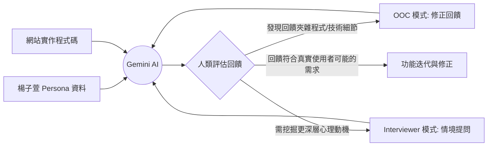
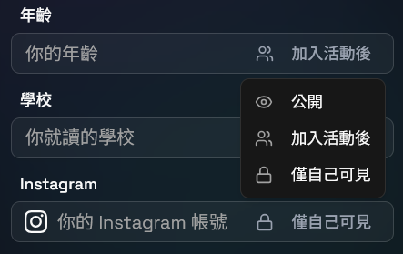

# AI 輔助驗證與「人機協作」迭代實錄

在產品開發過程中，我們將 Persona 設定（楊子萱）與網站程式碼餵給 AI 進行角色扮演測試。然而，我們發現 AI 在模擬時常出現問題。它雖然能模擬心理，但由於我們直接給它網站的程式碼，AI 會不自覺地提及開發者才看得到的檔案名稱與邏輯。因此，我們透過「訪談者」與「OOC 修正」雙重身分，將機械回饋轉化為真實的使用者體驗。

## 壹、 AI 角色扮演與驗證流程

下圖展示了我們如何與 AI 合作的迭代生成驗證流程。我們作為決策者，根據 AI 回饋的性質選擇不同的修正路徑：

## 貳、 AI 的技術偏誤：真實案例分析

在對話中，AI 雖然代入了楊子萱的焦慮心理，回饋中隱隱約約提及開發者才知曉的技術細節，這與 16 歲高一學生的視角嚴重脫節：

*   夾雜檔案名稱： AI 會說「在 **Profile.tsx** 上，如果有一個學生驗證標章...」或「主揪在 **Host.tsx** 填寫地點時...」。
*   指涉變數邏輯： AI 提到不希望在一開始就填寫 **Instagram 帳號 (socialMedia 變數)**。

這類回饋雖然具備功能建議價值，但卻暴露了 AI 無法自動區分「底層代碼」與「表層 UI」的弱點。

## 參、 Interviewer 與 OOC 的雙重引導

為了修正上述偏差，我們採取了兩種不同性質的指令（Flavors）來引導 AI：

1.  訪談者模式 (Interviewer)：
    當我們需要探索子萱對安全感的具體定義時，會以訪談者身分提問（例如：「在什麼情境下，妳才會覺得這個平台夠安全？」）。這能誘發 AI 產出更感性的描述，如：「我不想讓我的真實生活被陌生人完全看到。」

2.  OOC 模式 (Out of Character)：
    這是最重要的修正手段。當 AI 出現技術術語時，我們直接下達 OOC 指令：「**OOC: 請不要提到任何關於代碼的事情。終端使用者看不見那些。請完全從看得到的 UI 角度來描述。**」這強迫 AI 重新過濾資訊，將技術需求轉譯為使用者語言。

## 肆、 最終迭代成果：轉譯後的設計需求

透過這種人機拉扯，我們從 AI 的原始回饋中萃取出了以下真正符合楊子萱需求的機制：

1.  隱私掌控權：
    將原本程式碼中的資料欄位，轉化為一個可以自定義的「隱私權掌控權」機制。分別有以下選項：
    
2. 朋友互動與筆記：
    針對子萱「怕再也找不到這個人」的恐懼，我們設計了私人筆記功能。這讓她能記錄同好的細節，並整合即時訊息與活動邀請，確保連結的延續性。
3. 安全地圖與脫身指南：
    子萱提到「怕被困在尷尬場合，也怕遇到壞人」。我們為此提供了公園安全照明地圖與禮貌脫身話術。這賦予了她掌控感，確保她在感到不舒服時，有權利且有方法優雅地離開現場。
4. 通知系統：
    為了解決子萱對於參加活動的心理退縮（「我真的不會忘記參加嗎？」），我們加入了溫馨的通知系統，在活動開始前給予提醒，協助她對抗臨行前的焦慮。

**結語：**
本專案的迭代並非全由 AI 驅動。我們透過 **OOC 模式** 排除技術噪音，確保 AI 產出的回饋符合 16 歲高中生的認知，最終讓代碼隱形，只留下讓楊子萱感到安心的設計。