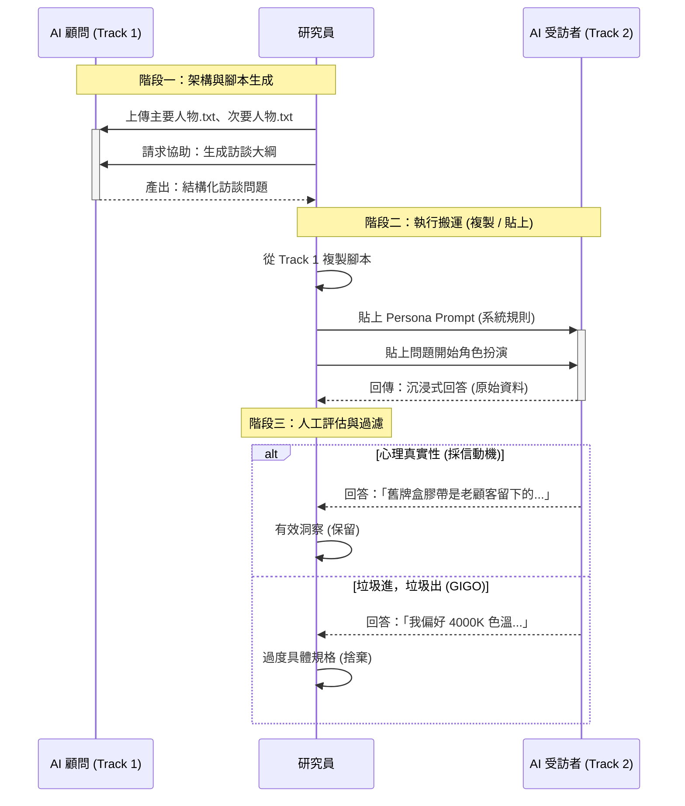

# AIGC 資料的反思

這份文件整合了我們透過生成式 AI 進行公園使用者經驗研究的歷程與我自己的反思。我們的操作策略其實包含兩條平行的對話軸線：一條是將 AI 視為「研究設計顧問」，協助生成腳本與分析架構；另一條則是將 AI 視為「模擬受訪者」，進行深度的角色扮演，分別開啟兩個 AI 進行對話。以下針對這雙軌策略、提示詞設計，以及我們對 AI 產出資料的具體反思與取捨標準進行說明。

## 雙軌運作與資料輸入策略

我們的核心策略是將「訪綱設計」與「訪談執行」利用兩個 AI 分開處理。這不僅能有效避免指令混淆，確保角色扮演的深度與沉浸感，從而獲取更具心理真實性的質化資料；更能大幅降低研究過程中的認知負荷，使團隊不必在「發想問題」上卡關。我們將重複性的思考工作外包給 AI，讓團隊從執行者轉型為決策者，跳過耗時的發想過程，直接針對高品質的產出進行收斂。以下為流程圖：

**第一個對話串：AI 作為研究設計顧問（資料結構化）**
在第一個對話串中，我們的策略是「結構化預處理」。我們並沒有一股腦地把所有田野觀察丟進去，而是先將田野資料整理成純文字檔（主要人物.txt、次要人物.txt），直接上傳給 AI 這樣就可以不用來回剪下貼上。我們要求這個「顧問 AI」先消化這些人物背景，然後協助我們產出訪談大綱與逐字稿架構。這樣做的好處是，我們可以先確認 AI 是否正確理解了人物設定，再讓它進行下一步的產出。我們也利用這個對話串進行後端的資料分析，要求 AI 運用 KJ 法將散亂的訪談內容結構化，並繪製同理心地圖（Says／Thinks／Does／Feels）。

**第二個對話串：AI 作為模擬受訪者（情境演繹）**
在第二個對話串中，我們執行「沉浸式演繹」。我們將第一軌產出的腳本投餵給 AI，但這裡我們不再輸入雜亂的背景資訊，而是只給予精煉後的 persona prompt。這裡的策略重點在於「情境維持」，我們不讓 AI 意識到自己是 AI，而是強迫它完全進入角色狀態，甚至在訪談中途加入了「老顧客小郭」的變數，將一般訪談轉化為脈絡訪談。

## 提示詞設計：從腳本生成到連續性追問

我們在不同階段使用了具針對性的提示詞，以獲取高品質的資料：

**1. 用於生成訪談腳本的 Prompt**
在設計階段，我們要求 AI 針對人物設定提出能引發故事的問題。我們特別強調追問技巧，使用的 Prompt 包含：「針對內容進行 follow up 追問」、「就像真人的訪談一樣」。這讓產出的問題不只是表面的「你喜歡什麼」，而是更深入的「那個瞬間你身體有什麼感覺？」。

**2. 用於角色扮演的沉浸式 Prompt**
在執行階段，我們設計了一套嚴格的規則來約束 AI 的回答品質。我們要求：
「以第一人稱回答、語氣自然像聊天；每題至少2–3句；若有記憶或感覺請補上『身體感受／小動作／心裡OS』。」

為了避免 AI 前後矛盾或產生幻覺，我們加入了一個最關鍵的指令，強制它建立邏輯連結：
「每一輪回答第一句，務必引用上一輪你說過的一個具體細節來銜接。」

例如，當 AI 扮演的林德海提到「牌邊沙沙聲」讓他心定時，下一題關於換新牌的追問，AI 就必須先引述這個「沙沙聲」的細節，才能回答後續。這大幅提升了對話的真實感與連貫性。

## AIGC 資料的反思：問題、辨別與取捨

對於 AI 產出的資料，我認為要採取「採信動機，驗證規格」的態度。

**認為可信且有價值的部分：**
AI 對於心理真實性的補完非常出色。它能根據我們輸入的原始人設（如林德海的穩定性與職人背景及其歷史），推演出極具說服力的生活細節與情感邏輯。

例如，當我們透過腳本追問關於道具（舊撲克牌）的細節時，AI 不僅賦予了物品一個合理的歷史背景（疫情收店時的留存），更自動衍生出一套符合角色性格的行為準則。

顧問 AI 提問:
> 你帶的是一副舊撲克牌，外盒有膠帶黏過。這副牌有什麼故事或規矩？

AI 扮演的林德海回答:
> 這副牌是以前我店裡的「等候用」，疫情那年收店就把它帶走，外盒裂角我自己用透明膠帶黏好。規矩很簡單：不要折角、不要拍太大力、洗完要把邊對齊，我習慣切兩次才發。喝水不要潑到，玩完一定放回盒子，這是對牌有禮貌。

這段回答中，「疫情收店」的時間標記與「對牌有禮貌」的堅持，雖然是 AI hallucinated 出來的，但完美呼應了角色對舊時代的眷戀以及身為理髮師對工具的尊重。這些關於「動機」、「儀式感」與「感受」的描述，幫助我們同理使用者的孤獨感與對秩序的渴求，是我們認為最有價值的部分。

**覺得有問題並需要取捨的部分：**
我們觀察到明顯的 Garbage In, Garbage Out 現象。AI 扮演的角色往往具有高度的「順從性」，若訪談者的提問本身帶有不合理的預設或過度專業的術語（Garbage In），AI 為了推進對話，便會順著竿子往上爬，產出違背角色背景的專業回答（Garbage Out）。

這顯示出問題的根源往往不在於 AI 扮演得不像，而在於提問的品質。如下方的對話紀錄所示，當顧問 AI 使用了不符合受訪者知識背景的專業參數進行誘導時，受訪者 AI 只是機械式地從選項中挑選了一個，而非表達真實感受。

顧問 AI 提問（Garbage In）：
>「你說晚間如果燈夠亮、人多、不吵就考慮；燈色你偏白，那色溫你大概喜歡偏 4000K 還是 5000K？你覺得哪一種『最不刺眼』？」

AI 扮演的林德海回答（Garbage Out）：
>「燈色我偏4000K，比5000K柔一點、不刺眼。那種像早上太陽還沒完全亮的白光最舒服，不會讓人眯眼。」

辨別與取捨的方式：
針對上述問題，我們採取「回溯人設」與「檢視輸入邏輯」的標準來篩選資料：

1. 檢視輸入端： 我們必須嚴格審視提問邏輯。例如上述案例，一位 68 歲退休理髮師不太可能具備色溫數值的認知。因此，我們捨棄「4000K」這個無效的誘導數據，但保留其後「像早上太陽還沒完全亮的白光」這類描述性語言，因為這才是符合使用者經驗的真實洞察。

2. 回溯核心動機： 如果 AI 給出的答案（如想要防風桌墊）是為了解決「風吹牌亂會打斷節奏」這個核心痛點，符合他追求「穩」的人設，我們就採信此需求；但對於具體的工程數據（如桌墊 60x45cm），我們將其視為 AI 的過度腦補，僅作為設計時的參考起點，而非絕對的事實依據。